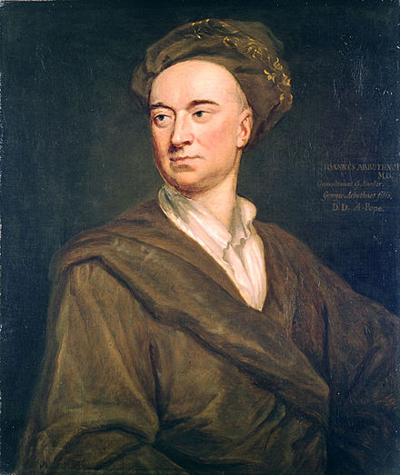
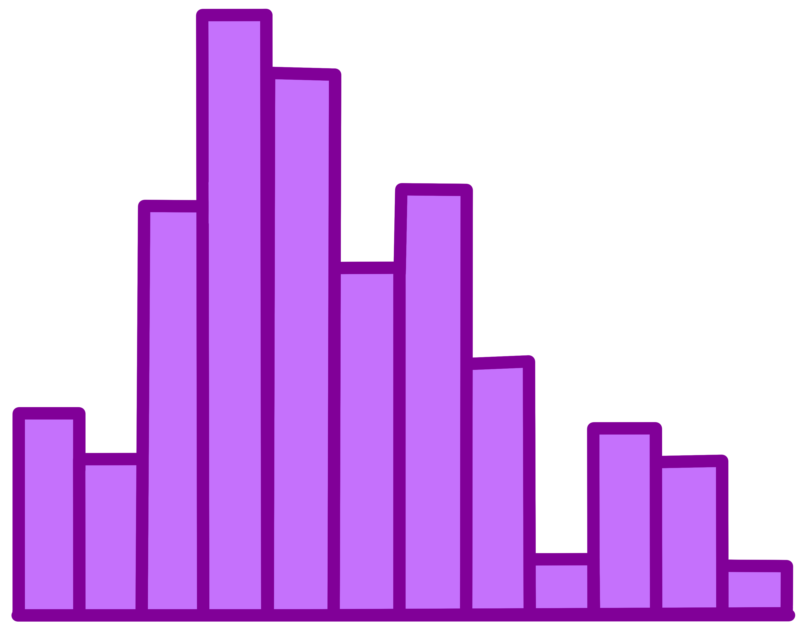

```{r setup, include=FALSE}
options(htmltools.dir.version = FALSE)
knitr::opts_chunk$set(echo = FALSE, message = FALSE, warning = FALSE, fig.align = 'center')
```

```{r, load_refs, include=FALSE, cache=FALSE}
library(RefManageR)
BibOptions(check.entries = FALSE,
           bib.style = "numeric",
           cite.style = "numeric",
           style = "markdown",
           hyperlink = FALSE,
           dashed = FALSE)
myBib <- ReadBib("references.bib", check = FALSE)
```

```{r xaringan-themer, include=FALSE, warning=FALSE}
library(xaringanthemer)
prim_color = "#9A83DE"
sec_color = "#F89D3F"

style_duo_accent(
  base_font_size = "20px",
  primary_color = prim_color,
  secondary_color = sec_color,
  inverse_header_color = "#FFFFFF",
  link_color = "#F89D3F"
)
```

```{r pkgs}
library(icon)
library(tidybayes)
```


class: title-slide   

# Visual Complements to $p$-values

.pull-left[
## FCSM 2020
### 14 Sep. 2020
#### Samantha C. Tyner, Ph.D.
`r fa('twitter')` [sctyner](https://twitter.com/sctyner)
`r fa('github')` [sctyner](https://github.com/sctyner)
`r fa('globe')` [sctyner.me](https://sctyner.me) 

Slides available at [bit.ly/viz-fcsm](http://bit.ly/viz-fcsm)


<br><br><br><br>
Image credit: [Allison Horst](https://github.com/allisonhorst/stats-illustrations/)
]


---
# Case Study: Early use of "p-values"

.left-column[
```{r arbuthnot, fig.cap="John Arbuthnot. Source: Wikipedia"}

```
]

.right-column[
[John Arbuthnot](https://en.wikipedia.org/wiki/John_Arbuthnot), "An argument for Divine Providence, taken from the constant regularity observed in the births of both sexes" `r Cite(myBib, "arbuthnot")` 
- Used probability ("p-value") to "prove" divine intervention in the human birth ratio (males are more common than females)
- Probability calculation that today would be the $p$-value in a [sign  test](https://en.wikipedia.org/wiki/Sign_test#Example_of_two-sided_sign_test_for_matched_pairs). (`binom.test()` in R) 

]

---
# Case Study: Early use of "p-values"
.left-column[
```{r arbuthnot2, fig.cap="John Arbuthnot. Source: Wikipedia"}

```
]
.right-column[
**Summary**  
`r emo::ji("radio_button")` Theory: By "divine provenance" there is a 1:1 ratio of men to women on Earth.  
`r emo::ji("radio_button")` Assume $Pr(male)=0.5$. In a year, there's a 50% chance that more males than females are born (and vice versa).  
`r emo::ji("radio_button")` In 82 years of London births, more males than females are born. The probability of this is $(0.5)^{82} = 2.1 \times 10^{-25}$.  
`r emo::ji("radio_button")` This number is so small, could not have happened by chance. Thus, "divine provenance" causes more males to be born.   
`r emo::ji("face_with_raised_eyebrow")` Despite the imbalanced ratio at birth, it remains balanced in adulthood, because more males die than females once born (due to more deaths from hunting for food and going outside the home).	The even ratio is designed by "divine provenance" and thus polygamy is unnatural. `r emo::ji("thinking_face")`
]

???
"The $p$-value is small, therefore we reject the null hypothesis.") 
`binom.test(x = 82, n = 82, p = .5, alternative = "greater")`

---
# Analyzing the Arbuthnot Data

.left-column[
```{r dists, fig.cap = "Image by Allison Horst"}

```

]

.right-column[
Resulting $p$-value<sup>1</sup> is incredibly small. How to understand it's smallness? 
]

.footnote[
[1] To arrive at the same $p$-value as Arbuthnot, do this test in R: `binom.test(x = 82, n = 82, p = .5, alternative = "greater")`
]

---
# Analyzing the Arbuthnot Data

.left-column[
```{r dists2, fig.cap = "Image by Allison Horst"}

```

]

.right-column[
Resulting $p$-value<sup>1</sup> is incredibly small. How to understand it's smallness? 

.pull-left[
3 visual complements for 3 types of analyses: 

- Simulation
- Frequentist model
- Bayesian parameter estimation 
] 

.pull-right[
Notation:  
- $i$: year {1629, 1630, ..., 1710}
- $n_i$: number of recorded births in year $i$
- $y_i$: number of male births in year $i$ 
- $p_i$: $y_i / n_i$
]
]

.footnote[
[1] To arrive at the same $p$-value as Arbuthnot, do this test in R: `binom.test(x = 82, n = 82, p = .5, alternative = "greater")`
]

???
Going to perform the analysis of the Arbuthnot data to determine the true proportion of male births. 
Use three different methods of arriving at an answer, get three different probabilistic answers. 


---
# Simulation Study

.left-column[
```{r dots, fig.cap="Image by Allison Horst"}

```

]

.right-column[
For some large $B$:

1. For each year $i$, draw $B$ samples: $y^*_{ib} \sim Binom(n_i, 0.5)$ for $b$ from 1 to B. 
2. For each year $i$, compute the proportion of male births in each simulation: $p^*_{ib} = y^*_{ib} / n_i$
3. For each year $i$, compute the proportion of simulations in which the proportion of males is greater than or equal to the observed proportion of males in Arbuthnot's data: $P_i^* = \frac{1}{B}\sum_{b = 1}^B \mathbb{I}(p^*_{ib} \geq p_I)$.
4. Compute the average: $P^* = \frac{1}{82}\sum_{i = 1629}^{1710} P_i^*$. 
5. Assuming years are independent, compute the joint probability of observing values as or more extreme than Arbuthnot's data: $\hat{p} = \prod_{i = 1629}^{1710} P_i^*$. 
]

---
# Results

```{r sim_res}
source("code/simulation_method.R")
```

.left-column[
Average probability, $P^*$: `r round(p_star, 3)`

Joint probability, $\hat{p}$:  
$< 10^{-100}$
]

.right-column[
```{r, out.width = "100%", fig.height = 5, fig.width=10}
male_births %>% 
  ggplot(aes(x = year, y = percent)) + 
  geom_point(size = 4) + 
  geom_hline(yintercept = 0.5, size = 1.5, color = "grey80") + 
  labs(x = "Year",y = NULL, 
       title = "Every year in Arbuthnot's data had over 50% male births") + 
  theme_xaringan() + 
  theme(panel.grid.minor = element_blank(), 
        plot.title = element_text(size = 29)) + 
  coord_cartesian(ylim = c(.5, .535), xlim = c(1627,1715), expand = F)
```

]

???
Average proportion ( $P^*$ ): mean proportion of simulated values greater than or equal to the observed. 
Joint probability ( $\hat{p}$ ): includes continuity correction. `r p_hat`


---
# Visualization 

```{r simviz, out.width="100%", fig.width=15, fig.height=7}
sim_births %>% 
  select(year, sim_props) %>% 
  unnest(sim_props) -> sim_births_long
ggplot() + 
  #geom_point(data = sim_births_long, aes(x = year, y = sim_props), size = .5, alpha = .01) + 
  geom_violin(data = sim_births_long, aes(x = year, y = sim_props, group = year), color = NA, fill = prim_color, scale = "width") + 
  geom_point(data = male_births, aes(x = year, y = percent), size = 3, color = sec_color) + 
  geom_hline(yintercept = 0.5, color = "grey80", size = .75) + 
  labs(x = "Year", y = NULL, title = "Arbuthnot's data rarely overlap with simulations when p=0.5", 
       subtitle = "Only a few years seem like they could've come from a population with p = 0.5") + 
  theme_xaringan() + 
  theme(panel.grid.minor = element_blank(), 
        panel.grid.major.x = element_blank(), panel.grid.major.y = element_line(size = .1), 
        axis.ticks = element_blank(), plot.title.position = "plot") + 
  coord_cartesian(ylim = c(.47, .53), xlim = c(1628,1711.5), expand = F)
  
```
???
Can confidently say that Arbuthnot's data show the true "natural" proportion of male births is higher than .5. 

---
# Frequentist model

.left-column[
```{r purple, fig.cap="Image by Allison Horst"}

```

]

.right-column[
**Generalized Linear Mixed-Effects Model:**
$$\begin{array} \\
  y_i  & \sim & Binom(n_i, p_i) \\
  logit(p_i)  & = & \mu + a_i \\
  a_i & \sim & N(0, \sigma^2)
  \end{array}$$

Use `lme4::glmer()` in R to fit the model to Arbuthnot's data.
]

???
If we're doing this the frequentist way, we could fit a generalized linear mixed effects model, supposing there is some baseline population value $\mu$, then each year has its own random effect, allowing us to predict new years. 

---
# Results

.pull-left[
```{r fitmod}
source("code/frequentist_method.R")

effs <- broom::tidy(mod)
effs$term <- c("mu", "sigma")
effs <- effs %>% select(-group)
knitr::kable(effs, digits = 4, caption = "Parameter estimates", label = "tab1")
```
```{r confints}
cis <- confint(mod)
rownames(cis) <- c("sigma", "mu")
knitr::kable(cis, digits = 4, caption = "95% Confidence Intervals", label = "tab2")
```

]

.pull-right[
**Fitted Model:**
$$\begin{array} \\
  y_i  & \sim & Binom(n_i, p_i) \\
  logit(p_i)  & = & 0.06565 + a_i \\
  a_i & \sim & N(0, 3.6149 \times 10^{-4})
  \end{array}$$
  
**Estimate of population proportion:**  
$logit^{-1}(\hat{\mu}) = logit^{-1}(0.06565) = 0.51641$  

```{r aic}
mod_summ <- summary(mod)
knitr::kable(t(mod_summ$AICtab), digits = 2, caption = "Fit metrics", label = "tab3")
```

]


---
# Visualization 

.pull-left[
```{r popprop, out.width = '100%', fig.width=8, fig.height=5}
sigma <- effs$estimate[2]
mu <- effs$estimate[1]
as <- rnorm(20, mean = 0, sd = sigma)
rhs <- mu + as
ps <- ( exp(rhs) / (1 + exp(rhs)) )
ns <- sample(male_births$total_births, 20, replace = T)

ci_mu <- confint(mod)[2,]

mu_rng <- seq(ci_mu[1], ci_mu[2], length = 100)
p_rng <-  ( exp(mu_rng) / (1 + exp(mu_rng)) )

tibble(probs = p_rng) %>% 
  mutate(dists = map(probs, dbinom, size = 11000, x = seq(5400, 6000))) %>% 
  unnest(dists) %>% 
  group_by(probs) %>% 
  mutate(x = seq(5400, 6000)) %>% 
  ggplot(aes(x = x/11000, y = dists, group = probs, color = probs)) + 
  geom_line() + 
  # geom_vline(xintercept = exp(mu) / (1+exp(mu))) + 
  geom_rug(data = male_births, inherit.aes= FALSE, aes(x = percent), color = "black") + 
  labs(color = "InverseLogit(mu)", x = 'p', y = "Probability (dbinom)",
       title = "Small range for the population proportion") + 
  scale_color_gradient(low = "#1d1d6c", high = prim_color) + 
  theme_xaringan(text_font_size = 18, title_font_size = 20) + 
  theme(legend.position = c(.8, .8), panel.grid.minor = element_blank(),
        panel.grid.major.x = element_blank())
```

]

.pull-right[
```{r ridges, out.width="100%", fig.height = 6.5}
tibble(n = ns, p = ps) %>% 
  mutate(sims = map2(n, p, rbinom, n =  10000)) %>% 
  unnest(sims) %>% 
  mutate(probs = sims / n) %>% 
  ggplot(aes(x = probs, y = p)) + 
  ggridges::geom_density_ridges(aes(group = p),rel_min_height = 0.01, color="grey20", fill = prim_color, size = .5, alpha = .5) + 
  geom_rug(data = male_births, inherit.aes= FALSE, aes(x = percent), color = "black") + 
  coord_cartesian(xlim = c(.49, .54)) + 
  labs(x = "Simulated data", y = "Simulated ps from fitted model",
       title = "Comparing model simulations to the data")+
  theme_xaringan(title_font_size = 20, text_font_size = 18) + 
  theme(panel.grid.minor = element_blank())
```
]

???
On left: take the 95% CI for mu and get a grid on it. Then, convert mus to probabilities by taking inverse logit. Using those probs, get the pmf of the binomial for some N and each p. Convert the value of x to a prob. based on N to show the range of values possible under the estimated population proportion. 

On right, incorporate the random effects. Sim. 20 values for the random effects, then add them to the estimate of mu. Take inverse logit to get p_is. Simulate 1000 y_i values for each value of p_i and some N, show the dist of values. (y axis is the p_i , x axis is the range of proportion male from the simulations)

---
# Bayesian approach 

.left-column[
```{r distsb, fig.cap="Image by Allison Horst"}

```

]

.right-column[
**Bayesian Hierarchical Model:**
$$\begin{array} \\
  y_i  & \sim & Binom(n_i, p_i) \\
  p_i  &  \sim & Beta(\alpha, \beta) \\
  \mu = \frac{\alpha}{\alpha + \beta} & & \eta = \alpha + \beta \\
  \mu & \sim & Beta(1, 1) \\ 
  \log(\eta) & \sim & Logistic(\log(\bar{n}), 1) \\ 
  \end{array}$$
  
Fit to Arbuthnot's data with the `runjags` package in R. 
]

---
# Results 

```{r bayesfit, cache=TRUE, results = 'hide'}
source("code/bayesian_method.R")
```


```{r bayestab}
params_ab %>% 
  select(param:SD) %>% 
  knitr::kable(digits =2, caption = "Summary of posterior draws of $\\alpha$, $\\beta$")
```


```{r bayestab2, out.width="100%", fig.width=15, fig.height=3.75}
value_summ_df %>% 
  filter(param != "alpha", param != "beta") %>% 
  mutate(year = male_births$year, obs = male_births$percent) %>% 
  select(year, obs, Median) %>% 
  pivot_longer(-year, names_to = "variable", values_to = "value") %>% 
  ggplot(aes(x = year, y= value, color = variable)) + 
  geom_point(size = 3) + 
  scale_color_manual(name = NULL, values = c(prim_color, sec_color), 
                     labels = c("Posterior median", "Observed value")) + 
  labs(x = "Year", y = NULL,
       title = "Posterior Medians of p for each year") + 
  theme_xaringan(text_font_size = 22, title_font_size = 26) + 
  theme(panel.grid.minor = element_blank(), 
        panel.grid.major.x = element_blank(), panel.grid.major.y = element_line(size = .1), 
        axis.ticks = element_blank(), plot.title.position = "plot", 
        legend.position = c(.9,1.1) ) + 
  coord_cartesian(ylim = c(.50, .53), xlim = c(1628,1711.5), expand = F)
# 
# ggplot() + 
#   stat_interval(data = p_draws, aes(x = p_year, y = .value)) + 
#   scale_color_brewer()

```


---
# Visualization

.pull-left[
```{r beta, out.width = "100%", fig.height=5, fig.width=8}
#params_ab
#library(ggfortify)
#ggdistribution(dbeta, seq(0.49, .54, 0.0001), shape1 = 	5808.95, shape2 = 5442.88)
alpha_draws %>% 
  bind_rows(beta_draws) %>% 
  ggplot(aes(x = .value, fill = .variable)) + 
  geom_density(alpha = .5) + 
  theme_xaringan() + 
  labs(x = "Value", y = NULL, title = "Posterior distributions nearly overlap", subtitle = "(Mode of beta distribution near 0.5)") + 
  scale_fill_manual(name = NULL, values = c(prim_color, sec_color)) + 
  theme(panel.grid.minor = element_blank(), 
        axis.ticks = element_blank(), 
        axis.text.y = element_blank(),
        plot.title.position = "plot", 
        legend.position = c(.9,.9) ) 
```

]

.pull-right[
```{r, out.width="100%", fig.width = 10, fig.height = 9}
p_meds <- value_summ_df %>% 
  filter(param != "alpha", param != "beta")
  
params_ab %>% 
  select(param:Mean) %>% 
  pivot_longer(-param, names_to = "name", values_to = "value") %>% 
  pivot_wider(names_from = param, values_from = value) %>% 
  mutate(dist = map2(alpha, beta, dbeta, x = seq(0.49, .54, 0.0001))) %>% 
  unnest(dist) %>% 
  group_by(name, alpha, beta) %>% 
  mutate(x = seq(0.49, .54, 0.0001)) %>% 
  ggplot(aes(x = x, y = dist, color = name)) + 
  geom_line(size  = 1) + 
  geom_rug(data = p_meds, inherit.aes= FALSE, aes(x = Median), color = "black") + 
  annotate("text", x = .49, y = Inf, label = "Rug lines represent\nposterior medians for p", hjust = 0, vjust = 1.5, size = 8) + 
  theme_xaringan() + 
  scale_color_brewer(palette = "RdYlBu") + 
  labs(x = "p", y = NULL, color = NULL, title = "Beta distributions for p") + 
  theme(axis.text.y = element_blank(), legend.position = c(.9,.9),
        panel.grid.minor = element_blank(), panel.grid.major.y = element_blank())
```

]

---
# Visualization 

.pull-left[
```{r ppost, out.width="100%", fig.width=12, fig.height=8}
ggplot() +
  stat_interval(data = p_draws, aes(x = p_year, y = .value)) +
  scale_color_brewer(name = "CI Level") + 
  theme_xaringan() + 
  scale_color_manual(values = c("#D5CBF2","#9A83DE","#6644C9")) + 
  scale_x_continuous(labels = (male_births$year-1)[(c(0:4)*20 +1)]) + 
  labs(x = "Year", y = NULL, title = "Posterior draws from p for each year")+
  theme(legend.position = c(.9, .9))

```
]

.pull-right[
```{r ppost2, out.width="100%", fig.width=12, fig.height=8}
ggplot() +
  stat_interval(data = p_draws, aes(x = reorder(p_year, .value, median), y = .value)) +
  scale_color_manual(values = c("#D5CBF2","#9A83DE","#6644C9"))+ 
  theme_xaringan() + 
  #scale_x_continuous(labels = (male_births$year-1)[(c(0:4)*20 +1)]) + 
  labs(x = NULL, y = NULL, title = "Posterior draws from p, ordered by median")+
  theme(legend.position = "none", axis.text.x = element_blank(),
        panel.grid.major.x = element_blank(), axis.ticks.x = element_blank())

```
]

---
# Takeaways 

.pull-left[
```{r hiding, fig.cap = "Image by Allison Horst"}
knitr::include_graphics("img/summary_statistics.png")
```
]

.pull-right[
**Dig deep into your model results**

- Think about how you can you show probabilities
    * What other ways are there to model your data?
    * What other parameter values could result in your data?
- Simulation is your friend
- Take advantage of existing tools (in R or elsewhere)  
    * [`ggplot2`](https://ggplot2.tidyverse.org/) extensions: [`ggridges`](https://cran.r-project.org/web/packages/ggridges/vignettes/introduction.html), [`ggdist`](https://mjskay.github.io/ggdist/articles/freq-uncertainty-vis.html)
- Further reading: *Model Visualization* `r Cite(myBib, c("modelvis", "streets"))` 
]

---
# References 

```{r refs, echo=FALSE, results="asis"}
PrintBibliography(myBib)
```

### R Packages Used

tidyverse (ggplot2, dplyr, tidyr), lme4, runjags, tidybayes, ggdist, ggridges

---
class: title-slide
# Thank you! 

### Contact: 
`r fa('envelope')` [sctyner90@gmail.com](mailto:sctyner90@gmail.com)  
`r fa('twitter')` [sctyner](https://twitter.com/sctyner)  
`r fa('github')` [sctyner](https://github.com/sctyner)  
`r fa('globe')` [sctyner.me](https://sctyner.me) 

Slides available at [bit.ly/viz-fcsm](http://bit.ly/viz-fcsm)
