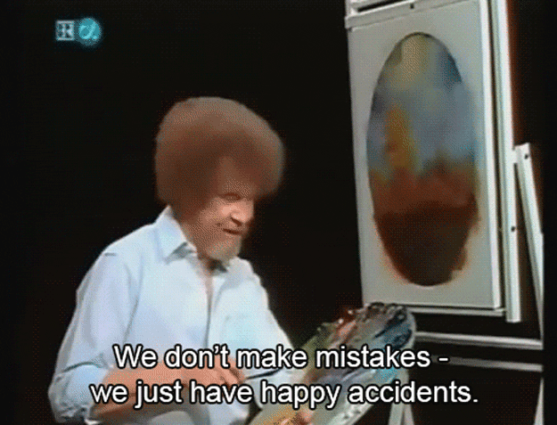
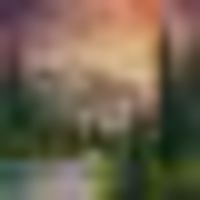
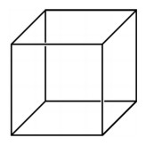
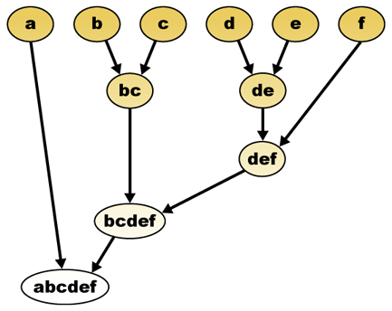
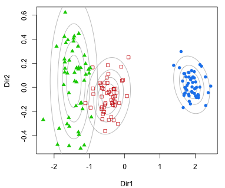
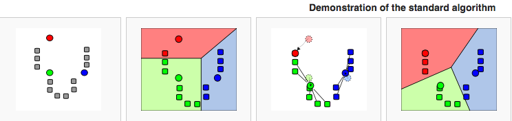
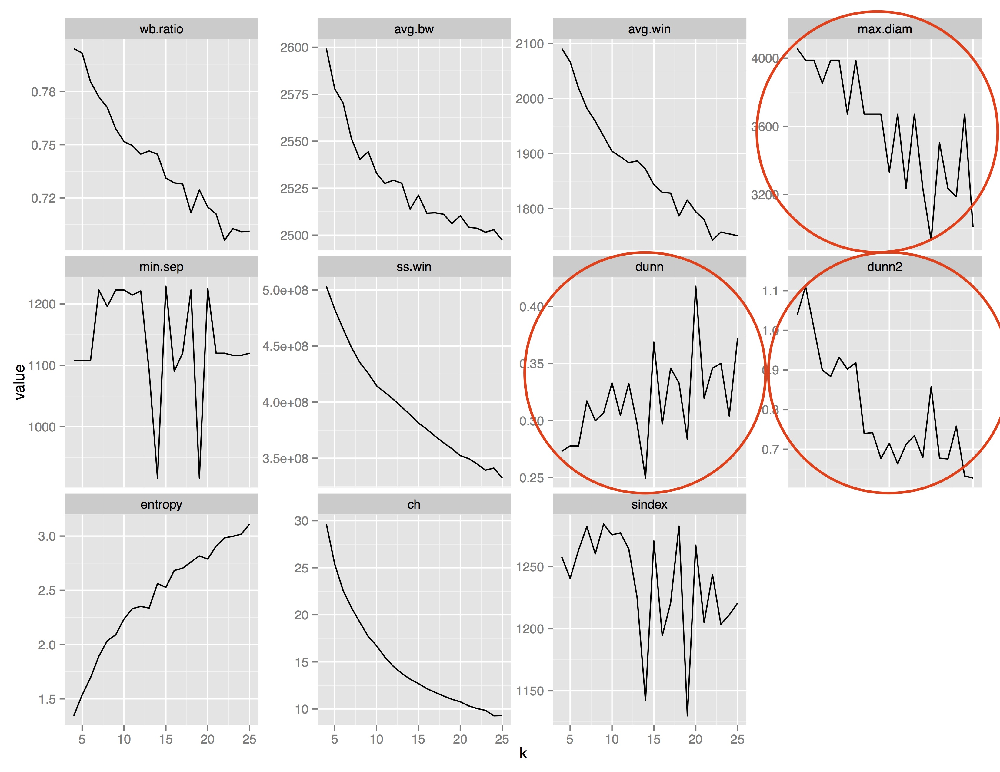
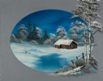
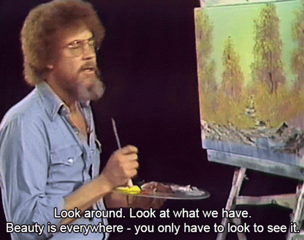

## The Joy of Painting

<center>

</center>

## Goals
- cluster paintings into groups containing similar things
- name the groups 
- "average" Bob Ross paintings
- avoid watching 400 episodes of *The Joy of Painting*

<center>

</center>

## Data Collection

- downloaded 222 .jpg files from [saleoilpaintings.com](http://www.saleoilpaintings.com/paintings/bob-ross/) (using R)
- rescale paintings to 20 x 20 pixels (using Python)

<center>
 becomes 

A bit bigger...


</center>

## Turning Paintings into Data

- Convert .jpg to .txt files (using ImageMagick)
    - (r,g,b) color values for *each* pixel are variables
    - $3 \times 20 \times 20 = 1200$ variables! 
    - 222 observations of 1200 variables each 
```{r, echo=FALSE}
paint.df <- read.csv("dat/clean_paint_data.csv")
paint.df <- paint.df[,-1]
paint.df[1:6,1:10]
```


## Principal Component Analysis

- number of variables (1200) is way bigger than number of observations (222)
- need dimension reduction
- principal components analysis on the $222 \times 1200$ data frame
    - translate each high dimensional point into a lower dimensional space
    - $1^{st}$ PC orders the points on a number line in 1D, $1^{st}$ & $2^{nd}$ PC place the points on a 2D plane, etc.

<center>
    
</center>

```{r, echo=FALSE}
paint.df <- read.csv("dat/clean_paint_data.csv")
svd.paint <- svd(paint.df[,-1])
# columns of svd.paint$v are the principal component directions
# z_j = X*v_j are the principal components. these are the cols of the mat below
pcs.paint <- apply(svd.paint$v, 2, function(x) as.matrix(paint.df[,-1])%*%x)
#find the most important PC:
#starting at 226, all are essentially 0. 
pcs.paint.import <- pcs.paint[,1:225]
# cluster on the principal components.
pcs.paint.import <- data.frame(pcs.paint.import)
pcs.paint.import$id <- 1:242
pcs.paint.dist <- dist(pcs.paint.import[, -ncol(pcs.paint.import)])
pcs.hc.single <- hclust(pcs.paint.dist, method="single")
#plot(pcs.hc.single)
```


```{r, echo=FALSE, message=FALSE}
means.paint.cols <- apply(paint.df[,-1], 2, mean)
center <- function(x) x - mean(x)
paint.df.cent <- apply(paint.df[,-1], 2, center)
mults <- c(10, 2, 50, 140, 45, 34, 143, 13, 187, 238, 7, 25, 43, 49, 67, 97, 155, 210, 85, 104)
id.new <- c(1:242)[-mults]
svd.paint <- svd(paint.df.cent[-mults,])
pcs.paint <- data.frame(apply(svd.paint$v, 2, function(x) as.matrix(paint.df.cent[-mults,])%*%x))
pcs.paint$id <- id.new
class.pcs <- data.frame(id = id.new)
pcs.paint.dist <- dist(pcs.paint[, -ncol(pcs.paint)])
pcs.hc.wardD <- hclust(pcs.paint.dist, method="ward.D")
class.pcs$hc.wardD.13 <- factor(cutree(pcs.hc.wardD, k = 13))
pcs.hc.wardD2 <- hclust(pcs.paint.dist, method="ward.D2")
class.pcs$hc.wardD2.14 <- factor(cutree(pcs.hc.wardD2, k = 14))
pcs.hc.complete <- hclust(pcs.paint.dist, method="complete")
class.pcs$hc.complete.7 <- factor(cutree(pcs.hc.complete, k = 7))
library(ggplot2)
#qplot(x = 1:length(svd.paint$d),svd.paint$d^2/sum(svd.paint$d^2), xlab = "Principal Component Number", ylab = "Percent of Variance Explained", main = "Percent of Variance Explained by Principal Components", geom = 'line')  + geom_line(data = NULL, aes(x = 1:length(svd.paint$d), y = cumsum(svd.paint$d^2/sum(svd.paint$d^2))), colour='red') + geom_hline(yintercept = c(.9,.95,.99), linetype = I(2)) + theme(text = element_text(size=16))
```

## Clustering Methods
Investigated the following methods on the $222 \times 222$ reduced-dimension data:

- Hierarchical clustering 
- Model-Based clustering 
- K-Means clustering

## Hierarchical Clustering

Agglomerative hierarchical clustering:

- Work from the bottom up
- Each observation starts as its own cluster then get combined according to a rule
- Rule = complete linkage: joins 2 clusters with minimum maximum distance

<center>

</center>

## Model-Based Clustering

Data follow a Gaussian mixture model

- Clusters form ellipsoid "clouds"
- Can be different sizes, shapes, and direction
- Was too restrictive a method for my purposes

<center>

</center>

## K-means Clustering 

Forms $K$ groups around $K$ centers

- Centers are randomly chosen at first - set a seed
- Points get assigned to closest center
- Average points, get new centers
- Repeat until convergence 



```{r, echo = FALSE, message=FALSE, cache=TRUE}
set.seed(-649487537)
pcs.km.20 <- kmeans(pcs.paint[, -ncol(pcs.paint)], 20)
class.pcs$km.20 <- pcs.km.20$cluster
library(mclust)
df.mbc <- Mclust(pcs.paint, G=4:25, modelNames=c("EII", "VII", "EEI", "EVI", "VEI", "VVI"))
class.pcs$mbc <- factor(df.mbc$classification)
library(fpc)
stats.complete <- cluster.stats(pcs.paint.dist, as.numeric(as.character(class.pcs$hc.complete.7)))
stats.kmeans <- cluster.stats(pcs.paint.dist, as.numeric(as.character(class.pcs$km.20)))
stats.mbc <- cluster.stats(pcs.paint.dist, as.numeric(as.character(class.pcs$mbc)))
library(plyr)
stats.all <- ldply(stats.complete[c(13:19,21,24:29,31:32)])
stats.all$kmeans <- ldply(stats.kmeans[c(13:19,21,24:29,31:32)])[,2]
stats.all$mbc <- ldply(stats.mbc[c(13:19,21,24:29,31:32)])[,2]
names(stats.all)[1:2] <- c('metric','complete')
library(tidyr)
stats.all2 <- gather(stats.all, method, value, complete:mbc)
#qplot(x = method, y = value, data = stats.all2) + facet_wrap(~metric, scales = 'free_y') 
```

## Choosing a K

Number of groups chosen by looking at cluster statistics

<center>

</center>

## Best Model
K-Means, $K = 20$

C# | 1 | 2 | 3 | 4 | 5 | 6 | 7 | 8 | 9 | 10 | 11 | 12 | 13 | 14 | 15 | 16 | 17 | 18 | 19 | 20| 
:-: | :-: | :-: | :-: | :-: | :-: | :-: | :-: | :-: | :-: | :-: | :-: | :-: | :-: | :-: | :-: | :-: | :-: | :-: | :-: | :-: | 
\# in | 6 | 12 | 8 | 8 | 16 | 15 | 4 | 8 | 17 | 6 | 6 | 5 | 6 | 24 | 10 | 11 | 8 | 18 | 19 | 15| 

## The Groups

- Looked at the original paintings after grouping
- Gave the 20 groups names based on their contents
- Smallest group called "blues and browns"

<center>
 
 
</center>

## Average Painting in the Groups

In each group of paintings:

- Group the paintings by pixel location
- Average red, blue, green color values over all paintings in group
- Combine these averages into an (r,g,b) color value
- Plot these color values on their assigned pixel location, creating an average painting 

## Average Paintings (1/5)
```{r, echo=FALSE, message=FALSE, warning = FALSE}
library(dplyr)
paintings2 <- read.csv("dat/paintings2.csv")[,-1]
paintings3 <- paintings2[-which(paintings2$id %in% mults),-7]
paintings3$cluster <- rep(class.pcs$km.20, each = 400)
avg_paintings <- paintings3 %>% group_by(cluster, x, y) %>% summarise_each(funs(mean))

avg_paintings$HEX <- as.character(rgb(avg_paintings[,c('red','green','blue')],max=255))
library(grid)
titles <- c("Shadowy Forests","Lakes, Mountains, Coniferous\nTrees, & Bright Blue Skies","Ocean Scenes or\nMountains near Lakes","Rivers Running through\na Forest","Winter near water","Sunsets in winter","All blues & browns","Light oval borders", "Abstract forests &\nSunsets in the woods", "Light-colored miscellany","Lakes in fall","Winter sunsets with\noval border","Darker scenes", "Cabins in forests at dusk","Saturated color miscellany","Sunsets behind mountains\nnear forests and rivers","Bright yellow miscellany","Rivers in forests leading\nto distant mountains","Abstract or bright\ngreen forests","*")
plot <- NULL
for (i in 1:20){
  plot[[i]] <- ggplot(data = subset(avg_paintings, cluster == i), aes(x = -x, y = y)) + 
    geom_tile(fill = subset(avg_paintings, cluster == i)$HEX, colour = subset(avg_paintings, cluster == i)$HEX) + labs(title = titles[i]) + theme_bw() + theme(aspect.ratio = 1, line = element_blank(), panel.background = element_blank(), plot.background = element_blank(), 
                   axis.text=element_blank(), axis.title=element_blank(),text = element_text(size=16), plot.margin = unit(c(0,0,0,0), "cm")) 
}
```

```{r, echo=FALSE, message=FALSE}
library(gridExtra)
grid.arrange(plot[[1]], plot[[2]],plot[[3]], plot[[4]])
```


## Average Paintings (2/5)

```{r, echo=FALSE, message=FALSE}
grid.arrange(plot[[5]], plot[[6]],plot[[7]], plot[[8]])
```


## Average Paintings (3/5)

```{r, echo=FALSE, message=FALSE}
grid.arrange(plot[[9]], plot[[10]],plot[[11]], plot[[12]])
```


## Average Paintings (4/5)

```{r, echo=FALSE, message=FALSE}
grid.arrange(plot[[13]], plot[[14]],plot[[15]], plot[[16]])
```


## Average Paintings (5/5)

```{r, echo=FALSE, message=FALSE}
grid.arrange(plot[[17]], plot[[18]],plot[[19]], plot[[20]])
```

\* Bright blue skies behind snow-capped mountains near rivers and coniferous trees

## Conclusion

- The average paintings look like the group names
- Very efficient method
- Able to see themes in Bob Ross paintings

<center>

</center>

## Acknowledgements 

Dr. Di Cook, Monash University 

Walt Hickey, [FiveThirtyEight](http://fivethirtyeight.com/features/a-statistical-analysis-of-the-work-of-bob-ross/) 

## Thank you for listening!

Website: [sctyner.github.io](http://sctyner.github.io/)

Twitter: @sctyner


<center>

</center>
