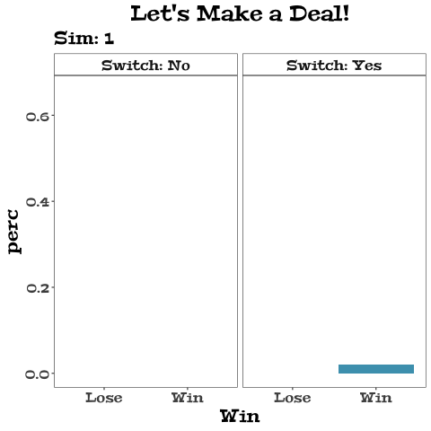

<link rel="stylesheet" href="https://use.fontawesome.com/releases/v5.6.0/css/all.css" integrity="sha384-aOkxzJ5uQz7WBObEZcHvV5JvRW3TUc2rNPA7pe3AwnsUohiw1Vj2Rgx2KSOkF5+h" crossorigin="anonymous">


```{r setup, include=FALSE}
options(htmltools.dir.version = FALSE)
knitr::opts_chunk$set(echo = FALSE, out.width = "80%", message = FALSE, warning = FALSE, fig.align = 'center',cache = FALSE)
extrafont::loadfonts()
```

```{r xaringan-themer, include=FALSE}
library(xaringanthemer)
style_mono_light(
  base_color = "#467fbf",
  text_font_google = google_font("Roboto"),
  text_font_size = "22px",
  header_font_google = google_font("Peralta"),
  code_inline_color = "#333333",
  code_inline_font_size = ".8em",
  code_font_size = ".75em",
  code_font_family = "Fira Code",
  code_font_url    = "https://cdn.rawgit.com/tonsky/FiraCode/1.204/distr/fira_code.css",
  link_color = lighten_color("#333333", strength = .2),
  header_h1_font_size = "50px",
  header_h2_font_size = "40px", header_h3_font_size = "30px",
)
# other colors 
# fuscia: D81E5B
# bright red: FF0035
# orange: E94F37
# flame: E53D00
```


```{r pkgs, message=FALSE, eval=TRUE}
library(dplyr)
```

# How to watch this webinar

For optimum learning: 

- Have both the webinar software and rstudio.cloud visible at all times 
    * Material available at https://rstudio.cloud/project/1442337
- Follow along with the code (`project/code/03-follow-along.R`) or the slides (`project/slides/slides.Rmd`) and run the code as we go
- Use the ask question and chat features to communicate with TAs and ask questions
- Have fun! 


---
# Learning Goals 

Upon completion of this tutorial, you will be able to: 

1. **identify** the appropriate plot types and corresponding `ggplot2` `geom`s to consider when visualizing your data;
2. **implement** the `ggplot2` grammar of graphics by using `ggplot()` and building up plots with the `+` operator;
3. **iterate** through multiple visualizations of your data by changing the aesthetic mappings, geometries, and other graph properties;  
4. **incorporate** custom elements (colors, fonts, etc.) into your visualizations by adjusting `ggplot2` theme elements; and 
5. **investigate** the world of `ggplot2` independently to expand upon the skills learned in the course.

---
# Motivating the motivating example

Clip from *Brooklyn Nine-Nine*, Season 4, Episode 8:

<iframe width="850" height="478" src="https://www.youtube.com/embed/QGxyIQzLeUc" frameborder="0" allow="accelerometer; autoplay; encrypted-media; gyroscope; picture-in-picture" allowfullscreen></iframe>

---
# Motivating example 

--

```{r, out.width="49%"}

```


---
class: inverse, center 
# `ggplot2` and its Grammar of Graphics

```{r, fig.cap='Artwork by <a href="https://twitter.com/allison_horst">@allison_horst</a>', out.width="50%"}
knitr::include_graphics("img/ggplot2_masterpiece.png")
```

---
# What is the grammar of graphics?

From a book, [*The Grammar of Graphics*](https://www.springer.com/us/book/9781475731002) by Leland Wilkinson (1999) 

> **grammar** (noun):  (1) the study of the classes of words, their inflections, and their functions and relations in the sentence; (2) the principles or rules of an art, science, or technique 

> **grammar of graphics** (noun): a set of principles for constructing data visualizations

### grammar of language : sentence :: grammar of graphics : data visualization

<i class="fas fa-bullhorn" style="color: #FF0035;"></i> I will try to use "data visualization" instead of "plot", "graph", "chart", or "graphic" because it is a more precise term. 


---
# A simple data viz

```{r, out.width="35%"}

```

---
# Data `r emo::ji("left_right_arrow")` Noun  
.pull-left[
### Data Visualization (Sentence)

```{r out.width="63%"}

```
]


.pull-right[
### Data (Noun)
```{r}
mh_sims <- readr::read_csv("dat/monty_hall.csv")
knitr::kable(mh_sims, format = "html")
```
]

---
# `ggplot2` code

```{r echo=TRUE, out.width="30%"}
mh_sims <- readr::read_csv("dat/monty_hall.csv")
library(ggplot2)
ggplot(data = mh_sims)
```


---
# Geom `r emo::ji("left_right_arrow")` Verb 

.pull-left[
### Data Visualization (Sentence)

```{r out.width="63%"}

```
]

.pull-right[
### Geom (Verb)

- bar chart a.k.a. column chart
- [`geom_col()`](https://ggplot2.tidyverse.org/reference/geom_bar.html)

]

---
# In `ggplot2` code

We build up a data visualization in `ggplot2` with the `+` operator. 

```{r echo=TRUE, out.width="50%", eval = FALSE}
ggplot(data = mh_sims) + 
  geom_col()
```

.preman[
`## Error: geom_col requires the following missing aesthetics: x, y`
]

<i class="fas fa-bullhorn" style="color: #FF0035;"></i>  The `geom_*()` suite of functions can take many arguments, which vary by the geom type

```{r, fig.align='default', out.width="12.5%", fig.cap='Source: <a href="https://ggplot2-book.org/individual-geoms.html">ggplot2 book</a>', fig.show='hold'}
geoms <- list.files(path = "img", pattern = "geom-basic",full.names = T)
knitr::include_graphics(geoms)
```


---
# aes mapping `r emo::ji("left_right_arrow")` Pronouns

.pull-left[
### Data Visualization (Sentence)

```{r out.width="63%"}

```
]

.pull-right[
### aes mapping (pronouns)

- x-axis: Outcome (win or lose)
- y-axis: % of outcomes in switch group
- Fill color: Outcome

]

---
# In `ggplot2` code

Use the `aes()` function inside `ggplot()`. (Can also use in `geom_col()`.)

```{r echo=TRUE, fig.width = 10, fig.height=5, out.width="63%"}
ggplot(data = mh_sims,
       aes(x = Win, y = perc, fill = Win)) + 
  geom_col()
```

---
# In `ggplot2` code

- **Note**: aesthetics / aes values do not have to be connected to data. 
- To change an aes value for the entire plot, use the aes value *outside* of the `aes()` function.

```{r echo=TRUE, fig.width = 10, fig.height=5, out.width="65%"}
ggplot(data = mh_sims, aes(x = Win, y = perc, fill = Win)) + 
  geom_col(fill = "#4AA0BB")
```


---
# Stat `r emo::ji("left_right_arrow")` Adverb

.pull-left[
### Data Visualization (Sentence)

```{r out.width="63%"}

```
]

.pull-right[
### stat (adverb)

- **Identity**: The data are not altered in any way
```{r}
knitr::kable(mh_sims, format = "html") 
```

]

---
# In `ggplot2` code

```{r echo=TRUE, fig.width = 10, fig.height=5, out.width="63%"}
ggplot(data = mh_sims,
       aes(x = Win, y = perc, fill = Win)) + 
  stat_identity(geom="col") #<<
```


---
# Theme `r emo::ji("left_right_arrow")` Adjective 

.pull-left[
### Data Visualization (Sentence)

```{r out.width="63%"}

```
]

.pull-right[
### Theme (adjectives)

- white background
- no gridlines
- text font, size & face

]

---
# In `ggplot2` code

The `theme()` function can modify any non-data element of the plot. 

```{r echo=TRUE, fig.width = 10, fig.height=5, out.width="100%"}
p <- ggplot(data = mh_sims,
       aes(x = Win, y = perc, fill = Win)) + 
  geom_col()  
```

<i class="fas fa-bullhorn" style="color: #FF0035;"></i>  This is a common trick. Create an object `p` that is the `ggplot` to add to later on.

---
# In `ggplot2` code

Can use pre-made `theme_*()` functions and the `theme()` function to alter any non-data element of the plot. 

```{r echo=TRUE, fig.width = 10, fig.height=5, out.width="100%", results='hide'}
p2 <- p +   
  theme_bw() + 
  theme(text = element_text(family = "serif", size = 20), 
        panel.grid = element_blank())   
```

```{r, fig.align='default', out.width="16.65%", fig.cap='Source: <a href="https://ggplot2-book.org/polishing.html">ggplot2 book</a>', fig.show='hold'}
thms <- list.files(path = "img", pattern = "built-in",full.names = T)
knitr::include_graphics(thms)
```

---
# In `ggplot2` code 

```{r echo=TRUE, fig.width = 10, fig.height=5, out.width="80%", eval = TRUE}
p2
```


---
# Guides `r emo::ji("left_right_arrow")` Prepositions

.pull-left[
### Data Visualization (Sentence)

```{r out.width="63%"}

```
]

.pull-right[
### guide (preposition)

- There is no guide/legend.
- Not needed here, because color and x-axis are the same.

]

---
# In `ggplot2` code

The `guides()` function controls all legends by connecting to the aes. 

```{r echo=TRUE, fig.width = 10, fig.height=5, out.width="63%"}
p3 <- p2 + guides(fill = "none")
p3
```


---
# Facets `r emo::ji("left_right_arrow")` Conjunctions 

.pull-left[
### Data Visualization (Sentence)

```{r out.width="63%"}

```
]

.pull-right[
### Facets (conjuction)

- Facet by the Switch variable 


]


---
# `ggplot2` code

```{r out.width="63%", echo = TRUE, fig.height=4}
p4 <- p3 + facet_grid(cols =  vars(Switch)) 
p4
```

---
# Other grammar elements


### **Scales**: control how data are translated to visual properties (sentence structure) 

### **Coordinate system**: how data are positioned in a 2D data visualization (verb tense)

### **Position**: How to deal with overlap, if any (word order)

- "native speakers" don't have to think about these too much
- `ggplot2` has smart defaults here, less work for you
- Largely up to individual taste/style


---
# Example

.pull-left[
### Data Visualization (Sentence)

```{r out.width="63%"}

```
]

.pull-right[
#### Scales, coordinate systems, positions (sentence structure, verb tense, word order)

- Scale: y-axis labeled every 10%
- Scale: color of bars 
- Scale: axes & plot titles
- Coordinate system: cartesian (automatic)
- Position: no position shift (identity)
 

]

---
# `ggplot2` code 

There are no overlapping elements, so no position needed.

```{r eval = FALSE, echo = TRUE}
p4 + 
  scale_y_continuous(name = NULL, 
                     breaks = seq(0, .7, by = .1), label = scales::label_percent(accuracy = 1)) + 
  scale_fill_manual(values =  c("#F6C40C", "#4AA0BB")) +
  labs(x = NULL, title = "Let's Make a Deal!") 
```

---

# Final Result (for now)


```{r out.width="40%"}
p4 + 
  scale_y_continuous(name = NULL, 
                     breaks = seq(0, .7, by = .1), label = scales::label_percent(accuracy = 1)) + 
  scale_fill_manual(values =  c("#F6C40C", "#4AA0BB")) +
  labs(x = NULL, title = "Let's Make a Deal!")
```

---
# Complete `ggplot2` code

```{r eval = FALSE, echo = TRUE}
ggplot(data = mh_sims,
       aes(x = Win, y = perc, fill = Win)) + 
  geom_col() +   
  facet_grid(cols =  vars(Switch)) + 
  scale_y_continuous(name = NULL, 
                     breaks = seq(0, .7, by = .1), label = scales::label_percent(accuracy = 1)) + 
  scale_fill_manual(values =  c("#F6C40C", "#4AA0BB")) +
  labs(x = NULL, title = "Let's Make a Deal!") + 
  theme_bw() + 
  theme(text = element_text(family = "serif", size = 20), 
        panel.grid = element_blank()) + 
  guides(fill = "none") 
```

---
# Complete `ggplot2` code

```{r eval = FALSE, echo = TRUE}
ggplot(data = mh_sims, #<<
       aes(x = Win, y = perc, fill = Win)) + #<<
  geom_col() +   #<<
  facet_grid(cols =  vars(Switch)) + #<<
  scale_y_continuous(name = NULL, 
                     breaks = seq(0, .7, by = .1), label = scales::label_percent(accuracy = 1)) + 
  scale_fill_manual(values =  c("#F6C40C", "#4AA0BB")) +
  labs(x = NULL, title = "Let's Make a Deal!") + 
  theme_bw() + 
  theme(text = element_text(family = "serif", size = 20), 
        panel.grid = element_blank()) + 
  guides(fill = "none") 
```


---
# What's next? 

More and more detail on the `ggplot2` universe: 

- `geom`s for one- and two-variable visualization
- Including three or more variables in the visualization 
    * Colors, sizes, shapes, linetypes
    * Grouping & faceting 
    * Maps 


---
class: inverse, center 
# One-variable visualization 


```{r, fig.cap="<a href='https://xkcd.com/988/'>xkcd.com/988/</a>", out.width="60%"}
knitr::include_graphics("img/tradition.png")
```

---
# Histogram 

> A **histogram** approximates the distribution of a single numeric variable. It shows frequency of values in specified ranges. 

### **`geom_histogram`**

- requires the `x` aesthetic inside `aes()`
- Specify width of bars with the `bins` or `binwidth` argument
- Can change appearance of the bars with `color`, `fill`, `alpha` arguments 

---
# Your Turn

`r countdown::countdown(minutes = 2, top = 0,  update_every = 30)`

Complete the code below to recreate the histogram of weekly NFL attendance. (Source: [Tidy Tuesday](https://github.com/rfordatascience/tidytuesday/blob/master/data/2020/2020-02-04/readme.md))

```{r echo=TRUE, eval = FALSE}
library(readr)
attendance <- read_csv("dat/nfl_attendance.csv")
ggplot(data = ???, aes(x = ???)) + 
  geom_???()
```

```{r, fig.height=4, fig.width=9, out.width='75%'}
library(readr)
attendance <- read_csv("dat/nfl_attendance.csv")
ggplot(data = attendance, aes(x = weekly_attendance)) + 
  geom_histogram()
```


---
# Bar chart 

> A **bar chart** displays counts of a categorical variable, and is the categorical equivalent of the histogram. 

### **`geom_bar`**

- requires the `x` aesthetic inside `aes()`
- Can change appearance of the bars with `color`, `fill`, `alpha` arguments 

---
# Your Turn

`r countdown::countdown(minutes = 2, top = 0, update_every = 30)`

Complete the code below to display a bar chart of total NFL attendance from 2000-2019 by team. 

```{r echo=TRUE, eval = FALSE}
ggplot(??? = attendance, ???(??? = ???, weight = weekly_attendance)) + 
  geom_bar() + 
  coord_flip()
```
```{r fig.height=5, fig.width=10, out.width='70%'}
ggplot(data = attendance, aes(x = team_name, weight = weekly_attendance)) + 
  geom_bar()+ 
  coord_flip()
```


---
# Density plot 

> A **density** estimate is a smoothed version of the histogram which is especially useful if the data come from a continuous distribution. 


### **`geom_density`**

- requires the `x` aesthetic inside `aes()`
- change the underlying kernel smoother with the `kernel` parameter
- change bandwidth with the `adjust` parameter
- Can change appearance of the bars with `color`, `fill`, `alpha` arguments 

---
# Example

```{r fig.height=4, fig.width=9, out.width='75%', echo = TRUE}
ggplot(data = attendance, aes(x = weekly_attendance)) + 
  geom_density() 
```

---
# Other one-variable viz

- `geom_freqpoly`: behaves the same as `geom_histogram` but with connected lines instead of bars 
- `geom_dotplot`: show values in bins as individual dots 
- `geom_rug`: place lines along an axis for each observation  

.pull-left[
`geom_freqpoly` + `geom_rug`:
```{r, out.width='100%', fig.width=8, fig.height=6}
ggplot(data = attendance, aes(x = weekly_attendance)) + 
  geom_freqpoly()+ 
  geom_rug()
```
]
.pull-right[
`geom_dotplot`:
```{r out.width='100%',  fig.width=8, fig.height=6}
ggplot(data = attendance, aes(x = weekly_attendance)) + 
  geom_dotplot(binwidth = 200)
```
]

---
class: inverse, center 
# Two-variable visualization

```{r fig.cap="<a href='https://xkcd.com/388/'>xkcd.com/388</a>", out.width="50%"}
knitr::include_graphics('img/xkcd_grapefruit.png')
```

---
# Which variables?

```{r out.width="40%"}

```


---
# Two numeric variables 

### `time`, `weekly_attendance`

Using data from The DC Team. 


```{r echo=TRUE}
library(dplyr)
dc <- attendance %>% filter(team_name == "The DC Team")
```

### **`geom_line`**

- requires the `x, y` aesthetics inside `aes()`
- Can change appearance of the lines with `color`, `linetype`, `alpha` arguments 
- The `group` `aes` draws lines according to a grouping variable (later)

---
# Your Turn

`r countdown::countdown(minutes = 2, top = 0, update_every = 20)`

Complete the code to make the time series chart of weekly attendance from 2000-2019 for the DC Team.  

```{r, echo=TRUE, eval = FALSE}
???(data = ???, aes(x = ???, y = ???)) + 
  geom_???()
```


```{r out.width="75%", fig.height=4, fig.width=8}
ggplot(data = dc, aes(x = time, y = weekly_attendance)) + 
  geom_line()
```

---
# One numeric, one categorical

### `team`, `weekly_attendance`

Return to the full `attendance` dataset. 

### **`geom_boxplot`**

- requires the `x,y` aesthetics inside `aes()`
- Can change appearance of the boxes with `color`, `fill`, `alpha` arguments 

---
# Your Turn 

`r countdown::countdown(minutes = 2, top = 0, update_every = 20)`

Modify the code below to create box plots for weekly attendance by team name. 

```{r, eval = FALSE, echo= TRUE}
ggplot(data = ???, aes( ??? , ???)) + 
  geom_???() + 
  coord_flip()
```


```{r out.width="75%", fig.height=4, fig.width=9}
ggplot(data = attendance, aes(x = team_name, y = weekly_attendance)) + 
  geom_boxplot() + coord_flip()
```

---
# Two categorical variables 

### `year`, `week`


```{r out.width="72%",fig.width =9, fig.height = 4, echo=TRUE}
ggplot(data = dc, aes(x = year, y = week, fill = weekly_attendance)) + 
  geom_tile(color = "grey40") + 
  scale_x_continuous(breaks = 2000:2019) + scale_y_continuous(breaks = 1:17) + 
  scale_fill_gradient(low = "white", high = "forestgreen")
```


---
class: inverse, center 
# Three or more variable visualization

```{r fig.cap="<a href='https://xkcd.com/880/'>xkcd.com/880</a>", out.width="40%"}

```

---
# The limits of `ggplot2`

#### `ggplot2` does not do 3D visualization  
- (there are ways...but you won't see them here.)

#### `ggplot2` is not interactive 
- See the `plotly` package and its [`ggplotly()`](https://plotly-r.com/overview.html#intro-ggplotly) function.  

### But, there are plenty of other ways to make informative graphics with `ggplot2` 

---
# Additional `aes()` mappings

Add a third variable to a plot with:  

<i class="fas fa-rainbow"></i> **color** : `color, fill`  

<i class="fas fa-expand-arrows-alt"></i> **size**: `size, stroke`   

<i class="fas fa-shapes"></i> **shape**: `shape, linetype`  

<i class="fas fa-water"></i> **contour lines**: `geom_contour(), geom_density_2d(), z`  

<i class="fas fa-chart-bar"></i> **bins**: `geom_bin2d(), geom_hex(), geom_tile()`   


---
# Choosing a mapping 

Image from Garrett Grolemund's [2019 JSM tidyverse tutorial](https://rstudio.cloud/project/385945). 

```{r out.width = "50%"}
knitr::include_graphics("img/garrett-aes-vars.PNG")
```

---
# Add a discrete/categorical variable

New York has two teams: the Giants and the Jets. 

```{r echo = TRUE}
ny <- attendance %>% filter(team == "New York")
glimpse(ny)
```

---
# Two time series, one plot

Use color to indicate team

```{r echo = TRUE, fig.width=9, fig.height=4}
ggplot(data = ny, aes(x = time, y = weekly_attendance, color =team_name)) + #<<
  geom_line(alpha = .7) 
```

---
# Two time series, one plot

Use linetype to indicate team

```{r echo = TRUE, fig.width=9, fig.height=4}
ggplot(data = ny, aes(x = time, y = weekly_attendance, linetype = team_name)) + #<<
  geom_line(alpha = .7) 
```


---
# Two time series, one plot

Use size to indicate team. <i class="fas fa-bullhorn" style="color: #FF0035;"></i>  Note: I do not recommended this! Why? 

```{r echo = TRUE, fig.width=9, fig.height=4}
ggplot(data = ny, aes(x = time, y = weekly_attendance, size =team_name)) + #<<
  geom_line(alpha = .7) 
```

---
# Adding a continuous/numeric variable

Using the `games` data from [Tidy Tuesday](https://github.com/rfordatascience/tidytuesday/blob/master/data/2020/2020-02-04/readme.md):

```{r echo = T}
games <- read_csv("dat/nfl_games.csv")
glimpse(games)
```

---
# Size 

```{r echo = TRUE, fig.width=9, fig.height=4}
ggplot(data = games, aes(x = yds_loss, y = yds_win, size = pt_spread)) + #<<
  geom_point(alpha = .1) 
```


---
# Color

```{r echo = TRUE, fig.width=9, fig.height=4}
ggplot(data = games, aes(x = yds_loss, y = yds_win, color = pt_spread)) + #<<
  geom_point(alpha = .3) 
```

---
# Grouping

> The `group` aesthetic partitions the data for plotting into groups 

```{r echo = TRUE, fig.show='hold', out.width="40%", fig.height = 5, fig.align='default'}
ny19 <- ny %>% filter(year == 2019)
ggplot(data = ny19, aes(x = time, y = weekly_attendance)) + geom_line(alpha = .7) 
ggplot(data = ny19, aes(x = time, y = weekly_attendance, group =team_name)) + geom_line(alpha = .5) 
```


---
# Many groups 

Look at all attendance for all teams

```{r echo = TRUE, fig.width=9, fig.height=4}
ggplot(data = attendance, aes(x = time, y = weekly_attendance, group =team_name))+
  geom_line(alpha = .4)
```

---
# Add another variable 

```{r echo = TRUE, fig.width=9, fig.height=4}
ggplot(data = attendance, aes(x = time, y = weekly_attendance, group =team_name, color = division))+
  geom_line(alpha = .4)
```

---
# Facets 

> Faceting generates small multiples, each displaying a different subset of the data. Facets are an alternative to aesthetics for displaying additional discrete variables.

- plot subgroups separately
- can be arranged by rows, columns, or both 
- can be "wrapped" for many subgroups 
- great for exploratory analyses 


---
# Faceting functions 

.pull-left[

#### `facet_grid()`

- create a grid of graphs, by rows and columns 
- use `vars()` to call on the variables 
- adjust scales with `scales = "free"`

#### `facet_wrap()`

- create small multiples by "wrapping" a series of plots
- use `vars()` to call on the variables 
- `nrow` and `ncol` arguments for dictating shape of grid 
]

.pull-right[
```{r, echo=TRUE, out.width="100%", fig.height=4}
p <- ggplot(data = attendance, aes(x = time, y = weekly_attendance, group =team_name, color = division))+
  geom_line(alpha = .4)
p
```
]
---
# Faceting example 

.pull-left[
```{r echo=TRUE}
p + facet_grid(cols = vars(conference))
```
]
.pull-right[
```{r echo = TRUE}
p + facet_wrap(vars(conference), nrow = 2)
```
]


---
class: inverse, center, middle
# Part 2: Advanced customization  

```{r fig.cap="Source <a href='https://twitter.com/djnavarro/status/1243769699055239170?s=20'>@djnavarro</a>"}
knitr::include_graphics("img/djnavarro.png")
```

---
class: inverse, center
# Combining layers


```{r fig.cap="Image from <a href='https://skillgaze.com/2017/10/31/understanding-different-visualization-layers-of-ggplot/'>skillgaze.com</a>", out.width = "60%"}
knitr::include_graphics("img/layers.png")
```

---
# Using the same data 

Add another layer by adding a different geom 

```{r echo=TRUE, fig.height=4,fig.width=9, out.width="63%"}
ggplot(data = games, aes(x = yds_loss, y = yds_win)) +
  geom_point(aes(size = pt_spread), alpha = .1) + 
  geom_smooth(se = FALSE, method = "lm") #<<
```

---
# Your Turn

`r countdown::countdown(minutes = 3, top = 0,  update_every = 20)`

```{r fig.height=4,fig.width=9}
ggplot(data = attendance, aes(x = time, y = weekly_attendance)) + 
  geom_line(aes(group = team_name), alpha = .3) + 
  geom_smooth(aes(color = division), se = FALSE)
```

---
# Using different data 
 
```{r echo = TRUE, eval=TRUE, out.width = "80%", fig.height = 4, fig.width=9}
ggplot() + 
 geom_line(data = attendance, aes(x = time, y = weekly_attendance, group = team_name), alpha = .1) + 
 geom_line(data = dc, aes(x = time, y = weekly_attendance), alpha = .7, color = "blue") #<<
```


---
class: inverse, center
# Graph appearance

```{r, out.width="30%", fig.cap = "Image by <a href='https://twitter.com/w_r_chase/status/1155212225621221376'>@w_r_chase</a>"}
knitr::include_graphics("img/glamourgraphics.png")
```

---
# Scales

> "Scales control the details of how data values are translated to visual properties." 

- Every aes value has a corresponding family of scales functions 
- Of the form `scale_{aes}_*()`, e.g. `scale_x_continuous()`
- Values of the * depend on the aes 
- Possible scale function arguments: 
    * `name`: label of the axis/legend
    * `breaks`: numeric positions of breaks on axes/legends
    * `labels`: labels of the breaks on axes/legends
    * `limits`: continuous axis limits
    * `expand`: padding around data 
    * `na.value`: what to do with missings
    * `trans`: continuous transformations of data 
    * `guide`: function to create guide/legend
    * `date_breaks`: breaks for date variables


---
# Scales for axes

.pull-left[
`scale_x_*()`, `scale_y_*()`
- continuous
- discrete
- binned
- log10
- sqrt 
- date
- datetime
- reverse
]

.pull-right[
```{r echo = TRUE, out.width="100%", fig.height=4}
ggplot(dc, aes(x = time, y = weekly_attendance)) + 
  geom_line() + 
  scale_x_continuous(breaks = seq(1, 340, by = 17), 
                     labels = 2000:2019, name = "Year")
```
]

---
# Scales for color

.pull-left[
`scale_color_*()`, `scale_fill_*()`

- manual 
- continuous 
- brewer/distiller/fermenter
- gradient/gradient2/gradientn
- steps
- viridis 
]
.pull-right[
```{r echo = TRUE, out.width="100%", fig.height=4}
ggplot(ny, aes(x = time, y = weekly_attendance, 
  color = team_name)) + geom_line(alpha = .7) + 
  scale_color_manual(name = NULL, 
    values = c("navy", "forestgreen"))
```
]

---
# Scales for size

.pull-left[
`scale_*()`
- `size`
- `radius` 
- `size_binned`
- `size_area`
- `size_binned_area`
]
.pull-right[
```{r echo = TRUE, out.width="100%", fig.height=4}
ggplot(data=games, aes(x = yds_loss, 
  y = yds_win, size = pt_spread)) +
  geom_point(alpha = .1) + 
  scale_size_binned("Point Spread",
                    n.breaks = 5)
```

]

---
# Other scale functions 

- `scale_alpha_*()`: for mapping a variable to transparency 
- `scale_linetype_*()`: for mapping a variable to linetype (`geom_line`)
- `scale_shape_*()`: for mapping a variable to shape (`geom_point`) 

<i class="fas fa-bullhorn" style="color: #FF0035;"></i> Note that linetype and shape have relatively few possible values by default, and are best for variables with only a few levels. 

```{r fig.align="default", out.width="50%", fig.show='hold'}
knitr::include_graphics(c("https://ggplot2.tidyverse.org/reference/scale_shape-6.png",
                          "https://ggplot2.tidyverse.org/reference/scale_linetype-3.png"))
```
  
```{r echo = TRUE, fig.width=9, fig.height=3, eval = FALSE}
ggplot(data = mpg, aes(x = cty, y = hwy, shape = class, alpha = cyl)) + 
  geom_jitter(color = "red") + theme(legend.position = "top") +  
  scale_shape_manual(values = c("◐", '◑', '◒' ,'◓', '◔','◕','◖'))
```


---
# Labels 

Labels are also scale elements 

- `ggtitle(main, subtitle)`: plot title & subtitle
- `xlab()`, `ylab()`: axes titles 
- `labs()`: all of the above plus captions, tags, and other aes values 
    * e.g. `color = "My variable"` names the legend "My variable" 
    * `title`: plot title 
    * `subtitle`: plot subtitle
    * `caption`: text for bottom right corner of plot area e.g. to ID data source
    * `tag`: text for top left corner of plot area, e.g. A, B, C when combining many plots together

---
# Coordinates

The `coord_*()` family of functions dictate position aesthetics (e.g. `x`, `y`):

- Controls the "canvas" the data are "drawn" on
- Especially useful for maps 

Function examples: 

- `coord_cartesian()`: the default. x, y axes 
- `coord_polar()`: x becomes radius, y becomes angle

<i class="fas fa-bullhorn" style="color: #FF0035;"></i> You can apply limits and transformations to axes in scales or coordinates (e.g. `xlim()`, `ylim()`) but using coordinates is probably what you want. 

---
# Example 

All three visualizations below begin with the same plot code: 
```r
ggplot(dc, aes(x = time, y = weekly_attendance)) + geom_line() +
```

```{r echo = FALSE, fig.align = "default", out.width="33%", fig.height = 6, fig.show='hold'}
p <- ggplot(dc, aes(x = time, y = weekly_attendance)) + geom_line()
p +   scale_x_continuous(breaks = seq(1, 340, by = 17), labels = 2000:2019) +
  ggtitle('scale_x_continuous(breaks = seq(1, 340, by = 17), labels = 2000:2019)')
p + scale_x_continuous(breaks = seq(1, 340, by = 17), 
                       labels = 2000:2019, limits = c(307, 340)) + 
  ggtitle('scale_x_continuous(breaks = seq(1, 340, by = 17), labels = 2000:2019,\nlimits = c(324, 340))')
p + scale_x_continuous(breaks = seq(1, 340, by = 17), 
                       labels = 2000:2019) +
  coord_cartesian(xlim = c(307, 340)) + 
  ggtitle('scale_x_continuous(breaks = seq(1, 340, by = 17), labels = 2000:2019) +\ncoord_cartesian(xlim = c(307, 340)')
```


---
# Themes

Specific themes: 

- `theme_grey()`: default
- `theme_bw()`: white background, gray gridlines
- `theme_classic()`: looks more like base R plots
- `theme_void()`: removes all background elements, all axes elements, keeps legends 

General `theme` function for advanced customization: 

- `theme()`
    * adjust the appearance every "non-data element" of the viz
    * fonts, background, text positioning, legend appearance, facet appearance, etc. 
- <i class="fas fa-bullhorn" style="color: #FF0035;"></i> Rule of thumb: when changing an element that shows data, use aes() and scales. Otherwise, use themes. 

---
# Theme elements

Every theme element is either a line, a rect, or text. See [documentation](https://ggplot2.tidyverse.org/reference/theme.html) for more.

To modify a theme element, use: 

- `element_line()`: change lines' appearance (color, linetype, size, etc.)
- `element_rect()`: change rectangles' appearance (fill, border lines, etc.)
- `element_text()`: change text elements' appearance (family, face, color, etc.)
- `element_blank()`: draw nothing. Use to remove a theme element. 

<i class="fas fa-bullhorn" style="color: #FF0035;"></i> Note: there are 92 possible arguments used to modify a ggplot theme. Usually, we will only need to call on a handful. 

---
# Example 

```{r, echo=TRUE, fig.width=10, fig.height=4}
mytheme <- theme(legend.position =  "top", 
        axis.text = element_text(face = "italic", color = "navy"), 
        plot.background = element_rect(fill = "#a0d1f2"), 
        panel.background = element_blank(), 
        panel.grid = element_line(linetype = "dotdash"))
ggplot(data = mpg) + geom_jitter(aes(x = cty, y = hwy, color = class)) + mytheme
```


---
# Legends 

The `guides()` family of functions control legends' appearance  
- `guide_colorbar()`: continuous colors
- `guide_legend()`: discrete values (shapes, colors)
- `guide_axis()`: control axis text/spacing, add a secondary axis 
- `guide_bins()`: creates "bins" of values in the legend
- `guide_colorsteps()`: makes colorbar discrete 

```{r out.width = "80%"}
knitr::include_graphics("img/guides_examples.png")
```

---
# Example 

```{r, echo=TRUE, fig.width=10, fig.height=4}
ggplot(data = mpg) + 
  geom_jitter(aes(x = cty, y = hwy, color = class),key_glyph = draw_key_pointrange) + #<<
  mytheme + 
  guides(color = guide_legend(nrow = 1)) #<<
```

---
# Fonts

To change fonts in a `ggplot2` viz: 

- Use the `element_text()` function inside of `theme()`
    * `family`: font family 
    * `face` : bold, italic, bold.italic, plain 
    * `color`, `size`, `angle`, etc. 
- Include additional fonts with the [`extrafont`](https://github.com/wch/extrafont) package: 
```{r eval=FALSE, echo=TRUE}
library(extrafont)
font_import() # will take 2-3 minutes. Only need to run once
loadfonts()
fonts()
fonttable()
```

<i class="fas fa-bullhorn" style="color: #FF0035;"></i> Restart R after importing the fonts for the first time, and load `extrafont` and `loadfonts` BEFORE loading `ggplot2`.

---
# Example 

```{r, echo=TRUE, eval=FALSE}
ggplot(data = mpg) + 
  geom_jitter(aes(x = cty, y = hwy, color = class)) + 
  theme(text = element_text(family = "Peralta")) #<<
```

```{r, out.width="80%"}

```

---
# Design principles

.pull-left[

Advice on data visualization design from [Will Chase](https://www.williamrchase.com/slides/assets/player/KeynoteDHTMLPlayer.html). 

- Left-align text 
- Don't make people tilt their heads! 
- Remove borders & gridlines 
- Directly label in place of legends 
- White space is your friend 
- Use simple, clear fonts
- Color is hard. (Stick to the available palettes)

Watch Will's talk [here](https://resources.rstudio.com/rstudio-conf-2020/the-glamour-of-graphics-william-chase). 
]
.pull-right[
```{r}

```
]


---
class: inverse, center
# `ggplot2` extensions

```{r, out.width="60%", fig.cap = 'Image by <a href="https://twitter.com/allison_horst">@allison_horst</a>'}
knitr::include_graphics("img/gganimate_fireworks.PNG")
```


---
# Where to find them

Maintainers of packages can put their `ggplot2` extension on [exts.ggplot2.tidyverse.org/gallery](http://exts.ggplot2.tidyverse.org/gallery/)

```{r}
knitr::include_graphics("img/ggplot-exts.png")
```

---
# Animation

[`gganimate`](https://gganimate.com/): a grammar of animated graphics 


From the documentation, here are the `gganimate` function families: 

- `transition_*()`: defines how the data should be spread out and how it relates to itself across time.
- `view_*()`: defines how the positional scales should change along the animation.
- `shadow_*()`: defines how data from other points in time should be presented in the given point in time.
- `enter_*()/exit_*()`: defines how new data should appear and how old data should disappear during the course of the animation.
- `ease_aes()`: defines how different aesthetics should be eased during transitions.

<i class="fas fa-bullhorn" style="color: #FF0035;"></i> For optimum performance, use the `animate()` and `anim_save()` functions to create and save animations. 

---
# Example (data)

Full simulated data: 

```{r}
sims <- read_csv("dat/monty_hall_sims.csv")
glimpse(sims)
```

---
# Example (code)

```{r echo=TRUE, eval = FALSE}
library(gganimate)
ggplot(data = sims) + 
  geom_col(aes(x = Win, y = perc, fill = Win, group = seq_along(sim))) + #<<
  facet_grid(cols = vars(Switch), labeller = label_both) + 
  scale_fill_manual(values = c("#F6C40C", "#4AA0BB")) +
  theme_bw() + 
  theme(legend.position = "none", 
        text = element_text(family = "Peralta", size = 20), 
        panel.grid = element_blank(), 
        strip.background = element_rect(fill = NA), 
        plot.title =  element_text(hjust = .5), 
        plot.background = element_rect(fill = NA), 
        panel.background = element_rect(fill = NA))  + 
  labs(title = "Let's Make a Deal!", subtitle = "Sim: {frame_along}") + #<<
  transition_reveal(seq_along(sim))  #<< 

```


---
# Example (animation)

```{r out.width="50%"}

```

---
# Your Turn

`r countdown::countdown(minutes = 6, seconds = 0, top = 0, update.every = 30)`

Complete the code to recreate the GIF from the motivating example. (GIF on next slide)

```{r eval = FALSE, echo=TRUE}
ggplot(data = sims) + 
  geom_???(aes(xmin = win - .5, xmax = win + .5, ymin = perc2, ymax = perc, fill = Win, 
                group = seq_along(sim)), 
            color = "grey40") + 
  facet_grid(cols = vars(Switch), labeller = label_both) + 
  scale_x_continuous(breaks = c(0,1), labels = ??? ) + 
  scale_y_continuous(breaks = ???, labels = scales::label_percent(accuracy = 1)) +
  scale_fill_manual(values = c("#F6C40C", "#4AA0BB")) +
  theme_bw() + 
  theme(legend.position = "none", 
        text = element_text(family = "Peralta", size = 20), 
        panel.grid = element_blank(), 
        strip.background = element_rect(fill = NA), 
        plot.title =  element_text(hjust = .5), 
        plot.background = element_rect(fill = NA), 
        panel.background = element_rect(fill = NA))  + 
  labs(title = "Let's Make a Deal!")  + 
  transition_???(sim, transition_length = 10, state_length = 5) + 
  shadow_???(color = NA) 
```

---
# Motivating example (again)


```{r, out.width="49%"}

```


---
class: inverse, center
# Conclusion

```{r, out.width="50%"}
knitr::include_graphics("https://media.giphy.com/media/lD76yTC5zxZPG/giphy.gif")
```

---
# Additional resources 

- [ggplot2 book](https://ggplot2-book.org/)
- [plotly book](https://plotly-r.com/)
- [R for Data Science book](https://r4ds.had.co.nz/)
- [Tidy Tuesday](https://github.com/rfordatascience/tidytuesday)
- [My advice for getting help in R](https://sctyner.github.io/rhelp.html)
- Thomas Lin Pedersen's ggplot2 webinar: [part 1](https://youtu.be/h29g21z0a68) and [part 2](https://youtu.be/0m4yywqNPVY)
- [RStudio Cheat Sheets](https://github.com/rstudio/cheatsheets)
- [Will Chase's Design Talk](https://rstudio.com/resources/rstudioconf-2020/the-glamour-of-graphics/) at rstudio::conf
- The [4-hour version](https://rstudio.cloud/project/1116791) of this workshop 
- More in the `resources/` folder

