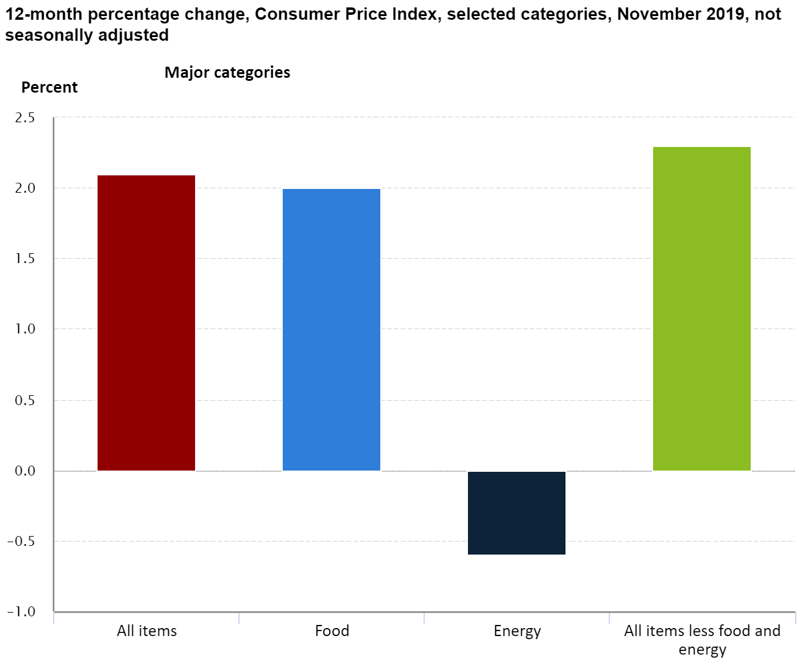
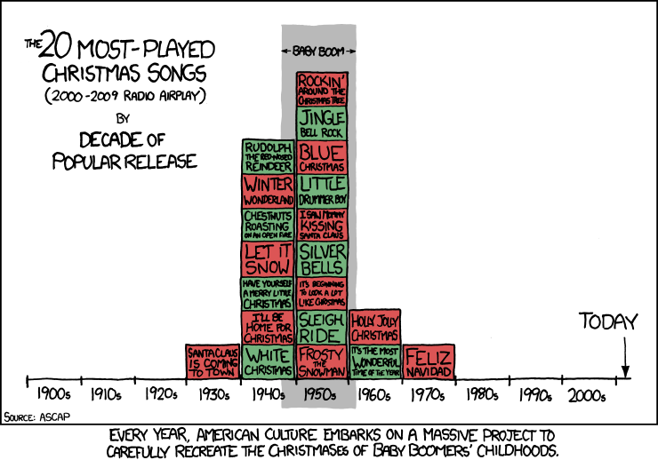

<link rel="stylesheet" href="https://use.fontawesome.com/releases/v5.6.0/css/all.css" integrity="sha384-aOkxzJ5uQz7WBObEZcHvV5JvRW3TUc2rNPA7pe3AwnsUohiw1Vj2Rgx2KSOkF5+h" crossorigin="anonymous">


```{r setup, include=FALSE}
options(htmltools.dir.version = FALSE)
knitr::opts_chunk$set(echo = FALSE, out.width = "80%", message = FALSE, warning = FALSE, fig.align = 'center',cache = TRUE)
```

```{r xaringan-themer, include=FALSE}
library(xaringanthemer)
mono_light(
  base_color = "#b41f24",
  text_font_google = google_font("Source Sans Pro"),
  text_font_size = "22px",
  header_font_google = google_font("Source Sans Pro"),
  code_inline_color = "#2a3683",
  code_inline_font_size = ".8em",
  code_font_size = ".75em",
  code_font_family = "Fira Code",
  code_font_url    = "https://cdn.rawgit.com/tonsky/FiraCode/1.204/distr/fira_code.css",
  link_color = lighten_color("#2a3683", strength = .4),
  header_h1_font_size = "50px",
  header_h2_font_size = "40px", header_h3_font_size = "30px",
)
```

```{r pkgs, message=FALSE, eval=TRUE}
library(dplyr)
```

# Learning Goals 

Upon completion of this tutorial, you will be able to: 

1. identify the appropriate plot types and corresponding `ggplot2` `geom`s to consider when visualizing your data;
2. implement the `ggplot2` grammar of graphics by using `ggplot()` and building up plots with the `+` operator;
3. iterate through multiple visualizations of your data by changing the aesthetic mappings, geometries, and other graph properties;  
4. incorporate custom elements (colors, fonts, etc.) into your visualizations by adjusting `ggplot2` theme elements; and 
5. investigate the world of `ggplot2` independently to expand upon the skills learned in the course.

---
# Outline 


Part 1: `ggplot2` basics (April 21)

- Introduction to `ggplot2`'s grammar of graphics 
- One-variable visualization
- Two-variable visualization
- Three or more variable visualization

Part 2: Advanced customization (April 23)

- Combining layers
- Graph appearance
    + Themes & Scales
    + Titles, legends, etc. 
- `ggplot2` extensions
- Interactivity with plotly 

---
class: inverse, center, middle
# Part 1: `ggplot2` basics 

```{r, fig.cap='Artwork by <a href="https://twitter.com/allison_horst">@allison_horst</a>', out.width="40%"}
knitr::include_graphics("img/ggplot2_exploratory.png")
```


---
class: inverse, center 
# `ggplot2` and its Grammar of Graphics

```{r, fig.cap='Artwork by <a href="https://twitter.com/allison_horst">@allison_horst</a>', out.width="50%"}

```

---
# What is the grammar of graphics?

From a book, [The Grammar of Graphics](https://www.springer.com/us/book/9781475731002) by Leland Wilkinson (1999) 

> **grammar** (noun):  (1) the study of the classes of words, their inflections, and their functions and relations in the sentence; (2) the principles or rules of an art, science, or technique 

> **grammar of graphics** (noun): a set of principles for constructing data visualizations

<i class="fas fa-bullhorn" style="color: #0F81BF;"></i> I will try to use "data visualization" instead of "plot", "graph", "chart", or "graphic" because it is a more precise term. 


---
# The language of English grammar

.pull-left[
- Parts of speech: 
    * noun
    * verb
    * adjective
    * adverb
    * pronoun 
    * conjunction
    * preposition
    * interjection
- Verb tense, word order and sentence structure
- Punctuation
] 

.pull-right[
```{r, fig.cap="<a href='https://xkcd.com/1443/'>xkcd.com/1443</a>", out.width="80%"}
# download.file(url = "https://imgs.xkcd.com/comics/language_nerd.png", destfile = "slides/img/xkcd-language.png")
knitr::include_graphics("img/xkcd-language.png")
```

]

---
# The language of `ggplot2`'s grammar


.pull-left[
- Data to visualize: a `data.frame`
    * Or coercible to a `data.frame`
- Families of functions to build a plot:
    * `aes` 
    * `geom_`
    * `stat_`
    * `position_`
    * `theme`
    * `scale_`
    * `annotation_`
    * `guide_` (legends)
    * `facet_`
    * `coord_`
- Operators to combine elements: `+`, `%>%`
]

.pull-right[

```{r fig.cap="Image from <a href='https://skillgaze.com/2017/10/31/understanding-different-visualization-layers-of-ggplot/'>skillgaze.com</a>", out.width = "100%"}
knitr::include_graphics("img/layers.png")
```
]
    
---
# Connecting the two grammars


.pull-left[
#### English grammar

- noun
- verb
- pronoun
- adverb
- adjective
- conjunction
- preposition 
- interjection
- verb tense, word order, and sentence structure
- punctuation
]

.pull-right[
#### `ggplot2`'s grammar

- data
- geom
- aes mapping 
- stat
- theme
- facets
- guides/legends
- annotation
- scales, coordinate systems, and positions
- `+` `()` `,` `%>%`
]

---
# Connecting the two grammars

### **Sentences** are constructed by combining *words and puncuation* in a logical and coherent way. 

### **Data Visualizations** are constructed by combining *data and visual attributes* in a logical and coherent way. 

**Next**: compare the two grammars and reconstruct a data visualization from [bls.gov](https://www.bls.gov/)  

---
# A simple data viz

```{r, fig.cap="Source: <a href='https://www.bls.gov/charts/consumer-price-index/consumer-price-index-by-category.htm'>bls.gov</a>", out.width="50%"}
# pretty sure this chart was made with IZENDA 

```


---
# Data `r emo::ji("left_right_arrow")` Noun  

> **noun**: any member of a class of words that can function as .hilite[the main or only elements of subjects of verbs] (A *dog* just barked), or of objects of verbs or prepositions (to send *money* from home).  ([dictionary.com](https://www.dictionary.com/browse/noun?s=t))

### **Data** are the subjects & objects of the data visualization sentence 

<i class="fas fa-bullhorn" style="color: #0F81BF;"></i>  `ggplot2` loves [tidy data](https://www.jstatsoft.org/article/view/v059i10)! Data are tidy when 1 row represents 1 observational unit and each column represents one measurement/quality of that observation. (Below: untidy data at left, tidy data at right from Wickham 2014)

```{r, fig.show='hold', out.width="40%", fig.align='default'}
knitr::include_graphics(c("img/untidy.png", "img/tidy.png"))
```


---
# Example

.pull-left[
### Data Visualization (Sentence)

```{r out.width="100%"}

```
]

.pull-right[
### Data (Noun)
```{r}
cpi19 <- readr::read_rds("dat/cpi19.rds")
knitr::kable(cpi19, format = "html")
```
]

---
# In `ggplot2` code

```{r echo=TRUE, out.width="30%"}
cpi19 <- readr::read_rds("dat/cpi19.rds")
library(ggplot2)
ggplot(data = cpi19)
```

---
# Geom `r emo::ji("left_right_arrow")` Verb 

> **verb**: any member of a class of words that function as the main elements of predicates, that typically .hilite[express action, state, or a relation between two things], and that may be inflected for tense, aspect, voice, mood, and to show agreement with their subject or object. ([dictionary.com](https://www.dictionary.com/browse/verb?s=t))

### The **geom** is what relates the data to a visual element.

```{r, fig.align='default', out.width="12.5%", fig.cap='Source: <a href="https://ggplot2-book.org/individual-geoms.html">ggplot2 book</a>', fig.show='hold'}
geoms <- list.files(path = "img", pattern = "geom-basic",full.names = T)
knitr::include_graphics(geoms)
```

---
# Example

.pull-left[
### Data Visualization (Sentence)

```{r fig.cap="Source: <a href='https://www.bls.gov/charts/consumer-price-index/consumer-price-index-by-category.htm'>bls.gov</a>", out.width="100%"}

```
]

.pull-right[
### Geom (Verb)

- bar chart a.k.a. column chart
- [`geom_col()`](https://ggplot2.tidyverse.org/reference/geom_bar.html)

]

---
# In `ggplot2` code

We build up a data visualization in `ggplot2` with the `+` operator. 

```{r echo=TRUE, out.width="50%", eval = FALSE}
ggplot(data = cpi19) + 
  geom_col()
```

.preman[
`## Error: geom_col requires the following missing aesthetics: x, y`
]

<i class="fas fa-bullhorn" style="color: #0F81BF;"></i>  The `geom_*()` suite of functions can take many arguments, which vary by the geom type

---
# aes mapping `r emo::ji("left_right_arrow")` Pronouns

> **pronoun**: any member of a small class of words found in many languages that are used as .hilite[replacements or substitutes for nouns] and noun phrases, and that have very general reference, as I, you, he, this, who, what.  ([dictionary.com](https://www.dictionary.com/browse/pronoun?s=t))

### **Aesthetic** (aes) **mappings** substitute visual properties (aesthetics) for the data

Commonly used `aes` values: 

- Axes: x, y
- Other visual properties: size, color, fill, shape, alpha (transparency)

---
# Example

.pull-left[
### Data Visualization (Sentence)

```{r fig.cap="Source: <a href='https://www.bls.gov/charts/consumer-price-index/consumer-price-index-by-category.htm'>bls.gov</a>", out.width="100%"}

```
]

.pull-right[
### aes mapping (pronouns)

- x-axis: Category
- y-axis: % change
- Fill color: Category

]

---
# In `ggplot2` code

Use the `aes()` function inside `ggplot()`. (Can also use in `geom_col()`.)

```{r echo=TRUE, fig.width = 10, fig.height=5, out.width="70%"}
ggplot(data = cpi19,
       aes(x = Category, y = `% change`, fill = Category)) + 
  geom_col(width = .6)
```

---
# In `ggplot2` code

- **Note**: aesthetics / aes values do not have to be connected to data. 
- To change an aes value for the entire plot, use the aes value *outside* of the `aes()` function.

```{r echo=TRUE, fig.width = 10, fig.height=5, out.width="65%"}
ggplot(data = cpi19, aes(x = Category, y = `% change`)) + 
  geom_col(width = .6, fill = "#b41f24")
```

---
# Stat `r emo::ji("left_right_arrow")` Adverb

> **adverb**: any member of a class of words that function as .hilite[modifiers of verbs] or clauses ([dictionary.com](https://www.dictionary.com/browse/adverb?s=t))

### The **stat** describes how the data are modified in order to be expressed through the geom. 

<i class="fas fa-bullhorn" style="color: #0F81BF;"></i>  Stats and Geoms go together. Every geom has a default stat and vice versa. Stat can be specified inside of a geom and vice versa. 

---
# Example

.pull-left[
### Data Visualization (Sentence)

```{r fig.cap="Source: <a href='https://www.bls.gov/charts/consumer-price-index/consumer-price-index-by-category.htm'>bls.gov</a>", out.width="100%"}

```
]

.pull-right[
### stat (adverb)

- **Identity**: The data are not altered in any way
```{r}
knitr::kable(cpi19, format = "html")
```

]

---
# In `ggplot2` code

`stat_identity` is default for `geom_col`, so it looks the same. 

```{r echo=TRUE, fig.width = 10, fig.height=5, out.width="70%"}
ggplot(data = cpi19,
       aes(x = Category, y = `% change`, fill = Category)) + 
  stat_identity(geom="col", width = .6) #<<
```

---
# Theme `r emo::ji("left_right_arrow")` Adjective 

> **adjective**: any member of a class of words that modify nouns and pronouns, primarily by .hilite[describing a particular quality] of the word they are modifying ([dictionary.com](https://www.dictionary.com/browse/adjective?s=t))

### The **theme** describes the appearance of the plot, such as the background color, font size, positions of labels, etc.

```{r, fig.align='default', out.width="16.65%", fig.cap='Source: <a href="https://ggplot2-book.org/polishing.html">ggplot2 book</a>', fig.show='hold'}
thms <- list.files(path = "img", pattern = "built-in",full.names = T)
knitr::include_graphics(thms)
```

---
# Example

.pull-left[
### Data Visualization (Sentence)

```{r fig.cap="Source: <a href='https://www.bls.gov/charts/consumer-price-index/consumer-price-index-by-category.htm'>bls.gov</a>", out.width="100%"}

```
]

.pull-right[
### Theme (adjectives)

- white background
- dotted gray major gridlines for y-axis
- text font, size & face

]

---
# In `ggplot2` code

The `theme()` function can modify any non-data element of the plot. 

```{r echo=TRUE, fig.width = 10, fig.height=5, out.width="100%"}
p <- ggplot(data = cpi19,
       aes(x = Category, y = `% change`, fill = Category)) + 
  geom_col(width = .6) 
```

<i class="fas fa-bullhorn" style="color: #0F81BF;"></i>  This is a common trick. Create an object `p` that is the `ggplot` to add to later on.

---
# In `ggplot2` code

The `theme()` function can modify any non-data element of the plot. 

```{r echo=TRUE, fig.width = 10, fig.height=5, out.width="100%", results='hide'}
p2 <- p + theme(
 panel.background = element_rect(fill = "white", 
                                 color = "black"),
 panel.grid.major.y = element_line(color = "gray80", 
                                   linetype = "dashed"), 
 axis.text = element_text(family = "Calibri", 
                          color = "black", 
                          size = 12), 
 title = element_text(family = "Arial", 
                           face = "bold",
                           size = 14)
)
```

---
# In `ggplot2` code 

```{r echo=TRUE, fig.width = 10, fig.height=5, out.width="80%", eval = TRUE}
p2
```

---
# Guides `r emo::ji("left_right_arrow")` Prepositions

> **preposition**: any member of a class of words that are used before nouns, pronouns, or other substantives to form phrases functioning as modifiers of verbs, nouns, or adjectives, and that typically .hilite[express a spatial, temporal, or other relationship,] as in, on, by, to, since. ([dictionary.com](https://www.dictionary.com/browse/preposition?s=t))

### The **guide** or **legend** connects non-axis aesthetics in the data visualization like color and size to the data
---
# Example

.pull-left[
### Data Visualization (Sentence)

```{r fig.cap="Source: <a href='https://www.bls.gov/charts/consumer-price-index/consumer-price-index-by-category.htm'>bls.gov</a>", out.width="100%"}

```
]

.pull-right[
### guide (preposition)

- There is no guide/legend.
- Not needed here, because color and x-axis are the same.

]

---
# In `ggplot2` code

The `guides()` function controls all legends by connecting to the aes. 

```{r echo=TRUE, fig.width = 10, fig.height=5, out.width="70%"}
p3 <- p2 + guides(fill = "none")
p3
```

---
# Annotations `r emo::ji("left_right_arrow")` Interjections

> **interjection**: any member of a class of words expressing emotion, distinguished in most languages by their use in .hilite[grammatical isolation] ([dictionary.com](https://www.dictionary.com/browse/interjection?s=t))

### An **annotation** is a separate layer that doesn't connect to other elements in the plot and is used to add fixed elements to a data visualization

---
# Example

.pull-left[
### Data Visualization (Sentence)

```{r fig.cap="Source: <a href='https://www.bls.gov/charts/consumer-price-index/consumer-price-index-by-category.htm'>bls.gov</a>", out.width="100%"}

```
]

.pull-right[
### Annotation (interjection)

- Solid gray line at y = 0


]

---
# In `ggplot2` code

The `annotate()` function creates an annotation layer

```{r echo=TRUE, fig.width = 10, fig.height=5, out.width="70%"}
p4 <- p3 + 
  annotate("segment", x = -Inf, xend = Inf, 
                    y = 0, yend = 0, color = "gray80") 
```

---
# In `ggplot2` code 

```{r echo=TRUE, fig.width = 10, fig.height=5, out.width="70%"}
p4
```

---
# Facets `r emo::ji("left_right_arrow")` Conjunctions

> **conjunction**: any member of a small class of words distinguished by their .hilite[function as connectors] between words, phrases, clauses, or sentences. ([dictionary.com](https://www.dictionary.com/browse/conjunction?s=t))

### **Faceting** generates "small multiples", which show the same visualization for different subsets of the data

<i class="fas fa-bullhorn" style="color: #0F81BF;"></i>  The current example is not faceted, so I present another toy example. More on faceting later. 

---
# Example & `ggplot2` code

```{r out.width="70%", echo = TRUE, fig.height=4}
data(mpg)
ggplot(mpg, aes(cty, hwy)) + geom_point() + 
  facet_wrap(vars(drv), labeller = "label_both")
```

---
# Other grammar elements


### **Scales**: control how data are translated to visual properties (sentence structure) 

### **Coordinate system**: how data are positioned in a 2D data visualization (verb tense)

### **Position**: How to deal with overlap, if any (word order)

- "native speakers" don't have to think about these too much
- `ggplot2` has smart defaults here, less work for you
- Largely up to individual taste/style


---
# Example

.pull-left[
### Data Visualization (Sentence)

```{r fig.cap="Source: <a href='https://www.bls.gov/charts/consumer-price-index/consumer-price-index-by-category.htm'>bls.gov</a>", out.width="100%"}

```
]

.pull-right[
#### Scales, coordinate systems, positions (sentence structure, verb tense, word order)

- Scale: y-axis labeled every 0.5%
- Scale: color of bars 
- Scale: axes & plot titles
- Coordinate system: cartesian
- Position: no position shift (identity)
 

]

---
# In `ggplot2` code 

There are no overlapping elements, so no position needed.

```{r eval = FALSE, echo = TRUE}
p4 + 
  scale_y_continuous(name = "Percent", 
                     breaks = seq(-1, 2.5, by = .5), expand = c(0,0)) + 
  scale_fill_manual(values = c("#910000", "#2f7ed8",
                               "#0d233a", "#8bbc21")) +
  coord_cartesian(ylim = c(-1.05, 2.5)) + 
  labs(x = "", title = "12-month percentage change, Consumer Price Index,
selected categories, November 2019, not seasonally adjusted", 
       subtitle = "Major categories") + 
  # needed for adjusting the subtitle
  theme(plot.subtitle = element_text(hjust = .5)) 
```

---

# In `ggplot2` code 


```{r fig.width = 10, fig.height=7, out.width="60%"}
p4 + 
  scale_y_continuous(name = "Percent", 
                     breaks = seq(-1, 2.5, by = .5), expand = c(0,0)) + 
  scale_fill_manual(values = c("#910000", "#2f7ed8",
                               "#0d233a", "#8bbc21")) +
  coord_cartesian(ylim = c(-1.05, 2.5)) + 
  labs(x = "", title = "12-month percentage change, Consumer Price Index,
selected categories, November 2019, not seasonally adjusted", 
       subtitle = "Major categories") + 
  # needed for adjusting the subtitle
  theme(plot.subtitle = element_text(hjust = .5))
```

---
# Complete `ggplot2` code

```{r eval = FALSE, echo = TRUE}
ggplot(data = cpi19,
       aes(x = Category, y = `% change`, fill = Category)) + 
  geom_col(width = .6) + 
  scale_y_continuous(name = "Percent", expand = c(0,0),
                     breaks = seq(-1, 2.5, by = .5)) +
  scale_fill_manual(values = c("#910000", "#2f7ed8", "#0d233a", 
                               "#8bbc21"), guide = "none") +
  coord_cartesian(ylim = c(-1.05, 2.5)) +
  theme(panel.background = element_rect(fill = "white", color = "black"),
        panel.grid.major.y = element_line(color = "gray80", linetype = "dashed"), 
        axis.text = element_text(family = "Calibri", color = "black", size = 12), 
        title = element_text(family = "Arial", face = "bold", size = 14),
        plot.subtitle = element_text(hjust = .5)) + 
  annotate("segment", x = -Inf, xend = Inf, y = 0, yend = 0, color = "gray80") + 
  labs(x = "", title = "12-month percentage change, Consumer Price Index,
      selected categories, November 2019, not seasonally adjusted", 
       subtitle = "Major categories")  
```

---
# Complete `ggplot2` code

```{r eval = FALSE, echo = TRUE}
ggplot(data = cpi19, #<<
       aes(x = Category, y = `% change`, fill = Category)) + #<<
  geom_col(width = .6) + #<<
  scale_y_continuous(name = "Percent", expand = c(0,0),
                     breaks = seq(-1, 2.5, by = .5)) +
  scale_fill_manual(values = c("#910000", "#2f7ed8", "#0d233a", 
                               "#8bbc21"), guide = "none") +
  coord_cartesian(ylim = c(-1.05, 2.5)) +
  theme(panel.background = element_rect(fill = "white", color = "black"),
        panel.grid.major.y = element_line(color = "gray80", linetype = "dashed"), 
        axis.text = element_text(family = "Calibri", color = "black", size = 12), 
        title = element_text(family = "Arial", face = "bold", size = 14),
        plot.subtitle = element_text(hjust = .5)) + 
  annotate("segment", x = -Inf, xend = Inf, y = 0, yend = 0, color = "gray80") + 
  labs(x = "", title = "12-month percentage change, Consumer Price Index,
      selected categories, November 2019, not seasonally adjusted", 
       subtitle = "Major categories")  
```

---
# Side-by-side

.pull-left[
## BLS
```{r out.width="90%"}

```
]

.pull-right[
## `ggplot2`
```{r out.width="90%", fig.width=8}
p4 + 
  scale_y_continuous(name = "Percent", breaks = seq(-1, 2.5, by = .5), expand = c(0,0)) + 
  labs(x = "", title = "12-month percentage change, Consumer Price Index,selected\ncategories, November 2019, not seasonally adjusted", 
       subtitle = "Major categories") + 
  scale_fill_manual(values = c("#910000", "#2f7ed8", "#0d233a", "#8bbc21")) +
  coord_cartesian(ylim = c(-1.05, 2.5)) + 
  theme(plot.subtitle = element_text(hjust = .5))
```
]

---
# What's next? 

More and more detail on the `ggplot2` universe: 

- `geom`s for one- and two-variable visualization
- Including three or more variables in the visualization 
    * Colors, sizes, shapes, linetypes
    * Grouping & faceting 
    * Maps 


---
class: inverse, center 
# One-variable visualization 


```{r, fig.cap="<a href='https://xkcd.com/988/'>xkcd.com/988/</a>", out.width="60%"}

```

---
# Histogram 

> A **histogram** approximates the distribution of a single numeric variable. It shows frequency of values in specified ranges. 

### **`geom_histogram`**

- requires the `x` aesthetic inside `aes()`
- Specify width of bars with the `bins` or `binwidth` argument
- Can change appearance of the bars with `color`, `fill`, `alpha` arguments 

---
# Your Turn

`r countdown::countdown(minutes = 4, top = 0,  update_every = 30)`

Create the Christmas song histogram. Data are in the `dat/` folder. There are many custom elements here; aim to get 1 or 2 of them in addition to the `ggplot2` defaults.  

```{r echo=T}
library(readr)
xmas <- read_csv("dat/xmassongs.csv")
```

```{r, fig.height=4, fig.width=9, out.width='75%'}
ggplot(data = xmas, aes(x = copy_year)) + 
  geom_histogram(binwidth = 10, center = 1935, fill = "darkred", color = "black") + 
  scale_x_continuous(name = "Copyright year", breaks = seq(1930, 2010, by = 10)) + 
  scale_y_continuous(name = "Count", breaks = 1:12) + 
  theme_bw() + 
  ggtitle("ASCAP Top 25 Holiday Songs of 2019", subtitle = "Nielsen data from August 2, 2019 to November 21, 2019")
```


---
# Bar chart 

> A **bar chart** displays counts of a categorical variable, and is the categorical equivalent of the histogram. 

### **`geom_bar`**

- requires the `x` aesthetic inside `aes()`
- Can change appearance of the bars with `color`, `fill`, `alpha` arguments 

---
# Your Turn

`r countdown::countdown(minutes = 3, top = 0, update_every = 30)`

Recall the `mpg` data from the facet example. Recreate the bar chart below. Try to match it exactly.

```{r echo=T}
data(mpg)
```
```{r fig.height=4, fig.width=8, out.width='65%'}
ggplot(data = mpg, aes(x = class)) + 
  geom_bar() + 
  ylab("Number of Cars")
```

---
# Density plot 

> A **density** estimate is a smoothed version of the histogram which is especially useful if the data come from a continuous distribution. 


### **`geom_density`**

- requires the `x` aesthetic inside `aes()`
- change the underlying kernel smoother with the `kernel` parameter
- change bandwidth with the `adjust` parameter
- Can change appearance of the bars with `color`, `fill`, `alpha` arguments 

---
# Your Turn

`r countdown::countdown(minutes = 2, top = 0, update_every = 20)`

Recreate the density plot below, again using data included `ggplot2`: the `x` column in `diamonds`. Again, there are many style elements here. Aim for one or two. Play around with the kernel & bandwidth parameters.

```{r echo = TRUE}
data("diamonds")
```

```{r fig.height=4, fig.width=9, out.width='75%'}
ggplot(diamonds, aes(x)) + 
  geom_density(fill = "forestgreen", alpha = .7, adjust = 4) + 
  theme_bw() + 
  labs(x = "Snake (x)", y = "Elephant (density)", title = "Why should anyone be frightened by a hat?")

```

---
# Other one-variable viz

- `geom_freqpoly`: behaves the same as `geom_histogram` but with connected lines instead of bars 
- `geom_dotplot`: show values in bins as individual dots 
- `geom_rug` (not shown): place lines along an axis for each observation  
.pull-left[
`geom_freqpoly`:
```{r, out.width='100%', fig.width=8, fig.height=6}
ggplot(data = xmas, aes(x = copy_year)) + 
  geom_freqpoly(binwidth = 10, center = 1935, color = "darkred") + 
  scale_x_continuous(name = "Copyright year", breaks = seq(1930, 2010, by = 10)) + 
  scale_y_continuous(name = "Count", breaks = 0:12) + 
  theme_bw() + 
  ggtitle("ASCAP Top 25 Holiday Songs of 2019", subtitle = "Nielsen data from August 2, 2019 to November 21, 2019")
```
]
.pull-right[
`geom_dotplot`:
```{r out.width='100%',  fig.width=8, fig.height=6}
ggplot(data = xmas, aes(x = copy_year)) + 
  geom_dotplot(binwidth = 10, fill = "darkred", method = "histodot", dotsize = .5, origin = 1930) + 
  scale_x_continuous(name = "Copyright year", breaks = seq(1930, 2010, by = 10)) + 
  scale_y_continuous(name = "") + 
  theme_bw() + 
  theme(axis.text.y = element_blank(), axis.ticks.y = element_blank()) + 
  ggtitle("ASCAP Top 25 Holiday Songs of 2019", subtitle = "Nielsen data from August 2, 2019 to November 21, 2019")

```
]

---
class: inverse, center 
# Two-variable visualization

```{r fig.cap="<a href='https://xkcd.com/388/'>xkcd.com/388</a>", out.width="50%"}

```

---
# Which variables?

```{r out.width="40%"}
knitr::include_graphics("img/two-vars.png")
```

---
# Example data 

Two CPI time series downloaded from BLS: one for the Chicago metro area, and one for the DC metro area.

```{r echo=TRUE, eval=TRUE}
chi_dmv_cpi <- read_csv("dat/chi_dmv_cpi-99-18.csv")
glimpse(chi_dmv_cpi)
```

---
# Two numeric variables 

### `date`, `cpi` 

Focus on the Chicago area for now.  (Code `S23A`)


```{r echo=TRUE}
library(dplyr)
chi_cpi <- chi_dmv_cpi %>% filter(area_code == "S23A")
```

### **`geom_line`**

- requires the `x, y` aesthetics inside `aes()`
- Can change appearance of the lines with `color`, `linetype`, `alpha` arguments 
- The `group` `aes` draws lines according to a grouping variable (later)

---
# Your Turn

`r countdown::countdown(minutes = 2, top = 0, update_every = 20)`

Recreate the time series plot below from the Chicago area CPI data. 

```{r out.width="90%", fig.height=4, fig.width=8}
chi_cpi %>% 
  ggplot(aes(x = date, y = cpi)) + 
  geom_line()
```

---
# One numeric, one categorical

### `period`, `cpi`

Continue to focus on the Chicago area for now.  (Code `S23A`)

### **`geom_boxplot`**

- requires the `x,y` aesthetics inside `aes()`
- Can change appearance of the boxes with `color`, `fill`, `alpha` arguments 

---
# Your Turn 

`r countdown::countdown(minutes = 2, top = 0, update_every = 20)`

Recreate this (admittedly unexciting) boxplot of the Chicago area data. 

```{r out.width="80%", fig.height=4, fig.width=8}
chi_cpi %>%
  ggplot() + 
  geom_boxplot(aes(x = reorder(periodName, period), y = cpi)) + 
  labs(x = "Month", y = "CPI", title = "Chicago-Naperville-Elgin Metro Area")
# source https://download.bls.gov/pub/time.series/su/
```

---
# Two categorical variables


Data from BLS: ownership (foreign or domestic) and industry (retail, wholesale, etc.)

.pull-left[
```{r out.width = "100%"}

# https://www.bls.gov/web/empsit/cps_charts.pdf
```
]


```{r echo=TRUE , results='markup'}
emp_own <-  read_csv("dat/bls-emp-ownership.csv")
head(emp_own, 3)
```


---
# Two categorical variables 

```{r echo=FALSE}
# https://www.bls.gov/spotlight/2019/a-look-at-employment-and-wages-in-u-s-establishments-with-foreign-ownership/home.htm
```

```{r out.width="80%",fig.width =9, fig.height = 4, echo=TRUE}
ggplot(emp_own, aes(x = ownership, y = industry, size = perc_by_own)) + 
  geom_count() + 
  labs(x = "Ownership", y = "Industry", size = "Percent")
```


---
# Your Turn 

`r countdown::countdown(minutes = 6, top = 0, update_every = 30)`

Using one or more of the data sets we've seen today, create **two** new two-variable data visualizations. Your visualizations must: 

- Use two variables 
- Be from 2 of the three categories (2 numeric; 2 categorical; 1 numeric, 1 categorical)
- Have titles (See `?labs` or `?ggtitle`)

Data sets: 
```{r eval = FALSE, echo = TRUE}
cpi19
diamonds
mpg
xmas 
chi_dmv_cpi
chi_cpi
emp_own
```

---
class: inverse, center 
# Three or more variable visualization

```{r fig.cap="<a href='https://xkcd.com/880/'>xkcd.com/880</a>", out.width="40%"}
knitr::include_graphics('img/xkcd-3d.png')
```

---
# The limits of `ggplot2`

#### `ggplot2` does not do 3D visualization  
- (there are ways...but you won't see them here.)

#### `ggplot2` is not interactive 
- More on this later 

### But, there are plenty of other ways to make informative graphics with `ggplot2` 

---
# Additional `aes()` mappings

Add a third variable to a plot with:  

<i class="fas fa-rainbow"></i> **color** : `color, fill`  

<i class="fas fa-expand-arrows-alt"></i> **size**: `size, stroke`   

<i class="fas fa-shapes"></i> **shape**: `shape, linetype`  

<i class="fas fa-water"></i> **contour lines**: `geom_contour(), geom_density_2d(), z`  

<i class="fas fa-chart-bar"></i> **bins**: `geom_bin2d(), geom_hex(), geom_tile()`   


---
# Choosing a mapping 

Image from Garrett Grolemund's [2019 JSM tidyverse tutorial](https://rstudio.cloud/project/385945). 

```{r out.width = "50%"}

```

---
# Add a discrete/categorical variable

Recall the CPI data from before: it has data from the Chicago metro area and the Washington DC metro area. 

```{r}
chi_dmv_cpi %>% arrange(year, period)
```

---
# Two time series, one plot

Use color to indicate region (S23A is Chicago)

```{r echo = TRUE, fig.width=9, fig.height=4}
ggplot(data = chi_dmv_cpi, aes(x = date, y = cpi, color = area_code)) + #<<
  geom_line() 
```

---
# Two time series, one plot

Use linetype to indicate region (S23A is Chicago)

```{r echo = TRUE, fig.width=9, fig.height=4}
ggplot(data = chi_dmv_cpi, aes(x = date, y = cpi, linetype = area_code)) + #<<
  geom_line() 
```


---
# Two time series, one plot

Use size to indicate region (S23A is Chicago). <i class="fas fa-bullhorn" style="color: #0F81BF;"></i>  Note: I do not recommended this! Why? 

```{r echo = TRUE, fig.width=9, fig.height=4}
ggplot(data = chi_dmv_cpi, aes(x = date, y = cpi, size = area_code)) + #<<
  geom_line() 
```

---
# Adding a continuous/numeric variable

Add data about the population of the region 

```{r echo = T}
chi_dmv_pop <- read_csv("dat/chi_dmv_pop.csv")
chi_dmv_cpi_pop <- left_join(chi_dmv_cpi, chi_dmv_pop)
glimpse(chi_dmv_cpi_pop)
```

---
# Size 

```{r echo = TRUE, fig.width=9, fig.height=4}
ggplot(data = chi_dmv_cpi_pop, aes(x = date, y = cpi, size = pop_est)) + #<<
  geom_point(alpha = .5) 
```

---
# Control for Missings

```{r echo = TRUE, fig.width=9, fig.height=4}
ggplot(data = chi_dmv_cpi_pop, aes(x = date, y = cpi, size = pop_est)) +
  geom_point(alpha = .5) + 
  scale_size_area(na.value = 1) #<<
```

---
# Color

```{r echo = TRUE, fig.width=9, fig.height=4}
ggplot(data = chi_dmv_cpi_pop, aes(x = date, y = cpi, color = pop_est)) + #<<
  geom_point() 
```

---
# Grouping

> The `group` aesthetic partitions the data for plotting into groups 

```{r echo = TRUE, fig.show='hold', out.width="50%", fig.height = 5, fig.align='default'}
ggplot(data = chi_dmv_cpi_pop, aes(x = date, y = cpi)) + geom_line()
ggplot(data = chi_dmv_cpi_pop, aes(x = date, y = cpi, group = area_code)) + geom_line()
```


---
# Many groups 

Larger set of CPI data from more major metropolitan areas in the contiguous U.S. 

```{r}
cpi_all <- read_csv("dat/cpi_all_msa.csv")
glimpse(cpi_all)
```

---
# Visualizing many groups

```{r echo = TRUE, fig.width=9, fig.height=4}
ggplot(data = cpi_all, aes(x = date, y = value, group = area_code)) + 
  geom_line(alpha = .4)
```

---
# Add another variable 

```{r echo = TRUE, fig.width=9, fig.height=4}
ggplot(data = cpi_all, aes(x = date, y = value, group = area_code, color = region)) + 
  geom_line()
```

---
# Facets 

> Faceting generates small multiples, each displaying a different subset of the data. Facets are an alternative to aesthetics for displaying additional discrete variables.

- plot subgroups separately
- can be arranged by rows, columns, or both 
- can be "wrapped" for many subgroups 
- great for exploratory analyses 


---
# Faceting functions 

.pull-left[

#### `facet_grid()`

- create a grid of graphs, by rows and columns 
- use `vars()` to call on the variables 
- adjust scales with `scales = "free"`

#### `facet_wrap()`

- create small multiples by "wrapping" a series of plots
- use `vars()` to call on the variables 
- `nrow` and `ncol` arguments for dictating shape of grid 
]

.pull-right[
```{r, echo=TRUE, out.width="100%", fig.height=4}
p <- ggplot(data = cpi_all, aes(x = date, 
  y = value, group = area_code)) + 
  geom_line()
p
```
]
---
# Faceting example 

.pull-left[
```{r echo=TRUE}
p + facet_grid(rows = vars(region))
```
]
.pull-right[
```{r echo = TRUE}
p + facet_wrap(vars(region), ncol = 2)
```
]

---
# Maps `r emo::ji("world_map")`

Material by [Angela Li](https://bit.ly/dc-spatial-2019)

.pull-left[
#### Map data is 

- shapefiles:
    * lines
    * points 
    * polygons
- latlong pairs 
]
.pull-right[
#### Map data is NOT

- addresses 
- zip codes 
- counties 
- cities 

]

If you don't have shapefiles or latlong pairs, you need to geocode! See Angela Li's slides linked above for more info. 

---
# The `sf` package 

The [`sf`](https://r-spatial.github.io/sf/) package

.pull-left[

- `tidyverse`-compatible spatial data frames
- "geometry" column stores the spatial information
```{r echo =TRUE, message = FALSE, warning=FALSE}
library(sf)
states <- USAboundaries::us_boundaries()
states %>% select(name, geometry) %>% slice (1:2)
```
] 
.pull-right[
```{r out.width="100%", fig.cap='Image by <a href="https://twitter.com/allison_horst">@allison_horst</a>'}
knitr::include_graphics("img/sf.jpg")
```
]

---
# `geom_sf()`

`geom_sf()` requires the `geometry` aes value. Automatically detects column named "geometry" 

```{r echo=TRUE, fig.width=9, fig.height=4}
states48 <- states %>% filter(stringr::str_detect(name, "Hawaii|Alaska|Puerto", negate = T))
ggplot() + geom_sf(data = states48) #<<
```

---
# Adding color  

Can use the `fill` aes to color geometries by another variable in the data. In this example, we color by the water area in the state.

```{r echo=TRUE, fig.width=9, fig.height=4}
ggplot() + geom_sf(data = states48, aes(fill = awater)) 
```

---
# Your Turn 

`r countdown::countdown(minutes = 20, top = 0,  update_every = 60)`


Using a data set of your own or from the web (e.g. Census), create 2 data visualizations: 

- one using facets, visualize 4 or more variables simultaneously 
- one using a map, use color to represent a variable of interest  

Some R packages containing `sf` data: 

```{r eval = FALSE, echo=TRUE}
USAboundaries
USAboundariesData 
albersusa 
```

Read in a shapefile with `sf::st_read()`

```{r eval = FALSE, echo = TRUE}
mydata <- st_read("filepath")
```

The `readr`, `readxl`, and `haven` packages can be used to read in additional data. 

---
class: inverse, center, middle
# Part 2: Advanced customization  

```{r fig.cap="Source <a href='https://twitter.com/djnavarro/status/1243769699055239170?s=20'>@djnavarro</a>"}

```

---
class: inverse, center
# Combining layers


```{r fig.cap="Image from <a href='https://skillgaze.com/2017/10/31/understanding-different-visualization-layers-of-ggplot/'>skillgaze.com</a>", out.width = "60%"}
knitr::include_graphics("img/layers.png")
```

---
# Using the same data 

Add another layer by adding a different geom 

```{r echo=TRUE, fig.height=4,fig.width=9, out.width="70%"}
ggplot(data = cpi_all, aes(x = date, y = value)) + 
  geom_line(aes(group = area_code), alpha = .4) + 
  geom_smooth(se = FALSE) #<<
```

---
# Your Turn

`r countdown::countdown(minutes = 3, top = 0,  update_every = 20)`

Recreate this data visualization, which adds a layer to a previous viz. 

```{r fig.height=4,fig.width=9}
ggplot(data = cpi_all, aes(x = date, y = value)) + 
  geom_line(aes(group = area_code), alpha = .4) + 
  geom_smooth(aes(color = region), se = FALSE)
```

---
# Using different data 
 
```{r echo = TRUE, eval=FALSE}
gens <- read_csv("dat/generations.csv")
ggplot() + 
  geom_rect(data = gens, #<<
            aes(xmin = birth_start, xmax = birth_end, ymin = 0, ymax = Inf, #<<
                fill = generation), color = "black", alpha = .3) +  #<<
  geom_histogram(data = xmas, aes(x = copy_year), binwidth = 10, center = 1935, 
                 fill = "darkred", color = "black") + 
  scale_x_continuous(name = "Copyright year", breaks = seq(1930, 2010, by = 10)) + 
  scale_y_continuous(name = "Count", breaks = 1:12) + 
  scale_fill_brewer(palette = "Reds") + theme_bw() + 
  ggtitle("ASCAP Top 25 Holiday Songs of 2019", 
          subtitle = "Nielsen data from August 2, 2019 to November 21, 2019")
```

---
# Using different data 
 
```{r fig.height = 5, fig.width=10, out.width = "100%"}
gens <- read_csv("dat/generations.csv")
ggplot() + 
  geom_rect(data = gens, inherit.aes = F, #<<
            aes(xmin = birth_start, xmax = birth_end, ymin = 0, ymax = Inf, fill = generation), color = "black", alpha = .3) +  #<<
  geom_histogram(data = xmas, aes(x = copy_year), binwidth = 10, center = 1935, fill = "darkred", color = "black") + 
  scale_x_continuous(name = "Copyright year", breaks = seq(1930, 2010, by = 10)) + scale_y_continuous(name = "Count", breaks = 1:12) + scale_fill_brewer(palette = "Reds") + theme_bw() + 
  ggtitle("ASCAP Top 25 Holiday Songs of 2019", subtitle = "Nielsen data from August 2, 2019 to November 21, 2019")
```

---
# Your Turn

`r countdown::countdown(minutes = 3, seconds = 0, top = 0, update_every = 20)`

Using the datasets `cpi_all` and `chi_dmv_cpi`, recreate the following data visualization: 

```{r fig.height=4,fig.width=9 }
ggplot() + 
  geom_line(data = cpi_all, aes(x = date, y = value, group = area_code), alpha=.4) + 
  geom_line(data = chi_dmv_cpi, aes(x = date , y = cpi, group =area_code), color = "green", size = 1.5) + 
  labs(x = "Date", y = "CPI", title = "CPI by metro area. Chicago and Washington, DC in green")
```


---
class: inverse, center
# Graph appearance

```{r, out.width="30%", fig.cap = "Image by <a href='https://twitter.com/w_r_chase/status/1155212225621221376'>@w_r_chase</a>"}

```

---
# Scales

> "Scales control the details of how data values are translated to visual properties." 

- Every aes value has a corresponding family of scales functions 
- Of the form `scale_{aes}_*()`, e.g. `scale_x_continuous()`
- Values of the * depend on the aes 
- Possible scale function arguments: 
    * `name`: label of the axis/legend
    * `breaks`: numeric positions of breaks on axes/legends
    * `labels`: labels of the breaks on axes/legends
    * `limits`: continuous axis limits
    * `expand`: padding around data 
    * `na.value`: what to do with missings
    * `trans`: continuous transformations of data 
    * `guide`: function to create guide/legend
    * `date_breaks`: breaks for date variables


---
# Scales for axes

.pull-left[
`scale_x_*()`, `scale_y_*()`
- continuous
- discrete
- binned
- log10
- sqrt 
- date
- datetime
- reverse
]

.pull-right[
```{r echo = TRUE, out.width="100%", fig.height=4}
ggplot(chi_cpi, aes(x = date, y = cpi)) + 
  geom_line() + 
  scale_x_date(breaks = "2 years", 
               date_labels = "%Y")
```
]

---
# Scales for color

.pull-left[
`scale_color_*()`, `scale_fill_*()`

- manual 
- continuous 
- brewer/distiller/fermenter
- gradient/gradient2/gradientn
- steps
- viridis 
]
.pull-right[
```{r echo = TRUE, out.width="100%", fig.height=4}
ggplot(chi_dmv_cpi, aes(x = date, y = cpi, 
  color = area_code)) + geom_line() + 
  scale_color_manual(
    values = c("blue", "orange"))
```
]

---
# Scales for size

.pull-left[
`scale_*()`
- `size`
- `radius` 
- `size_binned`
- `size_area`
- `size_binned_area`
]
.pull-right[
```{r echo = TRUE, out.width="100%", fig.height=4}
ggplot(data=chi_dmv_cpi_pop, aes(x = date, 
  y = cpi, size = pop_est)) +
  geom_point(alpha = .3) + 
  scale_size_binned("Population",
                    n.breaks = 5)
```

]

---
# Other scale functions 

- `scale_alpha_*()`: for mapping a variable to transparency 
- `scale_linetype_*()`: for mapping a variable to linetype (`geom_line`)
- `scale_shape_*()`: for mapping a variable to shape (`geom_point`) 
  
```{r echo = TRUE, fig.width=9, fig.height=3}
ggplot(data = mpg, aes(x = cty, y = hwy, shape = class, alpha = cyl)) + 
  geom_jitter(color = "red") + theme(legend.position = "top") +  
  scale_shape_manual(values = c("◐", '◑', '◒' ,'◓', '◔','◕','◖'))
```


---
# Labels 

Labels are also scale elements 

- `ggtitle(main, subtitle)`: plot title & subtitle
- `xlab()`, `ylab()`: axes titles 
- `labs()`: all of the above plus captions, tags, and other aes values 
    * e.g. `color = "My variable"` names the legend "My variable" 
    * `title`: plot title 
    * `subtitle`: plot subtitle
    * `caption`: text for bottom right corner of plot area e.g. to ID data source
    * `tag`: text for top left corner of plot area, e.g. A, B, C when combining many plots together

---
# Coordinates

The `coord_*()` family of functions dictate position aesthetics (e.g. `x`, `y`):

- Controls the "canvas" the data are "drawn" on
- Especially useful for maps 

Function examples: 

- `coord_cartesian()`: the default. x, y axes 
- `coord_polar()`: x becomes radius, y becomes angle

<i class="fas fa-bullhorn" style="color: #0F81BF;"></i> You can apply limits and transformations to axes in scales or coordinates (e.g. `xlim()`, `ylim()`) but using coordinates is probably what you want. 

---
# Example 

All three visualizations below begin with the same plot code: 
```r
ggplot(chi_cpi, aes(x = date, y = cpi)) + geom_line() +
```

```{r echo = FALSE, fig.align = "default", out.width="33%", fig.height = 6, fig.show='hold'}
p <- ggplot(chi_cpi, aes(x = date, y = cpi)) + geom_line() + theme(plot.title = element_text(size = rel(1.5)))
p + scale_x_date(breaks = "2 years", date_labels = "%Y") + 
  ggtitle('scale_x_date(breaks = "2 years", date_labels = "%Y")')
p + scale_x_date(breaks = "2 years", date_labels = "%Y", limits = as.Date(c("2004-01-01", "2014-01-01"))) + 
  ggtitle('scale_x_date(breaks = "2 years", date_labels = "%Y",\nlimits = as.Date(c("2004-01-01", "2014-01-01")))')
p + scale_x_date(breaks = "2 years", date_labels = "%Y") +
  coord_cartesian(xlim = as.Date(c("2004-01-01", "2014-01-01"))) + 
  ggtitle('scale_x_date(breaks = "2 years", date_labels = "%Y")+\ncoord_cartesian(xlim = as.Date(c("2004-01-01", "2014-01-01")))')
```


---
# Themes

Specific themes: 

- `theme_grey()`: default
- `theme_bw()`: white background, gray gridlines
- `theme_classic()`: looks more like base R plots
- `theme_void()`: removes all background elements, all axes elements, keeps legends 

General `theme` function for advanced customization: 

- `theme()`
    * adjust the appearance every "non-data element" of the viz
    * fonts, background, text positioning, legend appearance, facet appearance, etc. 
- <i class="fas fa-bullhorn" style="color: #0F81BF;"></i> Rule of thumb: when changing an element that shows data, use aes() and scales. Otherwise, use themes. 

---
# Theme elements

Every theme element is either a line, a rect, or text. See [documentation](https://ggplot2.tidyverse.org/reference/theme.html) for more.

To modify a theme element, use: 

- `element_line()`: change lines' appearance (color, linetype, size, etc.)
- `element_rect()`: change rectangles' appearance (fill, border lines, etc.)
- `element_text()`: change text elements' appearance (family, face, color, etc.)
- `element_blank()`: draw nothing. Use to remove a theme element. 

<i class="fas fa-bullhorn" style="color: #0F81BF;"></i> Note: there are 92 possible arguments used to modify a ggplot theme. Usually, we will only need to call on a handful. 

---
# Example 

```{r, echo=TRUE, fig.width=10, fig.height=4}
mytheme <- theme(legend.position =  "top", 
        axis.text = element_text(face = "italic", color = "navy"), 
        plot.background = element_rect(fill = "#a0d1f2"), 
        panel.background = element_blank(), 
        panel.grid = element_line(linetype = "dotdash"))
ggplot(data = mpg) + geom_jitter(aes(x = cty, y = hwy, color = class)) + mytheme
```


---
# Legends 

The `guides()` family of functions control legends' appearance  
- `guide_colorbar()`: continuous colors
- `guide_legend()`: discrete values (shapes, colors)
- `guide_axis()`: control axis text/spacing, add a secondary axis 
- `guide_bins()`: creates "bins" of values in the legend
- `guide_colorsteps()`: makes colorbar discrete 

```{r out.width = "80%"}
knitr::include_graphics("img/guides_examples.png")
```

---
# Example 

```{r, echo=TRUE, fig.width=10, fig.height=4}
ggplot(data = mpg) + 
  geom_jitter(aes(x = cty, y = hwy, color = class),key_glyph = draw_key_pointrange) + #<<
  mytheme + 
  guides(color = guide_legend(nrow = 1)) #<<
```

---
# Fonts

To change fonts in a `ggplot2` viz: 

- Use the `element_text()` function inside of `theme()`
    * `family`: font family 
    * `face` : bold, italic, bold.italic, plain 
    * `color`, `size`, `angle`, etc. 
- Include additional fonts with the [`extrafont`](https://github.com/wch/extrafont) package: 
```{r eval=FALSE, echo=TRUE}
library(extrafont)
font_import()
fonts()
fonttable()
```

---
# Example 

```{r, echo=TRUE, fig.width=9, fig.height=4}
ggplot(data = mpg) + 
  geom_jitter(aes(x = cty, y = hwy, color = class)) + 
  theme(text = element_text(family = "Comfortaa"))
```

---
# Design principles

.pull-left[

Advice on data visualization design from [Will Chase](https://www.williamrchase.com/slides/assets/player/KeynoteDHTMLPlayer.html). 

- Left-align text 
- Don't make people tilt their heads! 
- Remove borders & gridlines 
- Directly label in place of legends 
- White space is your friend 
- Use simple, clear fonts
- Color is hard. (Stick to the available palettes)

Watch Will's talk [here](https://resources.rstudio.com/rstudio-conf-2020/the-glamour-of-graphics-william-chase). 
]
.pull-right[
```{r}
knitr::include_graphics("img/chase-glamour.png")
```
]

---
# Your turn 

`r countdown::countdown(minutes = 15, seconds = 0, top = 0, update.every = 60)`

Try to recreate the XKCD comic at left as closely as possible. (Sam's version is at right.) Use this data: 

```{r, echo=TRUE, eval = FALSE}
xmas2 <- readr::read_rds("dat/xmasdata.rds")
bbs <- gens %>% slice(2) # baby boomer dates & info
```

.pull-left[
```{r,out.width="100%"}

```
]
.pull-right[
```{r out.width="85%"}

```
]

---
# Your turn hints


- Check out the `xkcd` package documentation. (`vignette("xkcd-intro")`) The xkcd font files are stored in the fonts folder. 

--

- geoms used: `tile`, `text`

--

- annotations used: `rect`, `text` (see `?annotate`)

--

- all named arguments of `labs` are used 

--

- scales used: `scale_x_*()`, `scale_size_*()`, `scale_fill_*()`. Fill in the *.

--

- scales used: `scale_x_discrete()`, `scale_size_continuous()`, `scale_fill_manual()`

--

- 9 `theme()` arguments used. 4 are `element_blank()`, 3 are position arguments. 


---
class: inverse, center
# `ggplot2` extensions

```{r, out.width="60%", fig.cap = 'Image by <a href="https://twitter.com/allison_horst">@allison_horst</a>'}

```


---
# Where to find them

Maintainers of packages can put their `ggplot2` extension on [exts.ggplot2.tidyverse.org/gallery](http://exts.ggplot2.tidyverse.org/gallery/)

```{r}
knitr::include_graphics("img/ggplot-exts.png")
```

---
# Animation

[`gganimate`](https://gganimate.com/): a grammar of animated graphics 


From the documentation, here are the `gganimate` function families: 

- `transition_*()`: defines how the data should be spread out and how it relates to itself across time.
- `view_*()`: defines how the positional scales should change along the animation.
- `shadow_*()`: defines how data from other points in time should be presented in the given point in time.
- `enter_*()/exit_*()`: defines how new data should appear and how old data should disappear during the course of the animation.
- `ease_aes()`: defines how different aesthetics should be eased during transitions.

---
# Example (code)

```{r echo=TRUE, eval = FALSE}
library(gganimate)
ggplot(data = chi_cpi, aes(x = period, y = cpi)) + 
  geom_line() + 
  labs(title = 'Year: {closest_state}') + #<<
  transition_states(year, transition_length = 3, state_length = 2) + #<<
  shadow_mark(alpha = .3, size = .5) + #<<
  ease_aes('linear') #<<
```  

Computed transition state variables: 

- {transitioning}: a boolean indicating whether the frame is part of the transitioning phase
- {previous_state}: name of the last state the animation was at
- **{closest_state}**: name of the state closest to this frame
- {next_state}: name of the next state the animation will be part of


---
# Example (animation)

```{r out.width="50%"}

```

---
# Your Turn

`r countdown::countdown(minutes = 7, seconds = 0, top = 0, update.every = 30)`

Make an animation using any data we or you have already used in this tutorial. Use at least three `gganimate` functions.

Some possible datasets are: 

```r
chi_dmv_cpi
chi_cpi
cpi_all
cpi19
diamonds
emp_own
mpg
states48
xmas 
xmas2
```


---
# Domain specific

.pull-left[
Networks: 

- [geomnet](https://github.com/sctyner/geomnet)
- [ggraph](https://github.com/thomasp85/ggraph)

Time Series: 

- [ggaluvial](http://corybrunson.github.io/ggalluvial/)
- [sugrrants](https://pkg.earo.me/sugrrants/)

Sciences: 

- [gggenes](https://wilkox.org/gggenes/)
- [ggtree](https://guangchuangyu.github.io/software/ggtree/)
- [ggseqlogo](https://github.com/omarwagih/ggseqlogo)
- [ggspectra](https://docs.r4photobiology.info/ggspectra/)
]

.pull-right[
```{r fig.cap="Example of a calendar plot from sugrrants."}

```
]

---
# Appearance customization


.pull-left[
- Arrange ggplots: 
    * [cowplot](https://wilkelab.org/cowplot/)
    * [patchwork](https://patchwork.data-imaginist.com/) 
- Custome themes and/or scales: 
    * [ggthemes](https://jrnold.github.io/ggthemes/)
    * [ggsci](https://nanx.me/ggsci/)
    * [ggtech](https://github.com/ricardo-bion/ggtech)
    * [ggthemr](https://github.com/cttobin/ggthemr)
    * [xkcd](https://cran.r-project.org/web/packages/xkcd/index.html)
    * [ggpubr](https://github.com/kassambara/ggpubr/issues)
]

.pull-right[
```{r out.width="100%", fig.cap="Image by <a href='https://twitter.com/allison_horst'>@allison_horst</a>"}

```
]
---
# Your Turn

`r countdown::countdown(minutes = 7, seconds = 0, top = 0, update.every = 30)`

Explore the ggplot extensions, find one you like, and apply it to a dataset we or you have seen already. 

Reminder of some data sets we've seen already: 

```r
chi_dmv_cpi
chi_cpi
cpi_all
cpi19
diamonds
emp_own
mpg
states48
xmas 
xmas2
```


---
class: inverse, center
# Interactivity with `plotly`

```{r, out.width="45%", fig.cap = 'Image <a href="https://media.giphy.com/media/JQdiNoDeGStkIfpwPZ/giphy.gif">source</a>'}
knitr::include_graphics("https://media.giphy.com/media/JQdiNoDeGStkIfpwPZ/giphy.gif")
```

---
# What is plotly? 

Plotly ([plotly.com](https://plotly.com/)) is a data visualization and dashboard company 

Provides open-source data visualization libraries for 

- [R](https://plotly.com/r/) 
- [Python](https://plotly.com/python/) 
- [JavaScript](https://plotly.com/javascript/)


---
# The `plotly` package

```r
install.packages("plotly")
library(plotly)
s <- seq(1, 4, by = 0.25)
plot_ly(x = ~s, y = ~s)
```

<iframe width="1000" height="400" frameborder="0" scrolling="no" src="img/plotly-scatter.html"></iframe>

<i class="fas fa-bullhorn" style="color: #0F81BF;"></i> `plotly` package syntax looks much more like base plot than ggplot2


---
# `ggplotly()`

Turn a `ggplot2` object into an interactive visualization with one function!

```{r, eval=FALSE, echo=TRUE}
p <- ggplot(data = cpi_all, aes(x = date, y = value, group = area_code)) + geom_line(alpha = .4) 
ggplotly(p)
```

<iframe width="1000" height="400" frameborder="0" scrolling="no" src="img/cpi-group-lines.html"></iframe>

---
# Tooltips 

What data should appear in the tooltip (on hover)? 

```{r, eval=FALSE, echo=TRUE}
p <- ggplot(data = cpi_all, aes(x = date, y = value, group = area_code,
                                tooltip = area_name, fill = NULL)) + #<< 
  geom_line(alpha = .4) 
ggplotly(p, tooltip = c("x", "y", "tooltip")) %>% layout(hoverlabel=list(bgcolor="white")) 
```

<iframe width="1000" height="350" frameborder="0" scrolling="no" src="img/cpi-group-tooltip.html"></iframe>

---
# Linked Views 

Connecting two plots so that interactions on one show changes in the other. See Chapter [15](https://plotly-r.com/introduction.html) of the plotly R book for more.  

```{r echo = TRUE, eval= FALSE}
d <- highlight_key(cpi_all)
p1 <- ggplot(data = d, aes(x = date, y = value, group = area_code,
                                tooltip = area_name, color = region )) + 
  geom_line() + theme(legend.position = "none")
p2 <- ggplot(data = d) + 
  geom_jitter(aes(x = as.factor(period),  y = value, color = region), alpha = .3) + 
  guides(color = guide_legend(override.aes = list(alpha = 1)))

p1 %>% subplot(p2) %>% 
  layout(title = "Select points at right to highlight lines at left") %>% 
  highlight("plotly_selected") 

```

---

<iframe width="1000" height="700" frameborder="0" scrolling="no" src="img/crosstalk.html"></iframe>

---
# Your Turn

`r countdown::countdown(minutes = 3, top = 0,  update_every = 30)`

Create your own interactive visualization with `ggplotly` using any one of the data sets and/or visualizations we've seen already. 

```r
chi_dmv_cpi
chi_cpi
cpi_all
cpi19
diamonds
emp_own
mpg
states48
xmas 
xmas2
```

---
class: inverse, center
# Conclusion

```{r, out.width="50%"}
knitr::include_graphics("https://media.giphy.com/media/lD76yTC5zxZPG/giphy.gif")
```

---
# Additional resources 

- [ggplot2 book](https://ggplot2-book.org/)
- [plotly book](https://plotly-r.com/)
- [R for Data Science book](https://r4ds.had.co.nz/)
- [Tidy Tuesday](https://github.com/rfordatascience/tidytuesday)
- [My advice for getting help in R](https://sctyner.github.io/rhelp.html)
- Thomas Lin Pedersen's ggplot2 webinar: [part 1](https://youtu.be/h29g21z0a68) and [part 2](https://youtu.be/0m4yywqNPVY)
- [RStudio Cheat Sheets](https://github.com/rstudio/cheatsheets)


