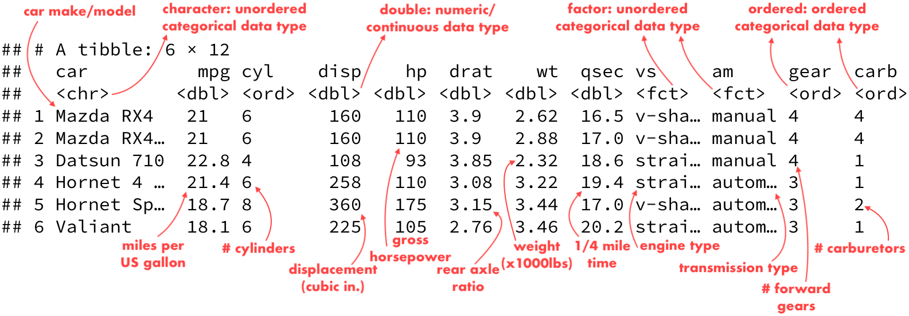
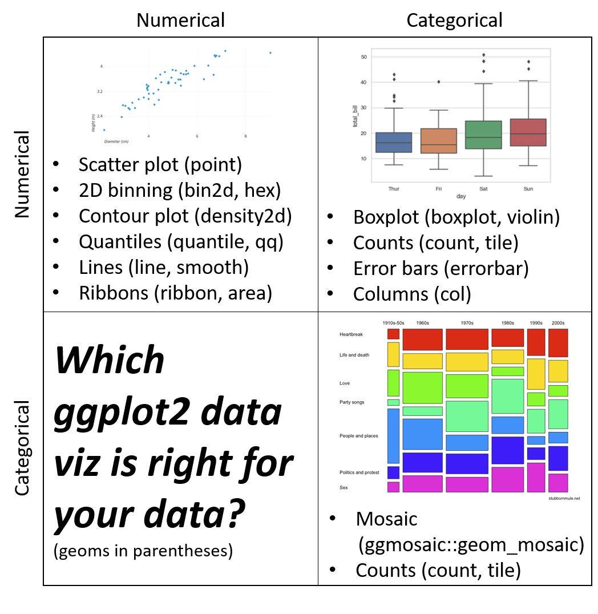
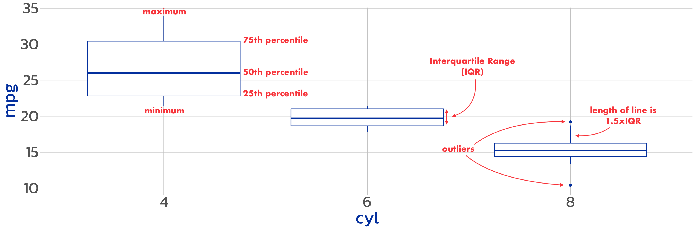
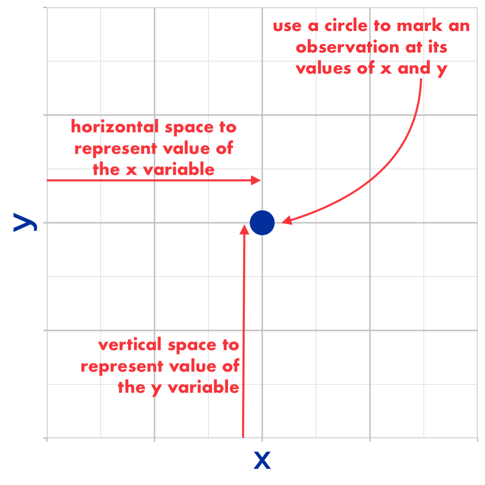
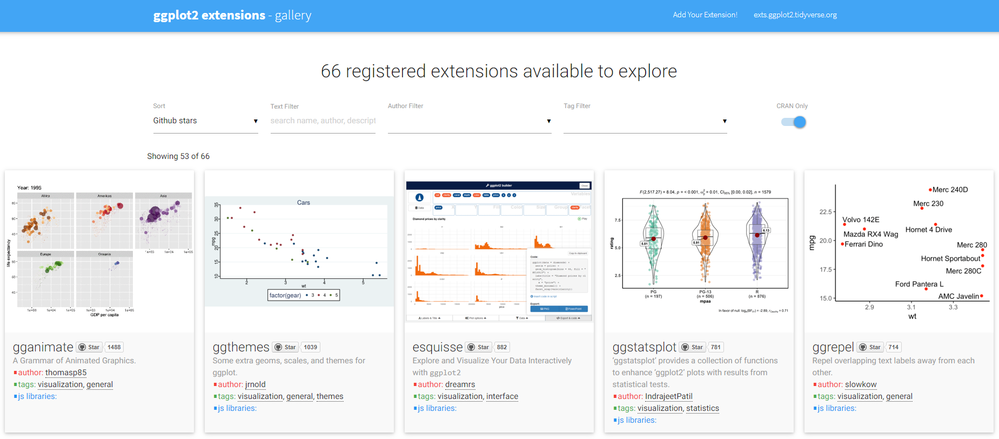

```{r setup, include=FALSE}
options(htmltools.dir.version = FALSE)
knitr::opts_chunk$set(
  fig.width=9, fig.height=3.5, fig.retina=3,
  out.width = "100%",
  fig.align = "center",
  cache = FALSE,
  echo = FALSE,
  message = FALSE, 
  warning = FALSE,
  hiline = TRUE
)
```

```{r xaringan-themer, include=FALSE, warning=FALSE}
library(xaringanthemer)
style_duo_accent(
  primary_color = "#0045AD",
  secondary_color = "#578A2D",
  inverse_header_color = "#FFFFFF",
  link_color = "#BB2C2B",
  text_font_google = google_font("Kanit", "300", "300i"),
  header_font_google = google_font("Kanit", "900", "900i"), 
  code_highlight_color = lighten_color("#BB2C2B", 0.8),
  base_font_size = "24px"
)
```

```{r pkgs}
library(tidyverse)
library(icons)
theme_cols <- c(red = "#BB2C2B", green = "#578A2D", blue = "#0045AD")
```

class: inverse center middle
## *INTRODUCTION TO DATA VISUALIZATION*

---
## *CHOOSE A VISUALIZATION TYPE*

How many variables? 

--
- One variable
- Two variables
- Three variables


What kind of variables? 

--
- Numeric / Continuous: The range of possible values is (theoretically) infinite. Examples: height, weight, age

--
- Categorical / Discrete: There are a finite number of categories to which all observations belong. Examples: country, survey responses on Likert scales, age categories

--
    * ordered: categories have a natural order. Example: income brackets 
    * unordered: categories don't have order. Example: eye color

---
## *DATA EXAMPLE*

`mtcars`: Data from the 1974 Motor Trend US magazine. Fuel consumption and 10 aspects of 32 automobiles (1973–74 models). First 6 cars below.

```{r, out.width="100%"}
source("R/data.R")
# head(mtcars)

```

---
class: inverse center middle
## *VISUALIZING ONE VARIABLE*

---
## *HISTOGRAM*

- For one continuous variable
- Width of bar shows a range of values of the variable
- Height shows the number of observations in that range

```{r hist_plot, out.width="90%", fig.width=15, fig.height=5}
ggplot(data = mtcars, aes(x = qsec)) + 
  geom_histogram(binwidth = 2, color = "gray40",
                 boundary = 13) + 
  scale_x_continuous(breaks = 12:23) +
  scale_y_continuous(breaks = 2*(1:8)) +
  theme_xaringan()
```

---
## *BAR CHART*

- For one categorical variable
- Each bar represents one category
- Height of bars represents number of observations in that category

```{r bar_chart, out.width="90%", fig.width=15, fig.height=5}
ggplot(data = mtcars) + 
  geom_bar(aes(x = carb)) + 
  scale_y_continuous(breaks = 2*(1:5)) + 
  theme_xaringan() 
```

---
class: inverse center middle
## *VISUALIZING TWO VARIABLES*

---
## What kind of variables? 

```{r twovars, out.width="45%"}

```


---
## *TWO NUMERIC VARIABLES: Scatterplot*

- Draw points in 2 dimensions: one per observation
- Values of one variable on X axis, value of the other on Y axis

```{r scatterplot, out.width="90%", fig.width=15, fig.height=6}
ggplot(data = mtcars) + 
  geom_point(aes(x = wt, y = mpg), size = 5) + 
  scale_y_continuous(breaks = seq(10, 40, 5)) + 
  theme_xaringan() +
  labs(subtitle = "") + 
  theme(plot.subtitle = element_text(size = 1))
```

---
## *TWO NUMERIC VARIABLES: Line chart*

- Connect points in space that represent 2 variables
- Values of one variable on X axis, value of the other on Y axis
- Special case: time series chart, where the X axis variable is a time metric

```{r line_chart, out.width="90%", fig.width=15, fig.height=5}
ggplot(data = mtcars) + 
  geom_line(aes(x = disp, y = mpg), color = "#0045AD") + 
  theme_xaringan() +
  labs(subtitle = "") + 
  theme(plot.subtitle = element_text(size = 1))
```

---
## *TWO CATEGORICAL VARIABLES: Counts*

- Draws points at the intersections of categories from each variable
- Size of points represents number of observations in each combination of categories

```{r count_chart, out.width="90%", fig.width=15, fig.height=5}
ggplot(data = mtcars) + 
  geom_count(aes(x = carb, y = cyl)) + 
  theme_xaringan()
```

---
## *ONE OF EACH: Box Plot*

- Draw a summary box plot of a numeric variable for each value of the categorical variable
- Categorical variable can go on either X or Y axis

```{r boxplot, out.width="90%", fig.width=15, fig.height=5, eval = FALSE}
ggplot(data = mtcars) + 
  geom_boxplot(aes(x = cyl, y = mpg), color = "#0045AD") + 
  theme_xaringan() +
  labs(subtitle = "") + 
  theme(plot.subtitle = element_text(size = 1))
```

```{r boxplot2, out.width="90%", fig.width=15, fig.height=5}

```

---
class: inverse center middle
## *VISUALIZING THREE VARIABLES*

---
## *3 VARIABLE STRATEGY*

Start with a 2-variable visualization, then add color, shape, or size:

```{r add_in, out.width = "40%", fig.cap="Example: adding 3rd variable to a scatterplot. Source: Garret Grolemund"}
knitr::include_graphics("img/garrett-aes-vars.PNG")
```


---
## *3 VARIABLE EXAMPLE: Scatterplot*

- Color the points according to the transmission type
- We see that: automatic cars are heavier and have lower MPG than manual cars

```{r scatterplot_3v, out.width="90%", fig.width=15, fig.height=6}
ggplot(data = mtcars) + 
  geom_point(aes(x = wt, y = mpg, color = am), size = 5) + 
  scale_y_continuous(breaks = seq(10, 40, 5)) + 
  theme_xaringan() +
  labs(subtitle = "") + 
  theme(plot.subtitle = element_text(size = 1)) +
  scale_color_manual(values = as.vector(theme_cols[2:3]))
```

---
## *3 VARIABLE EXAMPLE: Box Plot*

- Color by engine type
- 4 cylinder straight engines have the highest MPGs, and 8 cylinder engines are only v-shaped.

```{r boxplot_3v, out.width="90%", fig.width=15, fig.height=5}
ggplot(data = mtcars) + 
  geom_boxplot(aes(x = cyl, y = mpg, color = vs)) + 
  theme_xaringan() +
  labs(subtitle = "") + 
  theme(plot.subtitle = element_text(size = 1)) + 
  scale_color_manual(values = as.vector(theme_cols[2:3]))
```

---
class: inverse center middle
## *INTRODUCTION TO THE<br>GRAMMAR OF GRAPHICS*

---
## *WHAT IS A GRAMMAR?*

> _grammar_ (noun): (1) the study of the classes of words, their inflections, and their functions and relations in the sentence; (2) the principles or rules of an art, science, or technique


--
The grammar of a language is used to construct sentences.


--
The grammar of graphics<sup>1</sup> is used to construct data visualizations.

.footnote[[1] _The Grammar of Graphics_ is the title of a 1999 book by Leland Wilkinson]

--
The `gg` in `ggplot2` stands for "grammar of graphics"

---
## *DATA VIZ "PARTS OF SPEECH"*

.pull-left[

- Data
    * **What** are you visualizing?
- Coordinate system (almost always Cartesian)
    * What is your **canvas** for visualizing? 
- Mapping
    * How are you mapping variables to **visual features** (aesthetics)?
- Geometry (point, line, box plot, etc.)
    * What **shape(s)** are you drawing?
    
]

.pull-right[

```{r onept, out.width = "80%", fig.height=5, fig.width=5, eval = FALSE}
tibble(x = .5, y = .5) %>% 
  ggplot(aes(x = x, y = y)) + 
  geom_point(size = 8) + 
  theme_xaringan() + 
  theme(aspect.ratio = 1, axis.text = element_blank())
```

```{r onept2, out.width = "80%", fig.height=5, fig.width=5, fig.cap="Mapping data to x and y axes"}

```

]

---
class: inverse, center, middle
## *HOW TO BUILD A DATA VISUALIZATION<br>WITH GGPLOT2*

---
## *BUILDING A VIZ*

1. Need the data loaded in your workspace. 

```{r dat_head, echo = TRUE}
head(mtcars)
```

---
## *BUILDING A VIZ*

2\. Need the `ggplot2` package loaded.

```{r library, eval = FALSE, echo = TRUE}
library(ggplot2)
```

---
## *BUILDING A VIZ*

3\. Set up your canvas by passing the data to the `ggplot()` function. 

```{r skeleton, echo = TRUE, out.width = "80%"}
ggplot(data = mtcars)
```

---
## *BUILDING A VIZ*

4\. Set up your mapping inside of `aes()`. 

```{r skeleton2, echo = TRUE, out.width = "80%"}
ggplot(data = mtcars, 
       aes(x = wt, y = mpg)) #<<
```

---
## *BUILDING A VIZ*

5\. Pick your geometry with a function that starts with `geom_*()`

```{r done, echo = TRUE, out.width = "70%"}
ggplot(data = mtcars,
       aes(x = wt, y = mpg)) + 
  geom_point() #<<
```

---
## *BUILDING A VIZ*

5\. Pick your geometry with a function that starts with `geom_*()`

```{r done2, echo = TRUE, out.width = "70%"}
ggplot(data = mtcars,
       aes(x = wt, y = mpg)) + 
  geom_line() #<<
```

---
class: inverse, center, middle
## *BEYOND THE BASICS*

---
class: inverse, center, middle
## *AESTHETICS: aes()*

---
## *USING* `aes()` *FOR MAPPING*

- `x`, `y` and other values passed to `aes()` are called **aesthetics**
--

- Aesthetics can be mapped to data, as in `aes(x = wt , y = mpg)`
--

- Aesthetics can be mapped to a single value for a geometry, outside of `aes()`
--

- The mapping function (`aes()`) can go inside of `ggplot()` *or* inside of a `geom_*()` *or* **both**

---
## *EXAMPLE 1*

.pull-left[
**Inside** `aes()`

```{r inside, echo = TRUE, fig.height=2, fig.width=4, out.width = "90%"}
ggplot(data = mtcars,
       aes(x = wt, y = mpg)) +
  geom_point(aes(color = am)) #<<
```


]

.pull-right[
**Outside** `aes()`

```{r outside, echo = TRUE, fig.height=2, fig.width=4, out.width = "90%"}
ggplot(data = mtcars,
       aes(x = wt, y = mpg)) +
  geom_point(color = "orange") #<<
```

]

---
## *EXAMPLE 2*

.pull-left[
**Inside** `aes()`

```{r inside2, echo = TRUE, fig.height=2, fig.width=4, out.width = "90%"}
ggplot(data = mtcars, aes(x = wt, 
            y = mpg, size = hp)) + #<<
  geom_point()
```


]

.pull-right[
**Outside** `aes()`

```{r outside2, echo = TRUE, fig.height=2, fig.width=4, out.width = "90%"}
ggplot(data = mtcars,
       aes(x = wt, y = mpg)) +
  geom_point(size = 5) #<<
```

]

---
class: inverse, center, middle
## *LABELS: labs()*

---
## *USING* `labs()` *FOR PROPER LABELLING*

The `labs()` function labels plot elements, including:

- `title`: plot title 
- `subtitle`: plot subtitle
- `caption`: plot caption (bottom-right)
- `tag`: tag label (top-left)
- `alt`: alt-text for the plot
- Any aesthetic variable mappings: 
    * `x`: x-axis label
    * `y`: y-axis label
    * `color`: if there's a color mapped, the color legend's title
    * etc.

---
## *HOW TO LABEL A DATA VIZ*

- Axes should be clearly labeled with units where appropriate:

    * "Fuel Consumption in Miles per Gallon" not "mpg" 
    * "Age (in years)" not "age" 
--

- Legends and their values should also be clearly labeled:

    * "Transmission type", "automatic", "manual" not "am", "0", "1"
    * "Country", "Scotland", "England", "Northern Ireland", "Wales" not "ctry", "SCT", "ENG", "NIR", "WLS"
--

- The title should clearly convey the message of the plot
--

- When necessary, provide your data source in the caption.


---
## *EXAMPLE 1*


```{r labs1, echo = TRUE, eval = FALSE}
ggplot(data = mtcars,
       aes(x = wt, y = mpg)) + 
  geom_point() + 
  labs(x = "Weight (in 1,000s of lbs)", #<<
       y = "Fuel consumption (miles per US gallon)", #<<
       title = "As weight increases, fuel efficiency decreases", #<<
       caption = "Data from the datasets R package") #<<
```

---
## *EXAMPLE 1 RESULT*


```{r labs1res, out.width="90%", fig.width=8, fig.height=4}
ggplot(data = mtcars,
       aes(x = wt, y = mpg)) + 
  geom_point() + 
  labs(x = "Weight (in 1,000s of lbs)",
       y = "Fuel consumption (miles per US gallon)", 
       title = "As weight increases, fuel efficiency decreases",
       caption = "Data from the datasets R package")
```

---
## *EXAMPLE 2* 

```{r labs2, eval = FALSE, echo=TRUE}
ggplot(data = mtcars,
       aes(x = wt, y = mpg)) +
  geom_point(aes(size = hp), shape = 21) + 
  labs(x = "Weight (in 1,000s of lbs)", #<<
       y = "Fuel consumption (miles per US gallon)", #<<
       size = "Horsepower", #<<
       title = "As weight increases, fuel efficiency decreases", #<<
       subtitle = "Heavier, lower efficiency cars also have higher horsepower", #<<
       caption = "Data from the datasets R package") #<<
```

---
## *EXAMPLE 2 RESULT* 

```{r labs2res, out.width="90%", fig.width=8, fig.height=4}
ggplot(data = mtcars,
       aes(x = wt, y = mpg)) +
  geom_point(aes(size = hp), shape = 21) + 
  labs(x = "Weight (in 1,000s of lbs)",
       y = "Fuel consumption (miles per US gallon)", 
       size = "Horsepower", 
       title = "As weight increases, fuel efficiency decreases",
       subtitle = "Heavier, lower efficiency cars also have higher horsepower",
       caption = "Data from the datasets R package")
```

---
class: inverse, center, middle
## *APPEARANCE: scale_() FUNCTIONS*

---
## *USING scale_() FUNCTIONS FOR STYLING*

The `scale_()` family of functions is used to modify how the aesthetics are drawn: 

- Change how axes are labeled
- Change color scheme
- Change axis limits 
- Transform axis (e.g. log-transform)
- Change the number of breaks / labels

---
## *USING scale_() FUNCTIONS FOR STYLING*

The `scale_()` family of functions is used to modify how the aesthetics are drawn: 

- `scale_x_*()` functions modify the x-axis
- `scale_y_*()` functions modify the y-axis
- `scale_color_*()` functions modify the color `aes()` mapping 
- `scale_fill_*()` functions modify the fill `aes()` mapping
- `scale_shape_*()` functions modify the shape `aes()` mapping
- etc.

---
## *EXAMPLE 1*

Using a `scale_*()` function to change the axes: 

```{r scale1, eval = FALSE, echo=TRUE}
ggplot(data = mtcars,
       aes(x = wt, y = mpg)) + 
  geom_point() + 
  labs(y = "Fuel consumption (miles per US gallon)", 
       title = "As weight increases, fuel efficiency decreases",
       caption = "Data from the datasets R package") + 
  scale_x_continuous(name = "Weight (in 1,000s of lbs)", #<<
                     breaks = seq(1.5, 5.5, .5)) #<<
```

---
## *EXAMPLE 1 RESULT*

```{r scale1res}
ggplot(data = mtcars,
       aes(x = wt, y = mpg)) + 
  geom_point() + 
  labs(y = "Fuel consumption (miles per US gallon)", 
       title = "As weight increases, fuel efficiency decreases",
       caption = "Data from the datasets R package") + 
  scale_x_continuous(name = "Weight (in 1,000s of lbs)", 
                     breaks = seq(1.5, 5.5, .5))
```

---
## *EXAMPLE 2*

Using a `scale_()` function to change color scheme

```{r scale2, echo =TRUE, eval = FALSE}
ggplot(data = mtcars,
       aes(x = wt, y = mpg)) +
  geom_point(aes(color = am)) +
  scale_color_brewer(palette = "Set1") #<<
```

The website [colorbrewer2.org](https://colorbrewer2.org/) has a lot of colors & color palettes to choose from

---
## *EXAMPLE 2 RESULT*

```{r scale2res}
ggplot(data = mtcars,
       aes(x = wt, y = mpg)) +
  geom_point(aes(color = am), size = 3) +
  scale_color_brewer(palette = "Set1")
```


---
class: inverse, center, middle
## *APPEARANCE: theme()*

---
## *USING* `theme` *FUNCTIONS FOR STYLING* 

`ggplot2` has several built-in theme functions. The default is `theme_grey()`: 

```{r, fig.align='default', out.width="21%", fig.cap='Source: <a href="https://ggplot2-book.org/polishing.html#themes">ggplot2 book</a>', fig.show = 'hold'}
geoms <- list.files(path = "img", pattern = "built-in",full.names = T)
knitr::include_graphics(geoms)
```

---
## *USING* `theme` *FUNCTIONS FOR STYLING* 

The `theme()` function gives you control over every single non-data visual element of the plot: 

- fonts used for labels 
- background color
- axis text positioning, size, etc. 
- legend appearance, position, etc.

--

At time of writing, `theme()` takes 92 arguments! You'll never use them all. I typically use only 2-3, and rarely use more than 10.

---
## `theme()` *ELEMENTS*

There are 4 functions used to modify the theme: 

- `element_rect()`: Change appearance of a rectangle element
- `element_line()`: Change appearance of a line element
- `element_text()`: Change appearance of a text element
- `element_blank()`: Do not draw an element


--
The documentation of the `theme()` function tells you when to use each function


---
## *EXAMPLE 1*

Using a `theme_*()` function: 

```{r theme1, eval = FALSE, echo=TRUE}
ggplot(data = mtcars,
       aes(x = wt, y = mpg)) + 
  geom_point() + 
  labs(x = "Weight (in 1,000s of lbs)",
       y = "Fuel consumption (miles per US gallon)", 
       title = "As weight increases, fuel efficiency decreases",
       caption = "Data from the datasets R package") + 
  theme_classic() #<<
```

---
## *EXAMPLE 1 RESULT*

```{r theme1res, out.width="90%", fig.width=8, fig.height=4}
ggplot(data = mtcars,
       aes(x = wt, y = mpg)) + 
  geom_point() + 
  labs(x = "Weight (in 1,000s of lbs)",
       y = "Fuel consumption (miles per US gallon)", 
       title = "As weight increases, fuel efficiency decreases",
       caption = "Data from the datasets R package") + 
  theme_classic()
```

---
## *EXAMPLE 2*

Using the `theme()` function: 

```{r theme2, eval = FALSE, echo = TRUE}
ggplot(data = mtcars,
       aes(x = wt, y = mpg)) +
  geom_point(aes(size = hp), shape = 21) + 
  labs(x = "Weight (in 1,000s of lbs)",
       y = "Fuel consumption (miles per US gallon)", 
       size = "Horsepower", 
       title = "As weight increases, fuel efficiency decreases",
       subtitle = "Heavier, lower efficiency cars also have higher horsepower",
       caption = "Data from the datasets R package") + 
  theme(axis.title.y = element_text(angle = 0), #<<
        plot.title.position = "plot", #<<
        panel.grid = element_line(color = "red"), #<<
        panel.background = element_rect(fill = "white"), #<<
        panel.grid.minor = element_blank()) #<<
```

---
## *EXAMPLE 2 RESULT*

Using the `theme()` function: 

```{r theme2res, out.width="90%", fig.width=9, fig.height=4 }
ggplot(data = mtcars,
       aes(x = wt, y = mpg)) +
  geom_point(aes(size = hp), shape = 21) + 
  labs(x = "Weight (in 1,000s of lbs)",
       y = "Fuel consumption (miles per US gallon)", 
       size = "Horsepower", 
       title = "As weight increases, fuel efficiency decreases",
       subtitle = "Heavier, lower efficiency cars also have higher horsepower",
       caption = "Data from the datasets R package") + 
  theme(axis.title.y = element_text(angle = 0),
        plot.title.position = "plot",
        panel.grid = element_line(color = "red"),
        panel.background = element_rect(fill = "white"), 
        panel.grid.minor = element_blank()) 
```

---
class: inverse, center, middle
## *ggplot2 EXTRAS*

---
## *ggplot2 EXTENSIONS*

Maintainers of packages can put their `ggplot2` extension on [exts.ggplot2.tidyverse.org/gallery](http://exts.ggplot2.tidyverse.org/gallery/)

```{r ggexts, out.width="80%"}

```

---
## *EXAMPLES OF EXTENSIONS*
.pull-left[
**Domain specific**:
- Networks: 
    * [geomnet](https://github.com/sctyner/geomnet)
    * [ggraph](https://github.com/thomasp85/ggraph)
- Time Series: 
    * [ggaluvial](http://corybrunson.github.io/ggalluvial/)
    * [sugrrants](https://pkg.earo.me/sugrrants/)
- Sciences: 
    * [gggenes](https://wilkox.org/gggenes/)
    * [ggtree](https://guangchuangyu.github.io/software/ggtree/)
    * [ggseqlogo](https://github.com/omarwagih/ggseqlogo)
    * [ggspectra](https://docs.r4photobiology.info/ggspectra/)
]

.pull-right[
**Appearance customization**: 

- Arrange ggplots: 
    * [cowplot](https://wilkelab.org/cowplot/)
    * [patchwork](https://patchwork.data-imaginist.com/) 
    * [gganimate](https://gganimate.com/)
- Custome themes and/or scales: 
    * [ggthemes](https://jrnold.github.io/ggthemes/)
    * [ggsci](https://nanx.me/ggsci/)
    * [ggtech](https://github.com/ricardo-bion/ggtech)
    * [ggthemr](https://github.com/cttobin/ggthemr)
    * [xkcd](https://cran.r-project.org/web/packages/xkcd/index.html)
    * [ggpubr](https://github.com/kassambara/ggpubr/issues)
]


---
## *ADDITIONAL RESOURCES*

- [ggplot2 book](https://ggplot2-book.org/): 3rd edition freely available online! This book provides much more detail and covers advanced topics I didn't cover here, such as `stat`s. 
- [R for Data Science book](https://r4ds.had.co.nz/): Freely available online. Check out Chapter 3 on Data Visualization
- [Tidy Tuesday](https://github.com/rfordatascience/tidytuesday): Tidy Tuesday is an online learning community. There are many participants worldwide! Use #TidyTuesday on Twitter to find graphics inspiration.
- [My advice for getting help in R](https://sctyner.me/post/2019-2-17-rhelp/): my top 10 tips for getting help in R when you get stuck.
- Thomas Lin Pedersen's ggplot2 webinar: [part 1](https://youtu.be/h29g21z0a68) and [part 2](https://youtu.be/0m4yywqNPVY): 
- [RStudio Cheat Sheets](https://github.com/rstudio/cheatsheets)
- [Will Chase's Design Talk](https://rstudio.com/resources/rstudioconf-2020/the-glamour-of-graphics/) at rstudio::conf
- A [4-hour advanced version](https://rstudio.cloud/project/1116791) of this tutorial is available on RStudio Cloud.
- A [2-hour version](https://sctyner.github.io/talks/Conferences/user2020/#1) of this tutorial is available on my website. 

---
## *THANKS!*

.left-column[

**Contact me:**

`r icon_style(fontawesome("globe"), fill = "#0045AD")` sctyner.me

`r icon_style(fontawesome("twitter"), fill = "#0045AD")` @sctyner

`r icon_style(fontawesome("github"), fill = "#0045AD")` sctyner

`r icon_style(fontawesome("linkedin"), fill = "#0045AD")` /in/sctyner

]

.right-column[
```{r, out.width = "65%"}
knitr::include_graphics("https://media.giphy.com/media/LTE92qOkXUEGZ1J3qW/giphy.gif")
```
]

.footnote[Slides created via the R packages: [`xaringan`](https://github.com/yihui/xaringan) and 
[`xaringanthemer`](https://github.com/gadenbuie/xaringanthemer)
]