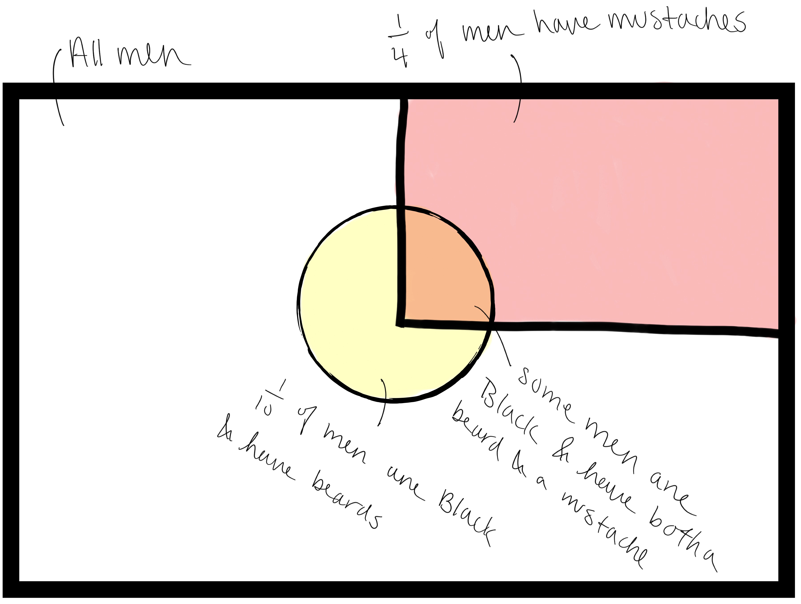
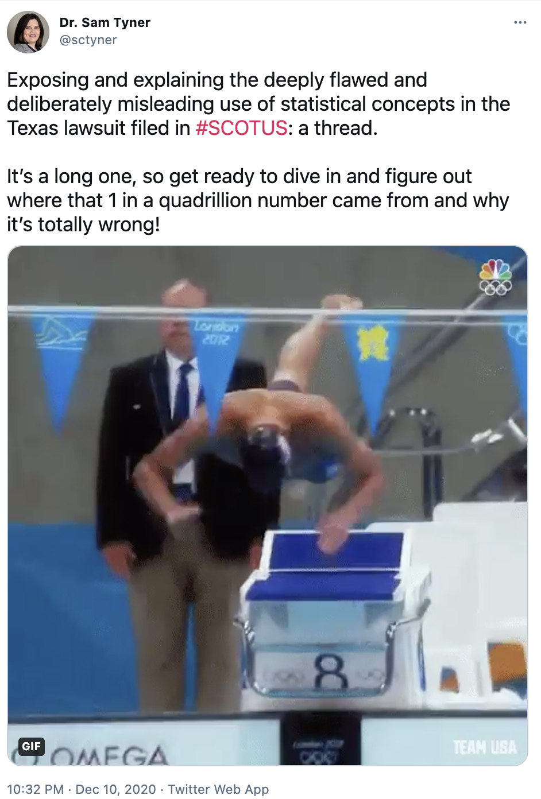

```{r setup, include=FALSE}
options(htmltools.dir.version = FALSE)
knitr::opts_chunk$set(echo = FALSE, out.width = "80%", message = FALSE, warning = FALSE, fig.align = 'center',cache = TRUE)
```


```{r xaringan-themer, include=FALSE, warning=FALSE}
library(xaringanthemer)
style_mono_accent(
  base_color = "#AC037E",
  header_font_google = google_font("Roboto"),
  text_font_google   = google_font("Montserrat", "300", "300i"),
  code_font_google   = google_font("Fira Mono")
)
```

# Case Study 

- Facts in the case 
- Prosecutor's obvious bias 
- Incorrect statistical calculations
- Prosecutor's fallacy
- Where to go for more 

---
# Facts 

- 1964, in California 
--

- An elderly woman, Juanita Brooks, was walking in an alley when she was  attacked from behind and robbed. 
--

- She saw a young blond woman running away.
--

- Witnesses said they saw a blond woman with a ponytail get into a yellow car driven by a Black man with a mustache and beard.
--

- Police arrested Malcolm and Janet Collins. an interracial couple with a yellow Lincoln
--

- Brooks could not identify Malcolm or Janet.
--

- The prosecutor brought in a math professor to talk about how "rare" it was to find a couple like the Collinses with a yellow car in the area. 
--

- The prosecutor argued that the Collinses had to have committed the robbery, because they were, according to the numbers, the only possible couple that existed in the area fitting the witnesses description. 
--

- The jury convicted the Collinses of second degree robbery. 
--

- Malcolm Collins received a sentence of 1 year to life and Janet received a sentence of 1 year.
--

- Malcolm appealed the decision to the California Supreme Court and the conviction was set aside. 

---
# Clear bias  

According to one third-party account of the case, the prosecutor believed that "the Collinses had to be the thieves for the simple reason that the number of couples fitting their description was so small that […] they were virtually certain to be the only such couple in the neighborhood” (Schneps and Colmez, 2013, p. 31). 


It was clear that the only reason Mr. & Mrs. Collins were arrested because they were an interracial couple that had a yellow car. 


---
# Creating a tiny number

The prosecution’s witness (math professor) testified to the population frequency of the identifying characteristics tying the Collinses to the crime.

- Black man with a beard: 1/10
- Man with a moustache: 1/4
- White woman with blonde hair: 1/3
- Woman with a ponytail: 1/10
- Interracial couple in a car:  1/1000
- Yellow car: 1/10

He was asked to determine the probability of all of those items appearing in one couple, so he multiplied
all of them together, thus treating all these events as independent:

$$\frac{1}{10\cdot 4 \cdot 3 \cdot 10\cdot 1000 \cdot10} = 12 \times 10^{-6}$$
resulting in the probability 1 in 12 million. 

The prosecutor argued that this probability was so small that the the Collinses had to have committed the robbery, because they were, according to the numbers, the only possible couple that existed in the area fitting the witnesses description.

---
# Misuse of statistics 

- Independence: In order to multiply probabilities together, the events have to be independent. 
- The events proposed by the expert witness cannot all be independent of each other. For example: 

```{r, out.width ="55%"}

```


---
# Prosecutor's fallacy 

Suppose there is some evidence E, that is known to be associated with the perpetrator of a crime and the defendant. 

- For instance, E is a DNA sample left at the crime scene which matches the defendant. 

--

An expert testifies to the fact that the probability of finding the evidence given that the defendant is not guilty is very small. 

- If the DNA matches the defendant, then the probability $Pr(E|NG)$ is very small.

--

The prosecutor’s fallacy is made when someone assumes that $Pr(E|NG)$ is equivalent to the probability that the defendant is not guilty. 

- $Pr(E|NG)$ is the probability that the DNA matches the defendant given the assumption that the defendant is not guilty. 
- This is not equal to the probability that the defendant is not guilty given the DNA match $(Pr(NG | E))$. 
- Assuming the above 2 are equal is the fallacy. $Pr(NG | E) \neq Pr(E|NG)$  

---
# Bayes' Rule 

$$Pr(NG | E) = Pr(E|NG) \times \dfrac{Pr(NG)}{Pr(E)}$$

- $Pr(NG)$: the baseline probability that the defendant is innocent, independent of all evidence. 
- $Pr(E)$: the prior probability that the evidence would be observed

If $Pr(E)$ is sufficiently small and $Pr(NG)$ is sufficiently large, then $Pr(NG|E)$ is not necessarily small, even if $Pr(E|NG)$ is very small. 

---
# More reading 

.pull-left[
My [twitter thread](https://twitter.com/sctyner/status/1337238913212166144?s=20) on the abuse of statistics in 2020 election fraud claims. 

[*Math on Trial: How Numbers Get Used and Abused in the Courtroom*](https://bookshop.org/books/math-on-trial-how-numbers-get-used-and-abused-in-the-courtroom/9780465032921)
by Leila Schneps and Coralie Colmez 

["The Supreme Court is Allergic to Math"](https://fivethirtyeight.com/features/the-supreme-court-is-allergic-to-math/) by Oliver Roeder
]

.pull-right[
```{r out.width="70%"}

```
]
