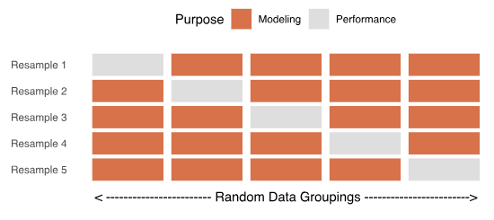
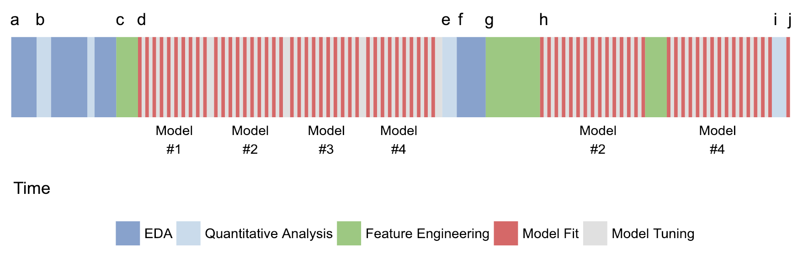
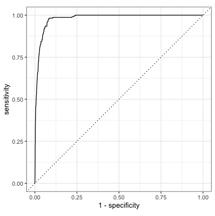

```{r setup, include=FALSE}
options(htmltools.dir.version = FALSE,echo = TRUE, warn = -1)
```

class: inverse
# Part 1: All about tidy tools

---
class: primary
# `tidymodels`?

The manifestation of the tidyverse applied to modeling (as opposed to data). 

```{r, fig.show='hold', out.width="50%", echo = FALSE}
knitr::include_graphics("https://avatars1.githubusercontent.com/u/22032646?s=200&v=4")
knitr::include_graphics("https://avatars2.githubusercontent.com/u/29100987?s=200&v=4")
```

---
class: primary
# Tidy Tools Principles 

From the [Tidy Tools Manifesto](https://cran.r-project.org/web/packages/tidyverse/vignettes/manifesto.html)

1. Reuse existing data structures.
2. Compose simple functions with the pipe. (`%>%`)
3. Embrace functional programming.
4. Design for humans.

---
class: primary
# Reuse existing data structures 

Use things of class `data.frame`, `list`, `tibble` in favor of creating a separate data structure / class. 

`tibble` : the `tidyverse` [response](https://cran.r-project.org/web/packages/tibble/vignettes/tibble.html) to the `data.frame` class: 

- It never changes an input’s type (no more `stringsAsFactors = FALSE`!)
- It never adjusts the names of variables (e.g. inserting periods for spaces)
- It evaluates its arguments lazily and sequentially, so you can use earlier variables when creating new variables.
- It never uses `row.names()`. (i.e. don't encode information in someplace that's not in the data table)
- It only recycles vectors of length 1. (This is because recycling vectors of greater lengths is a frequent source of bugs.)

---
class: primary
# Compose simple functions with `%>%` 

Strings functions together in a human readable way. `r emo::ji("eyes")`

Tidy Tips for writing functions: 

- Strive to keep functions as simple as possible (but no simpler!). Generally, each function should do one thing well.
- Avoid mixing side-effects with transformations. Ensure each function either returns an object, or has a side-effect. Don’t do both.
- Function names should be verbs. The exception is when many functions use the same verb. In that case, focus on the noun. A good example of this is `ggplot2`: almost every function adds something to an existing plot.

Note: Using `%>%` is NOT compulsory in the `tidy` collections of packages.  


---
class:primary
# Functional programming

R is a functional programming language. Embrace it, don't fight it! 

Python, C#, others are object-oriented programming languages. [(See more)](https://adv-r.hadley.nz/oo.html)

Most important reason for using FP: 

- Use tools that abstract over for-loops, like the `apply` family of functions or the `map` functions in `purrr`.

---
class: primary
# Design for `r emo::ji("developer")` `r emo::ji("developer")` `r emo::ji("developer")`

Computing time << Thinking time 

- Evocative function names that are easy to remember how to use (e.g. `filter`, `select`, etc.)
- Favour explicit, lengthy names, over short, implicit, names. The shortest names are the most important operations. (e.g `db_list_tables`) 
- Function families are identified by a common prefix, not a common suffix. This makes autocomplete more helpful, as you can jog your memory with the prompts. (e.g. `str_sub`, `str_replace`, `str_remove` in `stringr`)

---
class: primary
# `tidymodels` `r emo::ji("package")` `r emo::ji("package")` `r emo::ji("package")`

All stored in a [Github organization](https://github.com/tidymodels)

```{r, fig.show='hold', out.width="25%", echo = FALSE}
knitr::include_graphics("https://raw.githubusercontent.com/tidymodels/yardstick/master/man/figures/logo.png")
knitr::include_graphics("https://raw.githubusercontent.com/topepo/rstudio-conf-2019/master/Materials/images/parsnip.png")
knitr::include_graphics("https://raw.githubusercontent.com/topepo/rstudio-conf-2019/master/Materials/images/broom.png")
knitr::include_graphics("https://raw.githubusercontent.com/topepo/rstudio-conf-2019/master/Materials/images/recipes.png")
knitr::include_graphics("https://raw.githubusercontent.com/tidymodels/rsample/master/rsample_hex_thumb.png")
knitr::include_graphics("https://raw.githubusercontent.com/tidymodels/tidyposterior/master/tidyposterior_hex.png")
```

Others: `dials`, `infer`, `probably`, `textrecipes`, `embed`

---
class: inverse
# Part 2: The `tidymodels` "Workflow" 

---
class: primary
# "Workflow"?

```{r, echo = FALSE, out.width="75%", fig.align='center'}

```

---
class: primary
# Where to begin?

At the beginning! 

- Read your data into R
- Split it up to training and testing 
- Everything we do for now will be with the training data *only*
- Don't touch the testing data until the very end 

**Remember:** Set a seed (`set.seed()`) before each piece of the process that involves randomness. 

---
class: primary
# `r emo::ji("package")`: `rsample`

From the [website](https://tidymodels.github.io/rsample/): 

- "The scope of `rsample` is to provide the basic building blocks for creating and analyzing resamples of a data set but does not include code for modeling or calculating statistics."
- Anything to do with sampling the data: 
    + splitting into training/testing
    + sets for cross-validation 
    + other bootstrapping needs 
- Don't forget to set the seed! 

---
class: primary
# Glass data 

```{r getdat, message=FALSE}
library(tidyverse)
library(tidymodels)

# get data 
glass_data <- read_rds("dat/glass_data.rds")
```


---
class: secondary
```{r tabdat, echo = FALSE, tidy=FALSE}
head(glass_data, 5) %>% select(c(1:6,19)) %>% knitr::kable(format = "html", digits = 3, row.names = T)
```

```{r tabdat2, echo = FALSE, tidy=FALSE}
glass_data %>% count(match) %>% knitr::kable(format = "html")
```

---
class: primary
# Split data 

Use 75% for training 25% for testing. Change this with `prop`.

Make sure we get the same proportion of each class in the data with `strata`

```{r train}
set.seed(654321)
glass_data_split <- initial_split(data = glass_data, prop = 0.75, strata = "match")
glass_data_train <- training(glass_data_split)
glass_data_test <- testing(glass_data_split)

dim(glass_data) ; dim(glass_data_train) ; dim(glass_data_test)
```


---
class: primary
# Set up CV

Cross-validation (CV) : 

- resample the training data 
- create some (5 or 10) bootstrap samples of the training set 
- split up the bss into "analysis" and "assessment" sets 
- fit the model(s) of interest to each analysis set
- compare model performance based on the assessment sets

```{r, out.width="85%", echo = FALSE, fig.align='center'}

```

---
class: primary
# Why CV? 

```{r out.width="90%", echo = FALSE, fig.align='center'}

```

- want to find the best model for **all** data, not just your data 

---
class: primary
# Split data for CV

```{r cvsetup}
set.seed(2453)
cv_glass_data <- vfold_cv(
  data = glass_data_train,
  v = 5,
  strata = "match"
)
cv_glass_data ; cv_glass_data$splits[[1]]
```

---
class: primary 
# Model(s) of interest

Depending on your data, you will probably have several models you are interested in evaluating.

- Regression (continuous response): 
    + Linear model
    + Regression trees
    + K nearest neighhbors
    + etc. 
- Classification (discrete response):
    + Logsitic regression
    + Classification trees
    + Multinomial regression 
    + etc. 

---
class: primary
# `r emo::ji("package")`: `parsnip`

From the [website](https://tidymodels.github.io/parsnip/): 

The idea of parsnip is to:
- Separate the definition of a model from its evaluation.
- Decouple the model specification from the implementation (whether the implementation is in R, spark, or something else). For example, the user would call rand_forest instead of ranger::ranger or other specific packages.
- Harmonize the argument names (e.g. n.trees, ntrees, trees) so that users can remember a single name. This will help across model types too so that trees will be the same argument across random forest as well as boosting or bagging.

---
class: primary
# How? 

Unified tidy interface to many [types of models](https://tidymodels.github.io/parsnip/articles/articles/Models.html)

Example: random forest (mode is regression or classification)

```r
rand_forest(mode, mtry = NULL, trees = NULL,
  min_n = NULL)
```

A random forest model can be fit with `randomForest`, `ranger`, or `spark` by specifying the `engine`: 

```r
rand_forest(mode, mtry = NULL, trees = NULL,
  min_n = NULL) %>% 
  set_engine(engine)
```

---
class: primary 
# RF for glass data 

```{r setrfspec}
# parameter specification
Mtry <- floor(sqrt(18)) # could also choose to tune according to this or another RF parameter 
mod <- rand_forest(mode = "classification", mtry = Mtry) # other params set to defaults
# what engine to use to fit the model
spec_rf <- mod %>% 
  set_engine("randomForest")
spec_rf ; class(spec_rf)
```

Note: we don't need the data for this! 

---
class: primary 
# `r emo::ji("package")`: `parsnip`

The fitting of *every possible model* in the `parnsip` package is done with 1 function: 

```r
fit(object, # has class model_spec
    formula = NULL, # eg y ~ x
    data = NULL, # training data
    control = fit_control()) # control verbosity & error handling
```

--

```{r, echo = FALSE, out.width=c("50%", "30%")}
knitr::include_graphics("https://media.giphy.com/media/1nQ6af11oUa5Sb5oYg/giphy.gif") 
knitr::include_graphics("https://raw.githubusercontent.com/topepo/rstudio-conf-2019/master/Materials/images/parsnip.png")
```

---
class: primary
# Fit RF to glass data 

```r
rf_formula <- match ~ . 

fit(
    object = sprec_rf, 
    formula =rf_formula, 
    data = ??? # what data are you fitting it to? 
  )
```

--

Could use `data = glass_data_train`. But, we want to pick the best RF via cross-validation. So, use the CV splits. But: 

--

```{r cv1, echo=FALSE}
rf_formula <- match ~ . 
cv_glass_data$splits[[1]] %>% analysis() %>% count(match) %>% knitr::kable(format = "html")
```

---
class: primary 
# Prepare data for fitting 

Often, data need some massaging before we can fit a model

- centering & scaling for e.g. SVMs, NNs
- transformation of variables (e.g. log or Box-Cox transformations)
- impute missing values
- develop new features from data variables
- dummy variables (e.g. CoNNOR uses one-hot encoding)

---
class: primary
# `r emo::ji("package")`: `RECIPES`

From the [website](https://tidymodels.github.io/recipes/): 


"The idea of the recipes package is to define a recipe or blueprint that can be used to sequentially define the encodings and preprocessing of the data (i.e. "feature engineering")."

```{r recipeex}
data("Sonar",package = "mlbench")
sonar_rec <- recipe(Class ~ ., data = Sonar) %>%
  step_center(all_predictors()) %>%
  step_scale(all_predictors())
```

---
class:secondary

```{r recipeex2}
sonar_rec ; class(sonar_rec)
```

---
class: primary
# Why? 

Preparing your data for fitting with `recipes`

- Keeps track of what you do, both in the code and in the "recipe" object 
- Stores information from the training data (e.g. for centering, scaling) to use on the testing data
- Saves you time and energy by automating and documenting the data manipulation necessary for each model you fit

```r
recipe() %>% prep() %>% bake()/juice()

(define) --> (estimate) --> (apply)
```

---
class: secondary 

- `recipe(data, formula)` : The outline of what data manipulation to do. 
- `step_*()`: additional steps to add to the recipe
- `prep()` : do the `"recipe"` on the training data
- `bake()` : do the `"recipe"` on the testing data using info from the training data 

---
class: primary
# Recipe for glass data 

What do we need to do to the glass data? 

1. Convert the response from numeric to factor.
2. Downsample the non-matches. 

```{r recipeglass}
rf_recipe <- recipe(rf_formula, data = glass_data_train) %>% 
  step_bin2factor(match) %>% # convert class to a factor for randomForest
  step_downsample(match) # downsample the data due to the large number of 0s in the data. 
```


---
class: secondary 

```{r recipeglass2}
rf_recipe
```

---
class: primary
# Can we fit the model yet? 

Almost! First, we have to `prep` the cross-validation sets. 

Downsample inside of resampling: don't just toss a bunch of training data! Only downsample after the data has been split up for CV. 

```{r downsamplecv}
# do the downsampling ~~inside of resampling~~ 
cv_glass_data <-  cv_glass_data %>%
  mutate(recipes = map(splits, prepper, 
                       recipe = rf_recipe, retain = TRUE))
```

`retain = TRUE` keeps processed version of the training data around so we don't have to recompute it. 

---
class: secondary

```{r downsamplecv2}
cv_glass_data
cv_glass_data$splits[[1]]
```


---
class: primary
# Aside: the `purrr` `r emo::ji("package")`

Snuck the [`purrr`]() package into `mutate`

- `map_*()`: suite of functions to apply functions to elements of a list and return an object (list or vector) the same length as the list

```{r eval=FALSE, tidy = FALSE}
map(
{{ splits }}, 
  prepper, 
  recipe = rf_recipe, retain = TRUE
)
```

List of data to use: `splits` column in `cv_glass_data`

---
class: primary
# Aside: the `purrr` `r emo::ji("package")`

Snuck the [`purrr`]() package into `mutate`

- `map_*()`: suite of functions to apply functions to elements of a list and return an object (list or vector) the same length as the list

```{r eval=FALSE, tidy = FALSE}
map(
  splits, 
{{ prepper }}, 
  recipe = rf_recipe, retain = TRUE
)
```

Function to use: `prepper()`, a wrapper around `prep()` for iterating over lists

---
class: primary
# Aside: the `purrr` `r emo::ji("package")`

Snuck the [`purrr`]() package into `mutate`

- `map_*()`: suite of functions to apply functions to elements of a list and return an object (list or vector) the same length as the list

```{r eval=FALSE, tidy = FALSE}
map(
  splits, 
  prepper, 
{{ recipe = rf_recipe, retain = TRUE }}
)
```

Arguments to pass to the function: `prepper` requires the recipe, and we want to retain the training data for easy access

---
class: primary
# Fitting the model! 

```{r modelfun, cache=TRUE}
fit_rf_to_splits <- function(split, rec = NULL, mspec, form) {
  if (!is.null(rec)) # if rec is specified (rec = recipe)
    mod_data <- juice(rec) # return the processed version of the training data 
  else
    mod_data <- analysis(split) # if no recipe, use raw cv analysis data 
  
  mod_fit <- fit(
    object = mspec, # which model are you fitting 
    formula = form, # what is its form?
    data = mod_data # what data are you fitting it to? 
  )
  return(mod_fit)
}

cv_glass_data_fits <- cv_glass_data %>% 
  mutate(model = map2(splits, recipes, fit_rf_to_splits, mspec = spec_rf, form = rf_formula))
```

---
class: secondary

```r
cv_glass_data_fits
## #  5-fold cross-validation using stratification 
## # A tibble: 5 x 4
##   splits                id    recipes      model   
## * <list>                <chr> <list>       <list>  
## 1 <split [41.5K/10.4K]> Fold1 <S3: recipe> <fit[+]>
## 2 <split [41.5K/10.4K]> Fold2 <S3: recipe> <fit[+]>
## 3 <split [41.5K/10.4K]> Fold3 <S3: recipe> <fit[+]>
## 4 <split [41.5K/10.4K]> Fold4 <S3: recipe> <fit[+]>
## 5 <split [41.5K/10.4K]> Fold5 <S3: recipe> <fit[+]>
```

---
class: secondary

```r
print(cv_glass_data_fits$model$`1`)
## parsnip model object
## 
## 
## Call:
##  randomForest(x = as.data.frame(x), y = y, mtry = ~Mtry) 
##                Type of random forest: classification
##                      Number of trees: 500
## No. of variables tried at each split: 4
## 
##         OOB estimate of  error rate: 6.47%
## Confusion matrix:
##     yes  no class.error
## yes 837  21  0.02447552
## no   90 768  0.10489510
```

---
class: primary
# Comparing model performance

For binary classification: 

- **confusion matrix**: cross-tabulation between observed & predicted classes 
- **sensitivity** aka true positive rate: out of the actual positives, what proportion did the model classify as positives?
- **specificty** aka true negative rate: out of the actual negatives, what proportion did the model classify as negatives?
- **False negative rate** aka Type I error: 1 - specificity (classified true positives as negatives)
- **False positive rate** aka Type II error: 1 - sensitivity (classified true negatives as positive)
- **ROC AUC**: area under the receiver operating characteristic curve. Closer to 1 is better. 0.5 is random chance 


---
class: primary
# ROC Curve Ex. 

```{r rocex, echo = FALSE, out.width="60%", fig.align="center"}

```

---
class: primary
# But first, predict! 

`parsnip` has a nice tidy interface for predicting: 

```r
predict(object, # has class model_fit 
        new_data, # assessment/test data 
        type) # e.g. "prob" for class probability or "class" for class prediction
```

Just like with `fit()`, this is the same for any model available in `parsnip`

--

```{r echo=FALSE, out.width="50%", fig.align='center'}
knitr::include_graphics("https://media.giphy.com/media/31lPv5L3aIvTi/giphy.gif")
```


---
class: primary
# Predict for all CV splits

```{r predfun, eval=FALSE}
compute_pred <- function(split, model, rec) {
  # Extract the assessment set
  assess <- bake(rec, new_data = assessment(split)) 
  # Compute predictions (a df is returned)
  predprob <- predict(model, new_data = assess, type = "prob") 
  predclas <- predict(model, new_data = assess) 
  bind_cols(assess, predprob, predclas)
}  
cv_glass_data_fits <- cv_glass_data_fits %>% 
  mutate(predictions = pmap(.l = list(splits, model, recipes), .f = compute_pred))

```

```{r, echo = FALSE}
cv_glass_data_fits <- read_rds("dat/glass_data_fits.rds")
```

---
class: secondary

First 5 rows and last 6 columns of `cv_glass_data_fits$predictions[[1]]`: 

```{r echo=FALSE}
cv_glass_data_fits$predictions[[1]] %>% select(Nd:.pred_class) %>% head() %>% knitr::kable(format = "html", digits = 3)
```

---
class: primary
# `r emo::ji("package")`: `yardstick`

From the [website](https://tidymodels.github.io/yardstick): "yardstick is a package to estimate how well models are working using tidy data principles." 

- `conf_mat(truth, estimate)`: confusion matrix
- `roc_auc(truth, estimate)`: computes area under the ROC curve
- `spec(truth, estimate)`: computes specificity
- `sens(truth, estimate)`: computes sensitivity
- `roc_data(truth, estimate)`: returns a dataframe of values for plotting ROC curves
- `autoplot()`: plot ROC curve. requires output from `roc_data`.

---
class: primary
# Evaluate our RFs

```{r evalmod, tidy = TRUE}
cv_glass_data_fits <- cv_glass_data_fits %>% 
  mutate(conf_mat = map(predictions, 
                        ~conf_mat(.x, match, .pred_class)), 
         roc_auc = map_dbl(predictions, 
                           ~roc_auc(.x, match, .pred_yes)$.estimate), 
         specificity = map_dbl(predictions, 
                               ~spec(.x, match, .pred_class)$.estimate),
         sensitivity = map_dbl(predictions,
                               ~sens(.x, match, .pred_class)$.estimate),  
         roc_data = map(predictions, 
                        ~roc_curve(.x, match, .pred_yes)))
names(cv_glass_data_fits)
```

---
class: secondary

```{r}
cv_glass_data_fits %>% 
  select(id, roc_auc, specificity, sensitivity) %>%
  knitr::kable(format="html", digits = 3)
```

---
class: secondary

```{r, out.width="60%", fig.align="center", echo = FALSE}
plots <- list()
for (i in 1:5){
  plots[[i]] <- autoplot(cv_glass_data_fits$roc_data[[i]]) + ggtitle(paste0("Fold: ", i)) + 
    annotate("text", x = .75, y= .25, label = paste0("AUC: ", round(cv_glass_data_fits$roc_auc[i],3)))
}
library(patchwork)
plots[[1]] + plots[[2]] + plots[[3]] + plots[[4]] + plots[[5]] 
```

---
class: inverse
# Part 3: The End? 

---
class: primary
# What we learned

- The principles of tidy tools
- The main packages in the `tidymodels` suite of packages
    + rsample
    + parsnip
    + recipes
    + yardstick
- How to fit a random forest using these tools

---
class: primary
# What we didn't learn

- anything about tuning parameters. See the [`dials`](https://tidymodels.github.io/dials/) `r emo::ji("package")`
- anything Bayesian. See the [`tidyposterior`](https://tidymodels.github.io/tidyposterior/) `r emo::ji("package")` 

---
class: primary 
# What's next? 

```{r echo=FALSE, fig.align="center"}
knitr::include_graphics("https://media1.tenor.com/images/3f39a1f231e89d35b6287437709cce9c/tenor.gif?itemid=5039432")
```

--

Wednesday, **Feb 27th**: `tidymodels` BYOD DIY


