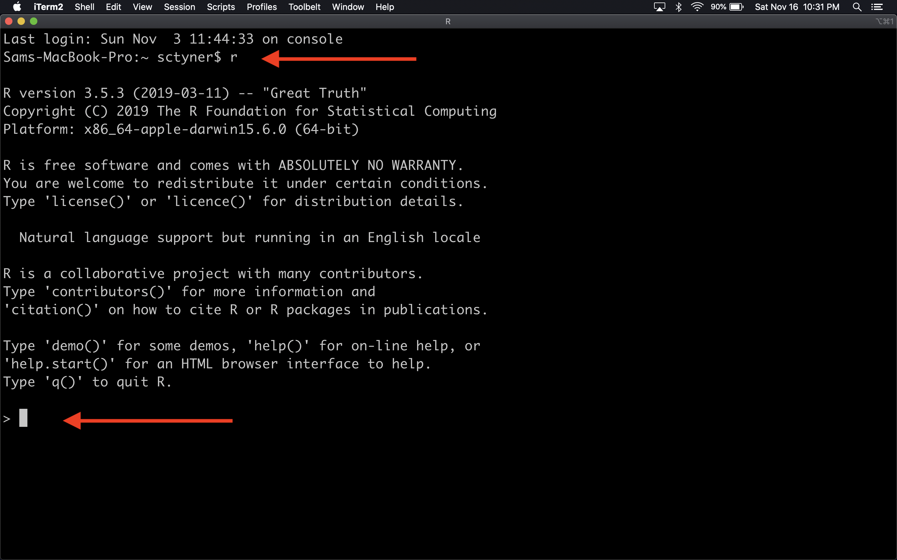

```{r setup, include=FALSE}
options(htmltools.dir.version = FALSE)
knitr::opts_chunk$set(echo = TRUE, fig.align = "center")
```

```{r xaringan-themer, include = FALSE}
library(xaringanthemer)
mono_light(
  base_color = "#072b50",
  text_color = "#444a5a",
  header_font_google = google_font("PT Serif"),
  text_font_google   = google_font("Roboto", "300", "300i"),
  code_font_google   = google_font("Droid Mono"), 
  link_color = "#0288ee"
)
```

```{r to_compile_slides, echo = FALSE, eval = FALSE}
# to build the slide deck, run these lines first: 
install.packages(c("knitr", "rmarkdown", "devtools"))
devtools::install_github('yihui/xaringan')
devtools::install_github("gadenbuie/xaringanthemer")
# then click "Knit" or type Ctrl + Shift + K or Cmd + Shift +K
```

# Outline 

1. Using R: R GUI, Terminal, RStudio IDE
2. R Data Types & Structures
3. Functions & loops
4. R Packages
5. Reading data into R 


---
class: inverse, middle, center
# Using R 

---
# R Gui 

```{r r_gui, echo=FALSE}
knitr::include_graphics("img/r-gui.png")
```

---
# Terminal 

```{r r_term, echo=FALSE}

```

---
# RStudio

```{r rstudio, echo=FALSE}
knitr::include_graphics("https://raw.githubusercontent.com/CSAFE-ISU/reu18/master/static/slides/rstats/img/rstudio4panes.png")
```

---
# RStudio

1. Source - these are scripts & other files. You edit them here. You can run code with Ctrl + Enter.
2. Console - where R "lives." Code is executed here. The results also print out here.
3. Environment and others

    a. Environment: shows what variables and values you have stored in your R session. 
    
    b. History: shows all code you've run in the console in the session
4. Files, Plots, Help, and others

    a. Files: shows & navigates through files on your computer. 
    
    b. Plots: shows you any plot that you've created in R. (Note: it does NOT save the plot)
    
    c. Packages: lists packages you have installed & are using
    
    d. Help: search for functions, topics, etc. to get help


---
# The R Console

```{r console, echo=FALSE}
knitr::include_graphics("https://raw.githubusercontent.com/CSAFE-ISU/reu18/master/static/slides/rstats/img/rprompt.png")
```


---
# Types of files to know

- **.R**: R scripts. R code is written & saved here.  
- **.Rmd**: RMarkdown document. Combines R code & Markdown to author reproducible documents
- **.csv**: Comma Separated Values. A simpler version of an Excel file. Very easy to read .csv data into R. (`read.csv()`)
- **.txt**: Text files. Can also be read into R very easily (`readLines()`, `read.delim()`)

---
class: inverse, middle, center
# R Data Types & Structures

---
# Basic Data Classes 

Numeric - numbers. Can also distinguish between integers and doubles.

```{r num}
x <- 1L
y <- 1.5
typeof(x); typeof(y)
```

---
# Basic Data Classes 

Character - strings

```{r char}
x <- "Hello darkness my old friend"
y <- "1"
typeof(x); typeof(y)
```

---
# Basic Data Classes

Logical - `TRUE` or `FALSE` (also `T` or `F` for short)

```{r logic}
x <- TRUE
y <- FALSE
z <- F
typeof(x); typeof(y); typeof(z)
```

---
# Data Structures: Vectors

Most vectors are atomic vectors: create with `c()`

```{r vecs}
# integer 
c(1L, 2L, 3L)
# numeric 
(my_vec <- c(pi, exp(1), 1))
# character
c("Hello", "darkness", "my old", "friend")
```
<!-- # factor - categories 
as.factor(c("A", "B", "B", "A", "B"))
-->

---
# Vectors `r emo::ji("warning")`

Warning! Only 1 type of data allowed in vectors! 

```{r one_type}
# what happens when we try to combine character & number? 
c("Hello", 3.14)
# what happens when we try to combine character & logical? 
c("Hello", F)
# what happens when we try to combine logical & number? 
c(T, 3.14)
```

---
# Data structures: Matrices

A matrix is made up of vectors. All matrix entries must be of the same type. 

```{r matrix}
# matrix of numerics
(my_mat1 <- matrix(rnorm(10), nrow = 2))
# matrix of characters 
(my_mat2 <- matrix(LETTERS[1:10], nrow = 2))
```
<!--
# matrix of integers
matrix(1:10, nrow = 2)
-->

---
# Get stuff out of lists, matrices

- In R, indexing starts at 1.
- Vectors: use `[]`
- Matrices: use `[,]`

```{r idxing}
my_vec[1]
my_mat1[1,1]
my_mat2[1,]
```


---
# Data structures: Lists

Can contain any type of data
 
```{r lists}
(x <- list(a_matrix = matrix(rnorm(10), nrow = 2), 
     a_vector = c("A", "B", "C"), 
     a_list = list(1,2)))
```

---
# Get stuff out of lists

```{r pepper, echo=FALSE}
knitr::include_graphics("https://pbs.twimg.com/media/CO2_qPVWsAAErbv?format=png")
```


---
# Data structures: Data frames

Stores data in rows and columns. Within a column, all items must be the same type. 

```{r dfs}
data(mtcars)
head(mtcars)
```

---
# Get stuff out of data frames

```{r}
head(mtcars$mpg)
mtcars[1, ]
head(mtcars[c(T, rep(F, 30), T),])
```


---
class: inverse, middle, center
# Functions & loops 

---
# Base R Functions 

Basic Math: `+`, `-`, `*`, `/`, `sin()`, etc.  
`tail()`: show the last $n$ rows of the data  
`plot()`: create basic plots  
`t()`: transpose a matrix  
 
Functions have named arguments: 

```{r fun_demo}
# generate 5 random standard normals 
rnorm(n = 5, mean = 0, sd = 1)
# fit a linear model 
lm(mpg ~ wt, data = mtcars)
```

---
# Create your own function

```{r myfun}
my_fun <- function(x){
  x + 2
}
my_fun(2)

my_fun2 <- function(name){
  paste0("My name is ", name)
}
my_fun2("Sam")
```

---
# For loops

Do the same thing to a bunch of things 

```{r loops}
for (i in 1:10){
  print(i^2)
}

```

---
# While loops 

```{r while}
i <- 0
while (i < 10){
  print(i)
  i <- i + 1
}
```

---
class: inverse, middle, center
# Packages `r emo::ji("package")` `r emo::ji("package")` `r emo::ji("package")`

---
# What is an R `r emo::ji("package")`?

- A collection of additional R functions for a specific purpose. 

Examples: 

- `ggplot2` for creating data visualizations 
- `lme4` for fitting linear, generalized linear, and nonlinear mixed models 
- `dplyr` for "tidy" data manipulation
- `tidyr` for tidying data 
- `devtools` for creating R packages 


---
# Installing a package 

Before you can use a package, you need to install it: 

```{r install, eval=FALSE}
# from CRAN
install.packages(c("ggplot2", "lme4", "dplyr", "tidyr", "devtools"))
# from Github
devtools::install_github("tidyverse/ggplot2")
```

---
# Using a package 

Two ways: 

- Attach it to the workspace with `library()`: 

```{r, eval=FALSE}
library(ggplot2)
```

- Call the functions out of the package with `::`: 

```{r}
dplyr::filter(mtcars, mpg < 15)
```

---
# Finding R packages to use

- CRAN task views: Collections of packages for types of tasks
    * [Time series](https://cran.r-project.org/web/views/TimeSeries.html)
    * [Social sciences](https://cran.r-project.org/web/views/SocialSciences.html)
    * [Econometrics](https://cran.r-project.org/web/views/Econometrics.html) 
    * [Chemometrics and Computational Physics](https://cran.r-project.org/web/views/ChemPhys.html)
    * [Many more!](https://cran.r-project.org/web/views/)


---
class: inverse, middle, center
# Reading data into R 

---
# Base R 

- `read.csv()`: reads in comma-separatd value files
- `read.table()`: reads in tab-delimited files 
- `read.delim()`: reads in arbitrarily delimited files 
- `readLines()`: reads in text files 
- `readRDS()`: reads in R data files (RDS)

---
# Using other packages 

The `readr` package: 
- `read_csv()`, `read_delim()`, `read_rds()`, etc. 

The `haven` package: 
- `read_sas()`, `read_spss()`, `read_stata()`, etc.  

The `readxl` package: 
- `read_excel()`, `read_xls()`, etc.

The `data.table` package: 
- `fread()` 

---
# Examples 

```{r message=FALSE}
commute <- readr::read_csv("https://raw.githubusercontent.com/rfordatascience/tidytuesday/master/data/2019/2019-11-05/commute.csv")
head(commute)
```

---
# Examples 

```{r message=FALSE}
iris <- haven::read_sas("dat/iris.sas7bdat")
head(iris)
```

---
# Some data cleaning 

The `janitor` package cleans things up nicely: 

```{r}
janitor::clean_names(iris)
```

---
# Some data cleaning 

```{r bobross, message=FALSE}
library(readr)
library(dplyr)
library(tidyr)
bob_ross <- read_rds("dat/bobross.rds")
head(bob_ross)
```

---
# Some data cleaning 

```{r}
bob_ross %>% 
  gather(element, present, apple_frame:wood_framed)
```

---
# Some data cleaning 

```{r}
bob_ross %>% 
  gather(element, present, apple_frame:wood_framed) %>% 
  mutate(present = as.logical(present)) 
```

---
# Some data cleaning 

```{r}
bob_ross %>% 
  gather(element, present, apple_frame:wood_framed) %>% 
  mutate(present = as.logical(present)) %>% 
  extract(episode, into = c("season", "ep_num"), 
          regex = "S(.*)E(.*)")
```

---
# Some data cleaning 

```{r}
bob_ross %>% 
  gather(element, present, apple_frame:wood_framed) %>% 
  mutate(present = as.logical(present)) %>% 
  extract(episode, into = c("season", "ep_num"), 
          regex = "S(.*)E(.*)") %>% 
  mutate_at(1:2, parse_number)
```

---
# Some data cleaning 

```{r}
bob_ross %>% 
  gather(element, present, apple_frame:wood_framed) %>% 
  mutate(present = as.logical(present)) %>% 
  extract(episode, into = c("season", "ep_num"), 
          regex = "S(.*)E(.*)") %>% 
  mutate_at(1:2, parse_number) %>% 
  arrange(season, ep_num)
```