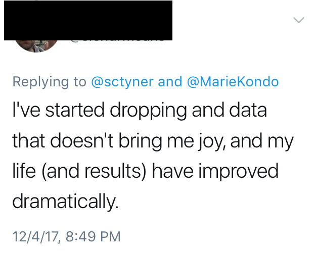

```{r setup, include=FALSE}
library(learnr)
knitr::opts_chunk$set(echo = FALSE, message = FALSE, warning = FALSE)
```

## Life-Changing Magic of Tidying Data

> "Life truly begins only after you have put your house in order."

This quote is from *Spark Joy: An Illustrated Master Class on the Art of Organizing and Tidying Up*, the companion guide to Marie Kondo's #1 *New York Times* best-selling book *The Life-Changing Magic of Tidying Up*.

These books and this method of organization, known as the KonMari method, are all about tidying your home and your life by surrounding yourself with only the things that bring you joy. 

Now, we're all here because we're huge data nerds. We hoard it. We love it. But before we can *do* anything with that data, we have to *clean* and *tidy* the data.

You can think of this tutorial as the companion guide to the hypothetical book *The Life-Changing Magic of Tidying Data*. Let's rephrase the quote above for tidy data:

> "~~Life~~ Analysis truly begins only after you have put your ~~house~~ data in order."

### Cleaning vs. Tidying

According to Kondo, cleaning and tidying your home are two very different things. According to Marie, "cleaning involves the removal of dirt and grease that naturally accumulates over time." The process of tidying, however, "entails returning objects where they belong after each use." Cleaning is very arduous in a non-tidy home, because there's so much stuff in so many different places, and not everything has a home. 

Cleaning and tidying data are also very different things. Cleaning data involves reformatting character variables that are supposed to be numeric, or removing columns that are all NAs. Cleaning data could also include correcting mispellings of variable values, like "oragne" instead of "orange", or making things all lower or upper case.

Tidying data is a much more holistic process. It is more about the shape of the data than about the values themselves. If the shape of the data is hard to manage, your analysis will be hard to manage. Cleaning data is easier when it is tidied first. Like in the home, cleaning data is very arduous when the data is not tidy. 

### Sources of messiness

In the home, untidyness can be caused by many different things. Perhaps you never put anything away. Or maybe you hold onto things way longer than you should. It could be that you keep buying things that have no use to you, but seemed exciting at the time of purchase. I was really a combination of all three of these things before I started "Kondo-ing" my life. 

There are also many different causes of untidy data: 

1. Column headers are values, not variable names. e.g. `day1`, `day2`, etc. 
2. Multiple variables are stored in one column. e.g. `Fall2015`, `Spring2016` or `1301 8th St SE, Orange City, Iowa 51041 (42.99755, -96.04149)`, `2102 Durant, Harlan, Iowa 51537 (41.65672, -95.33780)`
3. Multiple observational units are stored in the same table. e.g. several variables containing student data and their grades in various classes (repetive)
4. A single observational unit is stored in multiple tables. e.g. a different data table for each month, year, etc. collected on the same observational units

### Note: code as you go!

This workshop was written in the `learnr` format, so you can code on the website! Everytime you see a code box, you can write and run your own code! Play around! But note that running any code will run all code in the box. You cannot do it line-by-line.  

There will also be "quiz" questions along the way! 

## KonMari Rules of Tidying Your Home  

1. Commit yourself to tidying up - even though it may seem hard and it requires time and effort
2. Imagine your ideal lifestyle - think about the house you want to live in and even sketch it out if you like drawing
3. Finish discarding first - you can only decide where store things when you've decided what items to keep and what items to discard
4. Tidy by category, not by location - this allows you to see everything you own and to get a grasp of just how much stuff from each category you own
5. Follow the right order - tidy in the following order: clothes, books, papers, *komono*, and sentimental items 
6. Ask yourself if it sparks joy - only keep something if it sparks joy in you

## TySam Rules of Tidying Your Data

Some of them are pretty much identical to KonMari's, others need some...massaging.

1. Commit yourself to tidying ~~up~~ your data - even though it may seem hard and it requires time and effort
2. Imagine your ideal ~~lifestyle~~ dataset - ~~think about the house you want to live in and even sketch it out if you like drawing~~ rows are observations, columns are variables, each type of observation is stored its own table; you should sketch it out ahead of time to help wrap your head around it
3. Finish ~~discarding~~ **saving** first - ~~you can only decide where store things when you've decided what items to keep and what items to discard~~ *never* alter the original data. Store it elsewhere and save *new* copies. Never overwrite! 
4. Tidy by ~~category~~ data type, not by ~~location~~ data frame - this allows you to see ~~everything you own~~ the units in your data first and to get a grasp of just ~~how much stuff from each category you own~~ what information may be stored across several data frames or data objects
5. Follow the right order - ~~tidy in the following order: clothes, books, papers, *komono*, and sentimental items~~ determine your observation type(s), find the corresponding variables, and arrange them so you have the ideal dataset
6. Ask yourself if it sparks ~~joy~~ inspiration - ~~only keep something if it sparks joy in you~~ Then you can perform analyses or make beautiful plots.

## Rule #1: Commit yourself to tidying 

As in the KonMari method of tidying, in the TySam method of tidying data, your must commit yourself to tidying!  

An oft-repeated aphorism in data science is that "80% of data analysis is spent on the process of cleaning and preparing the data". That means, if you're an analyst, as little of 20% of your time on a project will be spent doing the things that are actually in your job description. 

So you are going to need to be good at tidying, and good at doing it quickly. 

## Rule #2: Imagine your ideal dataset 

When tidying your home, you must imagine exactly the kind of lifestyle you want to lead. In tidying your data, you must imagine the ideal dataset for analyses. Luckily, [Wickham (2014)](https://www.jstatsoft.org/article/view/v059i10/v59i10.pdf) has already clearly defined the ideal tidy dataset for us: 

1. Each row contains one observation
2. Each column contains one variable (and only one variable)
3. Each type of observation is stored its own table

And, since I'm already borrowing from Marie Kondo, I'll go ahead and share Wickham's borrowing of Tolstoy: 

> "~~Happy families~~ Tidy datasets are all alike; every ~~unhappy family~~ messy dataset is ~~unhappy~~ messy in its own way."

If you haven't read "Tidy Data" by Hadley Wickham, definitely take the time if you want to learn more about tidying messy data.

## Rule #3: Finish saving first

The corresponding rule from Mari Kondo is totally and utterly the *opposite* for tidying your data.  

*Never* alter the original data. Store it elsewhere and save *new* copies. Never overwrite!  

Again, **DO NOT ALTER THE ORIGINAL DATA**. *We tidy data to make analyses easier to perform,* **not to make our results more convenient.** 

We don't need anyone accusing us of this: 



## Rule #4: Tidy by data type, not frame 

Tidy by the type of observation(s), not by data frames. 
You may have the same object type stored in multiple data frames, or different types of objects stored in the same data frame. 
Determine the *types* of units in your data first!

1. List all your data types.
2. Determine which variables go with which types. 
3. Get them together! In the KonMari method, every object has a home. In our case, every variable has a "home" data type or observational unit. 

### Example 

What 2 types of observations are in the data below? 

```{r data-types, exercise=TRUE, exercise.lines = 15, warning=FALSE}
suppressMessages(library(tidyverse))
#library(tidyverse)
bb <- read_csv("data/billboard.csv")
head(bb)
```

```{r data-types-echo, echo=FALSE, message=FALSE, warning=FALSE}
library(tidyverse)
bb <- read_csv("data/billboard.csv")
```

```{r data-types-q, echo=FALSE}
question("What 2 types of data are present?",
  answer("Attractive people"),
  answer("Song information for some songs released in the year 2000", correct = TRUE),
  answer("Weekly chart standings of songs in 2000", correct = TRUE),
  answer("Average exam scores of these artists in high school")
)
```


## Rule #5: Tidy in the right order 

Find your observation type(s), find the corresponding variables, and arrange them so you have the ideal dataset. 

Don't waste time cleaning and tidying one data frame only to find that the same object type appears in another one of your data sets! Similarly, don't waste time trying to force a messy data frame with multiple data types into the perfect tidy form. Make the problem easier by splitting by type first. 

### Example 

We want to split the `bb` data from before into two data frames: song information (`songs`), and billboard rankings (`ranks`). 

First, assign an ID number to each artist-song combination. The song titles are probably unique, but we do it this way just in case there are multiple songs titled "Loser", for example. 

```{r data-types-sep, exercise=TRUE, exercise.lines = 15}
songs <- bb %>% select(artist, track, time) %>% unique
head(songs)
# songs <- unique(bb[,c("artist","track","time")])

songs <- songs %>% mutate(songID = row_number())
head(songs)
# songs$songID <- 1:nrow(songs)

bb <- bb %>% left_join(songs) %>% select(year, songID, artist:date.entered, x1st.week:x76th.week)
head(bb)

```

```{r data-types-sep-echo, echo=FALSE, warning=FALSE, message=FALSE}
songs <- bb %>% select(artist, track, time) %>% unique
songs <- songs %>% mutate(songID = row_number())
bb <- bb %>% left_join(songs) %>% select(year, songID, artist:date.entered, x1st.week:x76th.week)
```

Now that we have one column linking the songs and the rankings, we can split bb into the two data frames.

```{r data-types-sep2, exercise=TRUE, exercise.lines = 15}
songs <- bb %>% select(songID, artist, track, time, date.entered)
head(songs)

ranks <- bb %>% select(songID, date.entered, x1st.week:x76th.week)
head(ranks)

```

```{r data-types-sep2-echo, echo=FALSE, warning=FALSE, message=FALSE}
songs <- bb %>% select(songID, artist, track, time, date.entered)
ranks <- bb %>% select(songID, date.entered, x1st.week:x76th.week)
```

```{r data-types-sep-q, echo=FALSE}
question("Which data frame is in the ideal tidy form?",
  answer("`songs`", correct = TRUE),
  answer("`ranks`"),
  answer("both")
)
```

### Tidying the Messy Data

The `ranks` data at this point is untidy. It is in *wide* format when in should be in *long* format. Let's tidy it! 

First, we need to *gather* up all those week columns.

```{r tidy-ranks, exercise=TRUE, exercise.lines = 15}
head(ranks)

ranks2 <- ranks %>% gather(week, rank, x1st.week:x76th.week) 
head(ranks2)

glimpse(ranks2)

```

```{r tidy-ranks-echo, echo=FALSE, message=FALSE, warning=FALSE}
ranks2 <- ranks %>% gather(week, rank, x1st.week:x76th.week) 
```

Now that we have one observation (one song's rank in one week) per row, our data is tidy. But it's not exactly *clean*. Let's clean it up! 

First, let's make week and rank numbers instead of a characters: 

```{r tidy-ranks-int, exercise=TRUE, exercise.lines = 15}
ranks2 <- ranks2 %>% 
  mutate(week = parse_number(week))

head(ranks2)
tail(ranks2)
```

```{r tidy-ranks-int-echo, message=FALSE, warning=FALSE, echo=FALSE}
ranks2 <- ranks2 %>% 
  mutate(week = parse_number(week))
```

There are a lot of `NA`s in the rank variable now. Why?

```{r nas-q, echo=FALSE}
question("Where do you think all the NAs came from?",
  answer("Oh god, Sam what did you do? Where did all the data go?"),
  answer("Not every song has a rank for all 76 weeks", correct = TRUE),
  answer("I don't know but I trust you"),
  answer("We didn't use `parse_number` correctly")
)
```


```{r data-nas, exercise=TRUE, exercise.lines = 15}
ranks2 %>% filter(is.na(rank)) %>% glimpse
```

The `NA` values represent every time a song didn't make it to that week still being on the top charts. So, a week 2 with an `NA` in the `rank` column means that the song was only on the chart for one week. 

Just out of curiosity, which songs were on the charts for 76 weeks? 

```{r popular_songs, exercise=TRUE, exercise.lines = 15}
ranks2 %>% filter(week == 76, !is.na(rank)) %>% select(songID)

# hm. I guess that was just a boo-boo. what's the max number of weeks?
ranks2 %>% filter(!is.na(rank)) %>% select(week) %>% max()

# what song was that? 
ranks2 %>% filter(!is.na(rank), week == 65) %>% select(songID)
songs %>% filter(songID == 47)
```


Oh, early 2000s fashion.... we do not miss you. 

The final step is to ditch all the NAs.

```{r ranks-na-rm, exercise=TRUE, exercise.lines = 15}
ranks3 <- ranks2 %>% filter(!is.na(rank))
dim(ranks3)
summary(ranks3)
```

```{r ranks-na-rm-q, message=FALSE,warning=FALSE, echo=FALSE}
ranks3 <- ranks2 %>% filter(!is.na(rank))
```

## Rule #6: Does it spark inspiration?

Then you can perform analyses or make beautiful plots.

Let's make a simple line chart: 

```{r lines-ranks, exercise=TRUE, exercise.lines = 15, fig.width=10}
ggplot(data = ranks3, aes(x = week, y = rank, group = songID)) + 
  geom_line(alpha = .5) + 
  scale_y_reverse()
```

Maybe we should actually anchor these to the date they entered the top charts. 

```{r days-weeks, exercise=TRUE, exercise.lines = 15, fig.width=10}
ranks3 %>% mutate(date.actual = date.entered + (week-1)*7) %>% 
  ggplot(aes(x = date.actual, y = rank, group = songID)) +
  geom_line(alpha=.5) + 
  scale_x_date() + 
  scale_y_reverse()
```

Let's only look at ones that reached rank #1: 

```{r only-ones, exercise=TRUE, exercise.lines = 15, fig.width=10}
ranks3 %>% mutate(date.actual = date.entered + (week-1)*7) %>% 
  group_by(songID) %>% mutate(highest_rank = min(rank)) %>% 
  filter(highest_rank == 1) %>%
  left_join(songs) %>% 
  mutate(full = paste(track, artist, sep = " by\n")) %>% 
  ggplot(aes(x = date.actual, y = rank, group = songID)) +
  geom_line(aes(color = full)) +
  theme(legend.position = 'bottom') + 
  scale_x_date() + 
  scale_y_reverse() 
```

Which song had the most time at #1? 

```{r most-ones, exercise=TRUE, exercise.lines = 15}
ranks3 %>% group_by(songID) %>%
  filter(rank == 1) %>% 
  summarise(weeksat1 = n()) %>%
  left_join(songs) %>% 
  select(artist, track, weeksat1) %>% arrange(desc(weeksat1))
```


There's a reason she's called Queen Bey. 👸🏽🐝🍋

## The `tidyverse` package

The functions we've used to tidy the billboard data all come from packages in the `tidyverse`. 

### What is the `tidyverse`?

The [`tidyverse`](https://www.tidyverse.org/) is "an opinionated collection of `R` packages designed for data science". 

For more detail on those opinions, see the [Tidy Tools Manifesto](https://mran.microsoft.com/web/packages/tidyverse/vignettes/manifesto.html).

There are four basic principles that each `tidyverse` package adheres to: 

1. Reuse existing data structures.
2. Compose simple functions with the pipe.
3. Embrace functional programming.
4. **Design for humans.**

Number 4 is the reason I use the `tidyverse`. For the most part, it "thinks" like my brain thinks. Obviously, not everyone thinks like me or like Hadley et al, who created the `tidyverse`. Personally, I don't believe in one way to `R`. I'm a poly-`R`-ist and tend to get frustrated with folks who are mono-`R`-ists. 

The packages contained in the `tidyverse` are: 

```{r tidy-pkgs, echo=TRUE}
tidyverse::tidyverse_packages()
```

In the code throughout, I've used:

- `readr`: provide a fast and friendly way to read rectangular data
    * `read_csv()`: read in the billboard data
    * `parse_integer()`: convert characters to integers
- `dplyr`: provides a flexible grammar of data manipulation
    * `%>%`: the pipe operator. passes the data object on the left to the function on the right. e.g. `x %>% f` is equivalent to `f(x)`
    * `select()`: choose columns of your data
    * `filter()`: choose rows of your data according to a boolean condition 
    * `mutate()`: add columns to or edit columns of the data by performing operations on existing columns
    * `group_by()`: convert data to a grouped table, and operations after grouping are performed at the group level as opposed to the observation level
    * `left_join(x,y)`: for the data frames `x,y`, join them together by keeping all *rows* from `x` and all *columns* from `x` and `y`. Rows in `y` that are not in `x` will be dropped, and rows in `x` that are not in `y` will have NAs in the columns from `y`.
    * `row_number()`: exactly as it sounds. numbers the rows *within groups* of data
- `tidyr`: provides functions for creating tidy data
    * `gather()`: takes multiple columns, and gathers them into key-value pairs: it makes "wide" data longer. The column name become the key which corresponds to the value of that variable
    * `spread()`: (not used here) takes two columns (key & value) and spreads in to multiple columns, it makes "long" data wider. The key becomes the column name and the value becomes the variable value. 
- `stringr`: easy wrapper functions around functions in the `stringi` package, which contains functions for fast, correct, consistent, and convenient string/text manipulation
    * `str_replace(x,y,z)`: Find the pattern `y` in the string `x` and replace `y` with the pattern `z`
- `ggplot2`: a system for "declaratively" creating graphics, based on "The Grammar of Graphics" by Leland Wilkinson
    * `ggplot()`: initialize a plot object
    * `aes()`: define aesthetic mappings that describe how variables in the data are mapped to visual properties (aesthetics) of `ggplot2` `geom`s
    * `geom_line()`: connect observations in order of the variable on the x-axis
    * `theme()`: define the appearance of the non-data elements of a plot. (title, labels, legends, etc.)
    * `scale_x_date()`: automatically draw the x-axis when the x variable is a date object
    * `scale_y_reverse()`: exactly as it sounds: reverse the y-axis order.
- `lubridate`: provides tools that make it easier to parse and manipulate dates. We didn't use it explicitly, but implicitly relied on its intelligence to add dates in the billboard plots.
- `tibble`: provides a `tbl_df` class (the "tibble") that provides stricter checking and better formatting than the traditional data frame. Again, we didn't really use `tibble` explicitly, but implicity as the `tidyverse` packages (usually) automatically create `tbl_df`s out of `data.frame` objects.
    * `glimpse`: like a transposed version of print: columns run down the page, and data runs across. It's like the `tidyverse` version of `head()` in a way. 

### More examples of tidying

#### French fry data

Similar to the billboard data: it's wide when it should be long. Use the box below to tidy. 

```{r french-fry, exercise=TRUE, exercise.lines = 15}
fries <- reshape2::french_fries
head(fries)

```

#### Tuberculosis data

In this dataset, variables are stored in both row and columns. `m014` counts the number of cases for males between the ages of 0-14 years. Can you create a data frame with columns: `iso2`, `year`, `sex`, `age`, `no_cases`? Hint: use `tidyr` functions `gather()`, `spread()`, and `separate()` and `stringr` function `str_replace()`. 

```{r tb, exercise = TRUE, exercise.lines=15}
tb <- read_csv("http://stat405.had.co.nz/data/tb.csv") %>%
  select(iso2, year, new_sp_m014:new_sp_m65, new_sp_f014:new_sp_f65) %>% 
  filter(year >=2000)
head(tb)

```

```{r solution}
tb <- read_csv("http://stat405.had.co.nz/data/tb.csv") %>%
  select(iso2, year,new_sp_m014:new_sp_m65, new_sp_f014:new_sp_f65) %>%  
  filter(year >=2000) 

tb2 <- gather(tb, var, val, new_sp_m014:new_sp_f65) 
head(tb2)
tb2 <- tb2 %>% mutate(var = str_replace(var, "new_sp_", ""))
head(tb2)
tb2 <- tb2 %>% mutate(var = str_replace(var, "0", "00"))
head(tb2)
tb3 <- tb2 %>% 
  separate(var, into = c("sex", "low", "upp"), sep = c(1,3)) %>% 
  mutate(age = paste(parse_integer(low), parse_integer(upp), sep = "-"),
         no_cases = val) %>% 
  select(iso2, year, sex, age, no_cases) %>% 
  arrange(year, age)
head(tb3)
head(data.frame(tb3))
```


## Tidy time! 

Use the remaining time to tidy your own dataset! I'll walk around answering questions, and you should also ask your neighbors! 

Ice breaker question to get to know the people around you: who's your favorite musical artist from the late 1990s or early 2000s? 

Mine is the Backstreet Boys. 10 year old Sam ❤️ Nick Carter 4eva


<!--
### Exercise 

*Here's a simple exercise with an empty code chunk provided for entering the answer.*

Write the R code required to add two plus two:

```{r two-plus-two, exercise=TRUE}

```

### Exercise with Code

*Here's an exercise with some prepopulated code as well as `exercise.lines = 15` to provide a bit more initial room to work.*

Now write a function that adds any two numbers and then call it:

```{r add-function, exercise=TRUE, exercise.lines = 15}
add <- function() {
  
}
```

## Topic 2

### Exercise with Hint

*Here's an exercise where the chunk is pre-evaulated via the `exercise.eval` option (so the user can see the default output we'd like them to customize). We also add a "hint" to the correct solution via the chunk immediate below labeled `print-limit-hint`.*

Modify the following code to limit the number of rows printed to 5:

```{r print-limit, exercise=TRUE, exercise.eval=TRUE}
mtcars
```

```{r print-limit-hint}
head(mtcars)
```

### Quiz

*You can include any number of single or multiple choice questions as a quiz. Use the `question` function to define a question and the `quiz` function for grouping multiple questions together.*

Some questions to verify that you understand the purposes of various base and recommended R packages:

```{r quiz}
quiz(
  question("Which package contains functions for installing other R packages?",
    answer("base"),
    answer("tools"),
    answer("utils", correct = TRUE),
    answer("codetools")
  ),
  question("Which of the R packages listed below are used to create plots?",
    answer("lattice", correct = TRUE),
    answer("tools"),
    answer("stats"),
    answer("grid", correct = TRUE)
  )
)
```
-->
