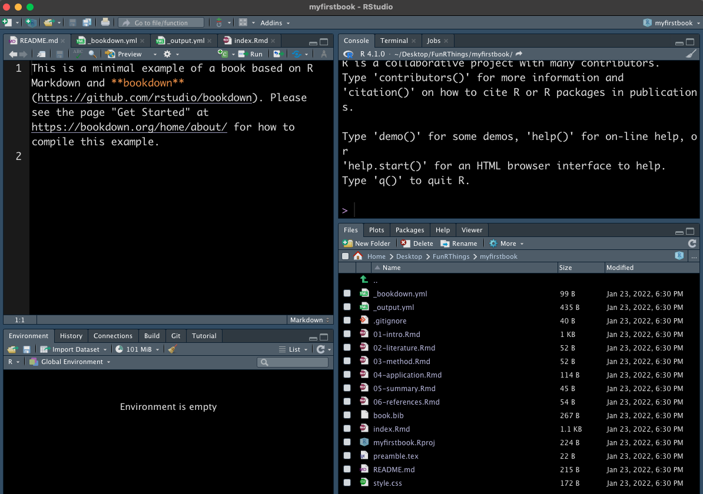
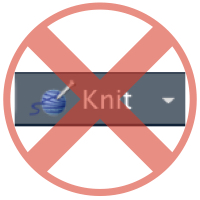

# Outline

1. Why `bookdown`?
2. What `bookdown` assumes about you
5. Your first book with `bookdown`
3. Tricky little bits
4. LaTeX vs. `bookdown`


.footnote[Note: This talk is very similar to one I gave in 2018. I tried to catch all the changes in bookdown since then, but I may have missed something! Always refer to [bookdown.org/yihui/bookdown](https://bookdown.org/yihui/bookdown) for current bookdown syntax]

---
# Why `bookdown`? 

.pull-left[
In the package author's [own words](https://slides.yihui.name/2017-rmarkdown-UNL-Yihui-Xie.html#4), books should be:

- easy to write
- cheap 
- dynamic
- quickly edited & re-released
- authored by a few people, but edited/reviewed/contributed to by many
]

.pull-right[


]

---
# Why `bookdown`?

.left-column[

]

.right-column[
Familiar with RStudio already? You're set! 

- Requires no additional software (outside of `install.packages("bookdown")`)
- Write in markdown -- lightweight markup language that's easy to learn 
- Knit to HTML or PDF (avoid the LaTeX headaches!)
- Generate figures and tables in the book with R code -- no more copy/pasting 

]

---
class: inverse, center
# What does `bookdown` assume about you? 

You know what they say when you assume...


---
# R/RStudio

`bookdown` assumes you know how to use R, including

- how to install packages 
- how to put code chunks in a .Rmd file
- how to render plots from R code in a .Rmd file

Working knowledge of / a desire to use RStudio is not necessary but is exceedingly helpful.

If you're seeing this, I assume you have this minimal working knowledge of R/RStudio. 

---
# Markdown

`bookdown` assumes you are comfortable writing in Markdown, including

- headers
- tables
- font formatting (*italics*, **bold**, etc.)

Luckily, this is not hard to learn. See the [R Markdown Reference Guide](https://www.rstudio.com/wp-content/uploads/2015/03/rmarkdown-reference.pdf) or the [cheat sheet](https://github.com/rstudio/cheatsheets/raw/master/rmarkdown-2.0.pdf)

---
# `bibtex`

`bookdown` assumes you know how to work with .bib files, including: 

- You know what bibliography style you want 
- You understand inline citations
- You understand the structure of entries in a .bib file

See this [user guide](https://www.economics.utoronto.ca/osborne/latex/BIBTEX.HTM) and this [fill-in-the-blank](https://truben.no/latex/bibtex/) Bibtex editor

---
# LaTeX Math 

`bookdown` assumes you know how to write math things (equations, formulae, etc.) with LaTeX


Here's the [Wikibook](https://en.wikibooks.org/wiki/LaTeX/Mathematics) for LaTeX. Good luck.

If you're seeing this, I assume you're familiar with the not-so-gentle giant that is LaTeX

---
class: inverse, center
# Your First Book 


---
# Creating a bookdown book from scratch

In RStudio: 

1. File > New Project 
2. New directory > Book project using bookdown
3. Choose a folder name and location for the book to live 
4. Click "Create Project"

```{r, out.width="33%", echo=FALSE}
knitr::include_graphics(list.files("img", pattern = "newbook", full.names = T))
```

---

```{r echo=FALSE}

```

---
class: center, middle
# Live Demo


---
class: inverse, center
# Tricky Little Bits 


---
# Building the book 

Several ways to build your book: 

1. RStudio > "Build" tab > Build Book 
2. R console > `bookdown::render_book()`
3. RStudio Viewer Pane: R console > `bookdown::serve_book()` 
4. Preview a chapter at a time with `bookdown::preview_chapter()`

.pull-left[
DO NOT click the Knit button! 

```{r echo=FALSE, fig.align='center'}

```

]

.pull-right[
Or else you will 

```{r echo=FALSE, out.width = "75%", fig.align='left'}
knitr::include_graphics("https://c.tenor.com/onsoP2CMU7wAAAAC/ted-lasso-tedlassogifs.gif")
```

]


---
# Math mode

For math, sometimes you need to enter mathmode (via `$$`...`$$` or `\(`...`\)`), and sometimes you don't...

- If the math expression creates something in `displaymath` (e.g. `equation`, `eqnarray`, `align`), don't put it in math mode 
- Otherwise, it needs mathmode (e.g. `matrix`,  `array`, etc.)

.pull-left[
Need math mode: 

    $$a^2 + b^2 = c^2$$
    
$$a^2 + b^2 = c^2$$     
]
.pull-right[
Don't need math mode: 

    \begin{equation}
     a^2 + b^2 = c^2
     \end{equation}
\begin{equation}
a^2 + b^2 = c^2
\end{equation} 

]

---
# Inserting images

Can do `` like in usual .Rmd things, but (AFAIK):

- Figure numbering is hard (or impossible)
- "" referencing ""
- "" alignment ""


Instead, do `knitr::include_graphics()` inside an R code chunk. 

Why?

--

- Figure naming, referencing, and numbering included "for free" (`\@ref(fig:chunkname)`)
- Can control size, alignment, etc. very easily 

---
# Inserting images

.pull-left[

How to use `knitr::include_graphics()`:

````
`r ''````{r eval=FALSE}
knitr::include_graphics("https://bit.ly/tlgif2022")
```
````

Add code chunk options:
- fig.height=2
- fig.align='center'
- fig.cap = "Ted" 
- echo=FALSE

To get the result at right.
]

.pull-right[
```{r tlgif, fig.height=2,fig.align='center', fig.cap = "Ted", echo=FALSE}
knitr::include_graphics("https://bit.ly/tlgif2022")
```
]

---
# Inserting tables 

Again, can do it in the [usual markdown way](https://github.com/adam-p/markdown-here/wiki/Markdown-Cheatsheet#tables), but (AFAIK):

- Table numbering is hard (or impossible)
- "" captions ""
- "" referencing ""
- "" alignment ""

Instead, do `knitr::kable()` inside an R code chunk. 

Why?

--

- Table naming, referencing, and numbering included "for free" (`\@ref(tab:chunkname)`)
- `caption` is an argument in the function to make table captions
- Get all the other "good stuff" from LaTeX/`xtable`. e.g. `digits`, `longtable`, etc. (See `?knitr::kable`)

---
# Inserting tables

How to use `knitr::kable()` to insert tables: 

````
`r ''````{r table2, eval = FALSE}
knitr::kable(head(mtcars), caption="mtcars data", format = "html")
```
````

With chunk options `{results='asis'}` gives:   

```{r table2, results='asis', echo=FALSE}
knitr::kable(head(mtcars), caption="mtcars data", format = 'html')
```


---
class: inverse, center
# LaTeX v. `bookdown`


---
# References & Citations

Difference between using LaTeX (left) and using `bookdown` (right) for references:

.pull-left[
- Label sections with `\label{section-label}` after `\section{Section name}`. Refer to them with `\ref{section` `-label}`.

- Inline citations with `\citet{biblabel}`, `\citep{biblabel}`

- Figure/table references with `\ref{fig-` `or-tab-label}`

- Label equations with `\label{eqnname}` after `begin{equation}`. Refer to them with `\ref{eqn` `name}`.
]

.pull-right[
- Label sections with `{#section-label}` after `## Section name`. Refer to them with `\@ref(label)`

- Inline citations with `@biblabel`, `[@biblabel]`

- Figure/table references with `\@ref(fig:figlabel)` / `\@ref(tab:tablabel)`. `figlabel` and `tablabel` should be the code chunk names 

- Label equations with `(\#eq:eqnname)` the line above `\end{equation}`. Refer to them with `\@ref(eq:eqnname)`
]

---
# Theorems, Proofs, etc. 

Difference between using LaTeX (left) and using `bookdown` (right) for different [text environments](https://bookdown.org/yihui/bookdown/markdown-extensions-by-bookdown.html#theorems):

.pull-left[

- Use `\begin{}` `\end{}` for `theorem`, `proof`, `definition`, etc. 

- Label and reference them with `\label{` `thmname}` and `\ref{` `thmname}`

]

.pull-right[
- Use "code chunks" : 
```
::: {.theorem #mythm}
This is a `theorem` environment that can contain **any** 
_Markdown_ syntax
:::
```

- Label them with `#` and reference them with `\@ref(prefix:label)` where `prefix` is one of `thm`, `lem`, [etc.](https://bookdown.org/yihui/bookdown/markdown-extensions-by-bookdown.html#theorems)
]

---
# Customization

.pull-left[
In LaTeX, create custom formats with: 

- `\newcommand{` `}` 
- `\renewcommand{` `}` 
- `\newenvironment{` `}` 

]

.pull-right[
In `bookdown`, create [custom formats](https://bookdown.org/yihui/rmarkdown-cookbook/custom-blocks.html) with: 

- `{block}` environment + custom [CSS](https://github.com/rstudio/bookdown/blob/master/inst/examples/css/style.css) styles 
- Similar to the way `{.theorem}` works

]

---
# Other random fun `bookdown` facts

1. Part and Appendix [headers](https://bookdown.org/yihui/bookdown/markdown-extensions-by-bookdown.html#special-headers) for separating different groups of chapters 
2. Text [references](https://bookdown.org/yihui/bookdown/markdown-extensions-by-bookdown.html#text-references) to save your sanity when writing figure/table captions
3. You can [embed whole webpages](https://bookdown.org/yihui/bookdown/web-pages-and-shiny-apps.html) in online books written with `bookdown`. (i.e. for `shiny` apps)

```{r echo = FALSE, fig.align="center"}
knitr::include_graphics("https://c.tenor.com/nqRQOYrv2U4AAAAC/ted-lasso.gif")
```

